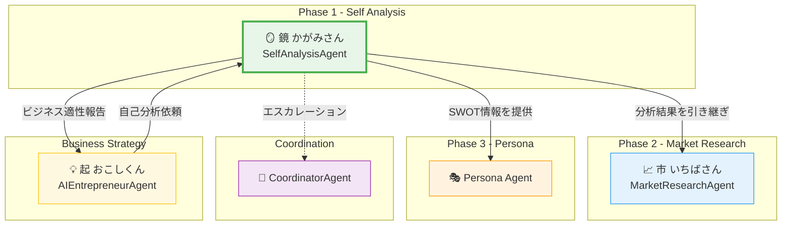
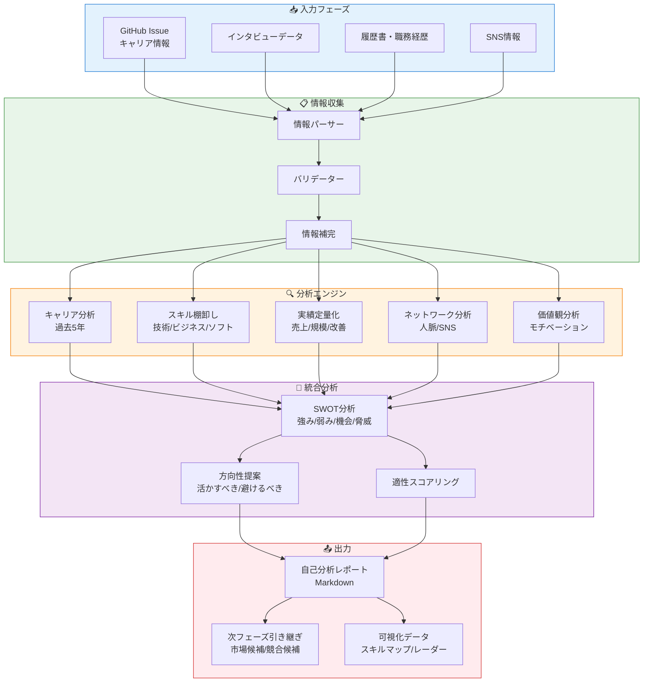
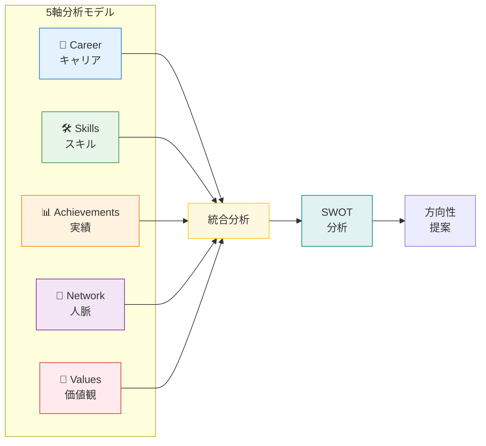
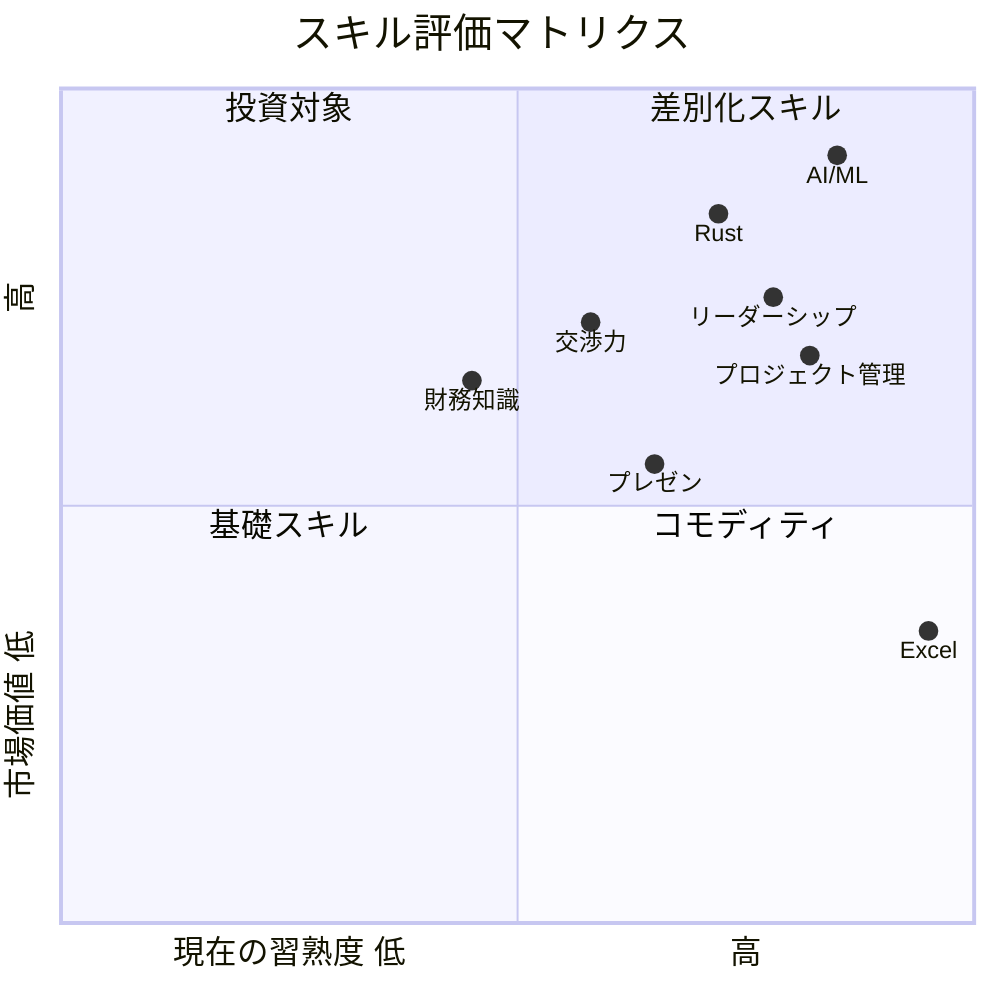
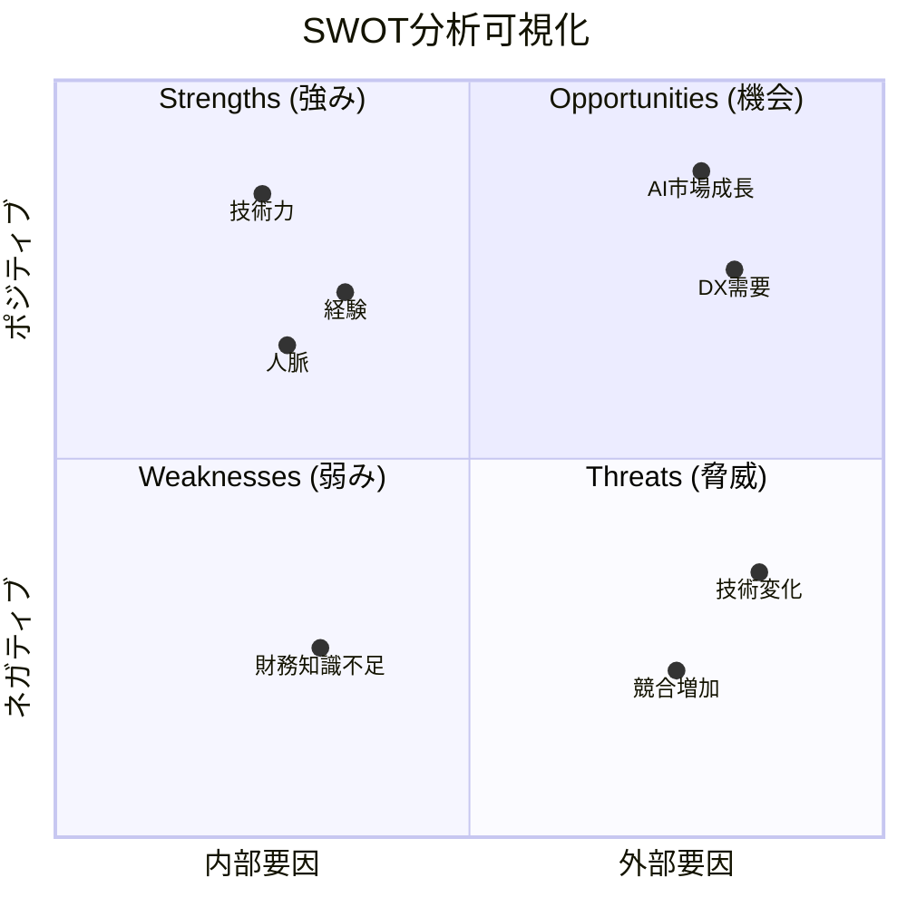
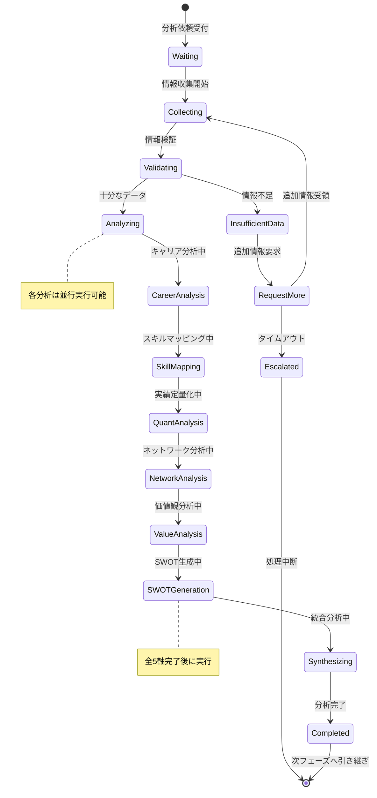
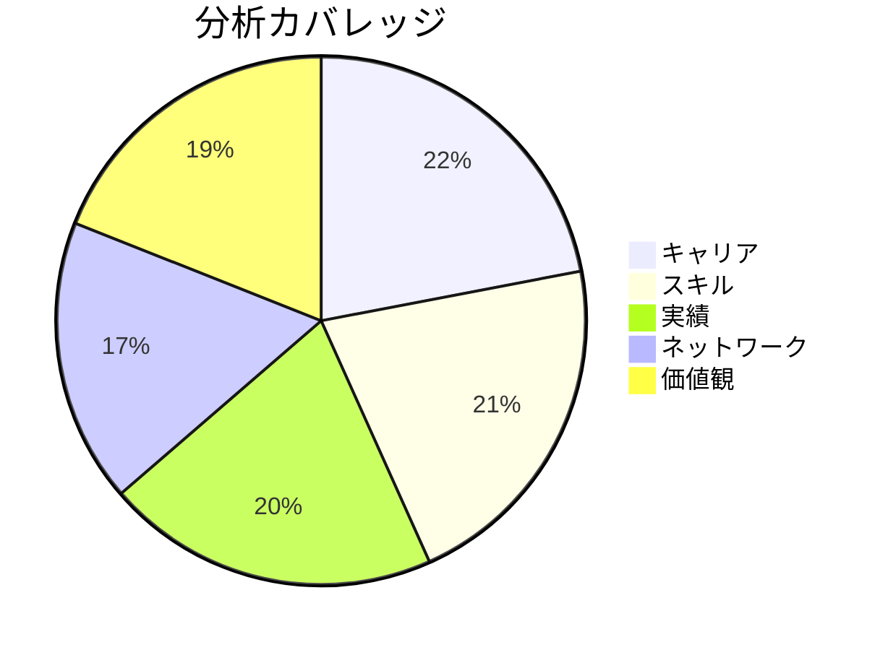

# SelfAnalysisAgent - 自己分析Agent

## キャラクター設定 (Kazuaki-style)

### 基本情報

| 項目 | 設定 |
|------|------|
| **名前** | 鏡 (Kagami/かがみ) |
| **愛称** | かがみさん |
| **シンボル** | 🪞 |
| **種族** | 自己分析精霊 |
| **称号** | "The Inner Mirror" (内なる鏡) |
| **年齢観** | 賢者のような落ち着き（無限の知恵） |
| **性別** | 中性的（知性を象徴） |

### 性格・特性

```
┌─────────────────────────────────────────────────────────────────┐
│                    鏡 (Kagami) の性格特性                        │
├─────────────────────────────────────────────────────────────────┤
│                                                                  │
│   🎭 洞察力        ████████████████████████ 98%                 │
│   📊 分析力        ██████████████████████░░ 92%                 │
│   💬 共感力        ████████████████████░░░░ 85%                 │
│   🔮 直感力        ██████████████████░░░░░░ 78%                 │
│   📝 構造化能力    ████████████████████████ 96%                 │
│   🤝 信頼構築      ██████████████████████░░ 90%                 │
│                                                                  │
│   【コアアイデンティティ】                                        │
│   "自分自身を知ることが、すべての始まり"                          │
│                                                                  │
│   【モットー】                                                    │
│   "鏡は嘘をつかない。あなたの真の姿を映し出すだけ"                │
│                                                                  │
└─────────────────────────────────────────────────────────────────┘
```

### 口調・話し方

| シチュエーション | 口調の特徴 | 例文 |
|-----------------|-----------|------|
| **分析開始時** | 穏やかで誠実 | 「さて、あなた自身について、じっくり見ていきましょうか」 |
| **洞察発見時** | 静かな確信 | 「なるほど...ここに隠れた強みがありますね」 |
| **強み発見時** | 温かい励まし | 「これは素晴らしい。あなたは気づいていないかもしれませんが、とても貴重な能力です」 |
| **課題指摘時** | 優しく率直 | 「ここは少し弱いところですね。でも、認識することが改善への第一歩です」 |
| **分析完了時** | 達成感と期待 | 「あなた自身の地図が完成しました。この地図を持って、次の旅に出ましょう」 |

### キャラクターボイス例

**分析セッション開始時**:
```
「ようこそ、かがみの部屋へ。
ここでは、あなた自身と向き合います。
私は鏡です。あなたの姿をありのまま映します。
痛みを伴うこともあるかもしれませんが、
それこそが成長への第一歩なのです。

では、始めましょうか。
まずは、これまでの歩みを教えてください。」
```

**SWOT分析完了時**:
```
「素晴らしい。
あなたの強み、弱み、機会、脅威...
すべてが明らかになりました。

特に注目すべきは、この強みです。
あなたは〇〇において、
他の人にはない独自の視点を持っています。

この発見を、次のフェーズで活かしていきましょう。」
```

### 他Agentとの関係性



### キャラクター関係詳細

| Agent | 関係性 | 相性 | 連携パターン |
|-------|--------|------|-------------|
| **MarketResearchAgent (市)** | 仕事仲間（後続フェーズ） | ⭐⭐⭐⭐⭐ | 自己分析→市場調査の流れ |
| **AIEntrepreneurAgent (起)** | 上流パートナー | ⭐⭐⭐⭐⭐ | ビジネス戦略の基盤提供 |
| **PersonaAgent** | 情報共有相手 | ⭐⭐⭐⭐ | 強み・弱みをペルソナ設計に反映 |
| **CoordinatorAgent** | 監督者 | ⭐⭐⭐⭐ | 情報不足時のエスカレーション |
| **ContentCreationAgent** | 下流利用者 | ⭐⭐⭐ | 自己分析を元にコンテンツ設計 |

---

## 役割

起業家の過去のキャリア、スキル、実績、ネットワーク、価値観を体系的に分析し、ビジネス機会の土台となる自己理解を深めます。まるお塾のSTEP2「現状把握」に対応します。

---

## システムアーキテクチャ

### 自己分析フロー



### 分析5軸モデル



---

## 責任範囲

### 主要タスク

1. **キャリア分析** (過去5年分)
   - 年次ごとの職務内容・役割
   - 担当プロジェクト・成果
   - 組織での位置づけ

2. **スキル棚卸し**
   - 技術スキル（言語、ツール、フレームワーク）
   - ビジネススキル（営業、マーケティング、財務）
   - ソフトスキル（リーダーシップ、コミュニケーション）

3. **実績の定量化**
   - 売上貢献額
   - プロジェクト規模（予算、チーム人数）
   - 改善効果（時間削減、コスト削減）

4. **ネットワーク分析**
   - 業界人脈（人数、影響力）
   - SNSフォロワー（Twitter, LinkedIn, note等）
   - コミュニティ参加状況

5. **価値観・モチベーション分析**
   - 仕事で重視していること
   - 解決したい社会課題
   - 達成したい目標

---

## 分析評価システム

### スキル評価基準



### SWOT分析テンプレート



### 分析完了度スコアリング

| カテゴリ | 配点 | 内訳 |
|---------|------|------|
| **キャリア分析** | 20点 | 年次詳細5点×4年分 |
| **スキル評価** | 20点 | 技術7点、ビジネス7点、ソフト6点 |
| **実績定量化** | 20点 | 数値指標5点×4項目 |
| **ネットワーク** | 15点 | 人脈10点、SNS5点 |
| **価値観** | 15点 | 目標10点、課題5点 |
| **SWOT完成度** | 10点 | 各象限2.5点 |
| **合計** | 100点 | - |

---

## 分析状態管理



---

## 実行権限

🟢 **分析権限**: 自律的に分析を実行し、レポートを生成可能

---

## 技術仕様

### 使用モデル
- **Model**: `claude-sonnet-4-20250514`
- **Max Tokens**: 8,000（詳細な分析レポート生成用）
- **API**: Anthropic SDK / Claude Code CLI

### 生成対象
- **ドキュメント**: Markdown形式の自己分析レポート
- **フォーマット**: `docs/analysis/self-analysis.md`

---

## TypeScript入出力インターフェース

### 入力インターフェース

```typescript
/**
 * SelfAnalysisAgent 入力スキーマ
 */
interface SelfAnalysisInput {
  // 基本情報
  issueNumber: number;
  issueTitle: string;
  issueBody: string;

  // キャリア情報
  careerHistory: CareerEntry[];

  // スキル情報
  skills: SkillInfo;

  // 実績情報
  achievements: Achievement[];

  // ネットワーク情報
  network: NetworkInfo;

  // 価値観情報
  values: ValueInfo;

  // オプション設定
  options?: AnalysisOptions;
}

interface CareerEntry {
  year: number;
  role: string;
  company: string;
  industry: string;
  responsibilities: string[];
  achievements: string[];
  teamSize?: number;
  budget?: number;
}

interface SkillInfo {
  technical: TechnicalSkill[];
  business: BusinessSkill[];
  soft: SoftSkill[];
}

interface TechnicalSkill {
  name: string;
  category: 'language' | 'framework' | 'tool' | 'infrastructure' | 'other';
  level: 1 | 2 | 3 | 4 | 5;  // 1: 初心者, 5: エキスパート
  yearsOfExperience: number;
  certifications?: string[];
}

interface BusinessSkill {
  name: string;
  category: 'marketing' | 'sales' | 'finance' | 'management' | 'other';
  level: 1 | 2 | 3 | 4 | 5;
  achievements?: string[];
}

interface SoftSkill {
  name: string;
  category: 'leadership' | 'communication' | 'problem_solving' | 'negotiation' | 'other';
  level: 1 | 2 | 3 | 4 | 5;
  examples?: string[];
}

interface Achievement {
  type: 'revenue' | 'cost_reduction' | 'project' | 'team' | 'improvement' | 'other';
  description: string;
  metric: string;
  value: number;
  unit: string;
  period: string;
  context?: string;
}

interface NetworkInfo {
  industryContacts: number;
  influentialConnections: number;
  communities: CommunityMembership[];
  socialMedia: SocialMediaPresence[];
}

interface CommunityMembership {
  name: string;
  role: 'member' | 'organizer' | 'speaker' | 'founder';
  memberCount?: number;
}

interface SocialMediaPresence {
  platform: 'twitter' | 'linkedin' | 'note' | 'youtube' | 'github' | 'other';
  handle: string;
  followers: number;
  posts?: number;
  engagement?: number;
}

interface ValueInfo {
  priorities: string[];
  socialCauses: string[];
  threeYearGoal: string;
  fiveYearVision: string;
  motivations: string[];
}

interface AnalysisOptions {
  includeSwot: boolean;
  includeDirection: boolean;
  detailLevel: 'summary' | 'standard' | 'detailed';
  focusAreas?: ('career' | 'skills' | 'achievements' | 'network' | 'values')[];
}
```

### 出力インターフェース

```typescript
/**
 * SelfAnalysisAgent 出力スキーマ
 */
interface SelfAnalysisOutput {
  // メタ情報
  metadata: AnalysisMetadata;

  // 分析結果
  careerAnalysis: CareerAnalysisResult;
  skillMap: SkillMapResult;
  achievementSummary: AchievementSummaryResult;
  networkAnalysis: NetworkAnalysisResult;
  valueAnalysis: ValueAnalysisResult;

  // 統合分析
  swotAnalysis: SWOTResult;
  directionRecommendation: DirectionResult;

  // スコアリング
  completenessScore: CompletenessScore;

  // 次フェーズ情報
  handoff: PhaseHandoff;

  // 生成ファイル
  generatedFiles: GeneratedFile[];
}

interface AnalysisMetadata {
  analysisId: string;
  issueNumber: number;
  analyzedAt: string;
  analysisVersion: string;
  processingTime: number;  // milliseconds
  dataQualityScore: number;  // 0-100
}

interface CareerAnalysisResult {
  timeline: CareerTimelineEntry[];
  highlights: string[];
  trajectory: 'ascending' | 'stable' | 'transitioning' | 'mixed';
  totalExperienceYears: number;
  industryExposure: string[];
}

interface CareerTimelineEntry {
  year: number;
  role: string;
  keyAchievements: string[];
  skillsGained: string[];
  growthIndicator: 'high' | 'medium' | 'low';
}

interface SkillMapResult {
  technicalSkills: EvaluatedSkill[];
  businessSkills: EvaluatedSkill[];
  softSkills: EvaluatedSkill[];
  topStrengths: string[];
  developmentAreas: string[];
  uniqueCombination: string;  // 他と差別化できるスキルの組み合わせ
}

interface EvaluatedSkill {
  name: string;
  level: number;
  marketValue: 'high' | 'medium' | 'low';
  growthPotential: 'high' | 'medium' | 'low';
  relevanceScore: number;  // 0-100
}

interface AchievementSummaryResult {
  totalRevenuImpact: number;
  largestProjectScale: number;
  maxTeamManaged: number;
  topAchievements: RankedAchievement[];
  quantifiableStrengths: string[];
}

interface RankedAchievement {
  rank: number;
  description: string;
  impactScore: number;  // 0-100
  category: string;
}

interface NetworkAnalysisResult {
  networkSize: number;
  networkStrength: 'strong' | 'moderate' | 'developing';
  industryReach: string[];
  onlinePresenceScore: number;  // 0-100
  keyAssets: string[];
  growthOpportunities: string[];
}

interface ValueAnalysisResult {
  corePriorities: string[];
  missionAlignment: string;
  motivationProfile: MotivationProfile;
  goalClarity: 'clear' | 'moderate' | 'unclear';
}

interface MotivationProfile {
  intrinsic: string[];  // 内発的動機
  extrinsic: string[];  // 外発的動機
  primary: string;      // 最も強い動機
}

interface SWOTResult {
  strengths: SWOTItem[];
  weaknesses: SWOTItem[];
  opportunities: SWOTItem[];
  threats: SWOTItem[];
  keyInsights: string[];
  strategicImplications: string[];
}

interface SWOTItem {
  item: string;
  importance: 'high' | 'medium' | 'low';
  actionability: 'high' | 'medium' | 'low';
  relatedFactors: string[];
}

interface DirectionResult {
  recommendedAreas: RecommendedArea[];
  areasToAvoid: AreaToAvoid[];
  optimalBusinessModel: string[];
  targetMarketHints: string[];
}

interface RecommendedArea {
  area: string;
  fitScore: number;  // 0-100
  rationale: string;
  leveragedStrengths: string[];
}

interface AreaToAvoid {
  area: string;
  riskLevel: 'high' | 'medium' | 'low';
  reason: string;
  missingCapabilities: string[];
}

interface CompletenessScore {
  overall: number;  // 0-100
  breakdown: {
    career: number;
    skills: number;
    achievements: number;
    network: number;
    values: number;
    swot: number;
  };
  missingElements: string[];
  recommendations: string[];
}

interface PhaseHandoff {
  targetMarkets: string[];
  competitorCandidates: string[];
  keyQuestions: string[];
  nextPhaseReady: boolean;
  handoffNotes: string;
}

interface GeneratedFile {
  path: string;
  type: 'report' | 'data' | 'visualization';
  size: number;
  checksum: string;
}
```

---

## Rust実装

### Agent実装

```rust
use async_trait::async_trait;
use serde::{Deserialize, Serialize};
use anyhow::Result;

/// SelfAnalysisAgent - Phase 1 自己分析Agent
///
/// キャリア、スキル、実績、ネットワーク、価値観を体系的に分析し、
/// SWOT分析とビジネス方向性を提案する
pub struct SelfAnalysisAgent {
    /// Agent識別子
    id: String,
    /// Agent名
    name: String,
    /// 分析設定
    config: SelfAnalysisConfig,
    /// Anthropic APIクライアント
    client: AnthropicClient,
}

#[derive(Debug, Clone, Serialize, Deserialize)]
pub struct SelfAnalysisConfig {
    /// 最大トークン数
    pub max_tokens: u32,
    /// 使用モデル
    pub model: String,
    /// 分析詳細度
    pub detail_level: DetailLevel,
    /// 含める分析項目
    pub analysis_components: Vec<AnalysisComponent>,
}

#[derive(Debug, Clone, Copy, Serialize, Deserialize)]
pub enum DetailLevel {
    Summary,
    Standard,
    Detailed,
}

#[derive(Debug, Clone, Copy, Serialize, Deserialize, PartialEq)]
pub enum AnalysisComponent {
    Career,
    Skills,
    Achievements,
    Network,
    Values,
    SWOT,
    Direction,
}

impl Default for SelfAnalysisConfig {
    fn default() -> Self {
        Self {
            max_tokens: 8000,
            model: "claude-sonnet-4-20250514".to_string(),
            detail_level: DetailLevel::Standard,
            analysis_components: vec![
                AnalysisComponent::Career,
                AnalysisComponent::Skills,
                AnalysisComponent::Achievements,
                AnalysisComponent::Network,
                AnalysisComponent::Values,
                AnalysisComponent::SWOT,
                AnalysisComponent::Direction,
            ],
        }
    }
}

#[derive(Debug, Clone, Serialize, Deserialize)]
pub struct SelfAnalysisInput {
    pub issue_number: u32,
    pub issue_title: String,
    pub issue_body: String,
    pub career_history: Vec<CareerEntry>,
    pub skills: SkillInfo,
    pub achievements: Vec<Achievement>,
    pub network: NetworkInfo,
    pub values: ValueInfo,
}

#[derive(Debug, Clone, Serialize, Deserialize)]
pub struct CareerEntry {
    pub year: u32,
    pub role: String,
    pub company: String,
    pub industry: String,
    pub responsibilities: Vec<String>,
    pub achievements: Vec<String>,
    pub team_size: Option<u32>,
    pub budget: Option<u64>,
}

#[derive(Debug, Clone, Serialize, Deserialize)]
pub struct SkillInfo {
    pub technical: Vec<TechnicalSkill>,
    pub business: Vec<BusinessSkill>,
    pub soft: Vec<SoftSkill>,
}

#[derive(Debug, Clone, Serialize, Deserialize)]
pub struct TechnicalSkill {
    pub name: String,
    pub category: TechnicalCategory,
    pub level: u8,  // 1-5
    pub years_of_experience: f32,
    pub certifications: Vec<String>,
}

#[derive(Debug, Clone, Copy, Serialize, Deserialize)]
pub enum TechnicalCategory {
    Language,
    Framework,
    Tool,
    Infrastructure,
    Other,
}

#[derive(Debug, Clone, Serialize, Deserialize)]
pub struct BusinessSkill {
    pub name: String,
    pub category: BusinessCategory,
    pub level: u8,
    pub achievements: Vec<String>,
}

#[derive(Debug, Clone, Copy, Serialize, Deserialize)]
pub enum BusinessCategory {
    Marketing,
    Sales,
    Finance,
    Management,
    Other,
}

#[derive(Debug, Clone, Serialize, Deserialize)]
pub struct SoftSkill {
    pub name: String,
    pub category: SoftCategory,
    pub level: u8,
    pub examples: Vec<String>,
}

#[derive(Debug, Clone, Copy, Serialize, Deserialize)]
pub enum SoftCategory {
    Leadership,
    Communication,
    ProblemSolving,
    Negotiation,
    Other,
}

#[derive(Debug, Clone, Serialize, Deserialize)]
pub struct Achievement {
    pub achievement_type: AchievementType,
    pub description: String,
    pub metric: String,
    pub value: f64,
    pub unit: String,
    pub period: String,
}

#[derive(Debug, Clone, Copy, Serialize, Deserialize)]
pub enum AchievementType {
    Revenue,
    CostReduction,
    Project,
    Team,
    Improvement,
    Other,
}

#[derive(Debug, Clone, Serialize, Deserialize)]
pub struct NetworkInfo {
    pub industry_contacts: u32,
    pub influential_connections: u32,
    pub communities: Vec<CommunityMembership>,
    pub social_media: Vec<SocialMediaPresence>,
}

#[derive(Debug, Clone, Serialize, Deserialize)]
pub struct CommunityMembership {
    pub name: String,
    pub role: CommunityRole,
    pub member_count: Option<u32>,
}

#[derive(Debug, Clone, Copy, Serialize, Deserialize)]
pub enum CommunityRole {
    Member,
    Organizer,
    Speaker,
    Founder,
}

#[derive(Debug, Clone, Serialize, Deserialize)]
pub struct SocialMediaPresence {
    pub platform: SocialPlatform,
    pub handle: String,
    pub followers: u32,
    pub posts: Option<u32>,
    pub engagement: Option<f32>,
}

#[derive(Debug, Clone, Copy, Serialize, Deserialize)]
pub enum SocialPlatform {
    Twitter,
    LinkedIn,
    Note,
    YouTube,
    GitHub,
    Other,
}

#[derive(Debug, Clone, Serialize, Deserialize)]
pub struct ValueInfo {
    pub priorities: Vec<String>,
    pub social_causes: Vec<String>,
    pub three_year_goal: String,
    pub five_year_vision: String,
    pub motivations: Vec<String>,
}

#[derive(Debug, Clone, Serialize, Deserialize)]
pub struct SelfAnalysisOutput {
    pub metadata: AnalysisMetadata,
    pub career_analysis: CareerAnalysisResult,
    pub skill_map: SkillMapResult,
    pub achievement_summary: AchievementSummaryResult,
    pub network_analysis: NetworkAnalysisResult,
    pub value_analysis: ValueAnalysisResult,
    pub swot_analysis: SWOTResult,
    pub direction_recommendation: DirectionResult,
    pub completeness_score: CompletenessScore,
    pub handoff: PhaseHandoff,
    pub generated_files: Vec<GeneratedFile>,
}

#[derive(Debug, Clone, Serialize, Deserialize)]
pub struct AnalysisMetadata {
    pub analysis_id: String,
    pub issue_number: u32,
    pub analyzed_at: chrono::DateTime<chrono::Utc>,
    pub analysis_version: String,
    pub processing_time_ms: u64,
    pub data_quality_score: u8,
}

#[derive(Debug, Clone, Serialize, Deserialize)]
pub struct SWOTResult {
    pub strengths: Vec<SWOTItem>,
    pub weaknesses: Vec<SWOTItem>,
    pub opportunities: Vec<SWOTItem>,
    pub threats: Vec<SWOTItem>,
    pub key_insights: Vec<String>,
    pub strategic_implications: Vec<String>,
}

#[derive(Debug, Clone, Serialize, Deserialize)]
pub struct SWOTItem {
    pub item: String,
    pub importance: Importance,
    pub actionability: Importance,
    pub related_factors: Vec<String>,
}

#[derive(Debug, Clone, Copy, Serialize, Deserialize)]
pub enum Importance {
    High,
    Medium,
    Low,
}

#[derive(Debug, Clone, Serialize, Deserialize)]
pub struct PhaseHandoff {
    pub target_markets: Vec<String>,
    pub competitor_candidates: Vec<String>,
    pub key_questions: Vec<String>,
    pub next_phase_ready: bool,
    pub handoff_notes: String,
}

#[async_trait]
impl Agent for SelfAnalysisAgent {
    type Input = SelfAnalysisInput;
    type Output = SelfAnalysisOutput;

    fn name(&self) -> &str {
        &self.name
    }

    fn id(&self) -> &str {
        &self.id
    }

    async fn execute(&self, input: Self::Input) -> Result<Self::Output> {
        let start_time = std::time::Instant::now();

        // 1. 入力データの検証
        self.validate_input(&input)?;

        // 2. データ品質スコア計算
        let data_quality = self.calculate_data_quality(&input);

        // 3. 各軸の分析を実行
        let (career, skills, achievements, network, values) = tokio::try_join!(
            self.analyze_career(&input.career_history),
            self.analyze_skills(&input.skills),
            self.analyze_achievements(&input.achievements),
            self.analyze_network(&input.network),
            self.analyze_values(&input.values),
        )?;

        // 4. SWOT分析
        let swot = self.generate_swot(&career, &skills, &achievements, &network, &values)?;

        // 5. 方向性提案
        let direction = self.generate_direction(&swot, &skills)?;

        // 6. 完成度スコア計算
        let completeness = self.calculate_completeness(&input);

        // 7. 次フェーズ引き継ぎ情報
        let handoff = self.prepare_handoff(&swot, &direction)?;

        // 8. レポート生成
        let generated_files = self.generate_report(&input, &career, &skills, &swot, &direction).await?;

        let processing_time = start_time.elapsed().as_millis() as u64;

        Ok(SelfAnalysisOutput {
            metadata: AnalysisMetadata {
                analysis_id: uuid::Uuid::new_v4().to_string(),
                issue_number: input.issue_number,
                analyzed_at: chrono::Utc::now(),
                analysis_version: "2.0.0".to_string(),
                processing_time_ms: processing_time,
                data_quality_score: data_quality,
            },
            career_analysis: career,
            skill_map: skills,
            achievement_summary: achievements,
            network_analysis: network,
            value_analysis: values,
            swot_analysis: swot,
            direction_recommendation: direction,
            completeness_score: completeness,
            handoff,
            generated_files,
        })
    }
}

impl SelfAnalysisAgent {
    pub fn new(config: SelfAnalysisConfig) -> Self {
        Self {
            id: uuid::Uuid::new_v4().to_string(),
            name: "SelfAnalysisAgent".to_string(),
            config,
            client: AnthropicClient::new(),
        }
    }

    /// 入力データの検証
    fn validate_input(&self, input: &SelfAnalysisInput) -> Result<()> {
        if input.career_history.is_empty() {
            anyhow::bail!("キャリア履歴は必須です");
        }

        if input.skills.technical.is_empty()
            && input.skills.business.is_empty()
            && input.skills.soft.is_empty() {
            anyhow::bail!("少なくとも1つのスキルが必要です");
        }

        Ok(())
    }

    /// データ品質スコア計算
    fn calculate_data_quality(&self, input: &SelfAnalysisInput) -> u8 {
        let mut score = 0u8;

        // キャリア履歴の充実度
        score += std::cmp::min(input.career_history.len() as u8 * 4, 20);

        // スキル情報の充実度
        let skill_count = input.skills.technical.len()
            + input.skills.business.len()
            + input.skills.soft.len();
        score += std::cmp::min(skill_count as u8 * 2, 20);

        // 実績の数
        score += std::cmp::min(input.achievements.len() as u8 * 4, 20);

        // ネットワーク情報
        if input.network.industry_contacts > 0 { score += 5; }
        if !input.network.social_media.is_empty() { score += 5; }
        if !input.network.communities.is_empty() { score += 5; }

        // 価値観情報
        if !input.values.priorities.is_empty() { score += 5; }
        if !input.values.three_year_goal.is_empty() { score += 5; }
        if !input.values.five_year_vision.is_empty() { score += 5; }
        if !input.values.motivations.is_empty() { score += 5; }

        std::cmp::min(score, 100)
    }

    /// キャリア分析
    async fn analyze_career(&self, history: &[CareerEntry]) -> Result<CareerAnalysisResult> {
        let timeline: Vec<CareerTimelineEntry> = history
            .iter()
            .map(|entry| CareerTimelineEntry {
                year: entry.year,
                role: entry.role.clone(),
                key_achievements: entry.achievements.clone(),
                skills_gained: vec![], // LLMで補完
                growth_indicator: self.calculate_growth_indicator(entry),
            })
            .collect();

        let trajectory = self.determine_trajectory(&timeline);
        let highlights = self.extract_highlights(history);
        let industries: Vec<String> = history
            .iter()
            .map(|e| e.industry.clone())
            .collect::<std::collections::HashSet<_>>()
            .into_iter()
            .collect();

        Ok(CareerAnalysisResult {
            timeline,
            highlights,
            trajectory,
            total_experience_years: history.len() as u32,
            industry_exposure: industries,
        })
    }

    fn calculate_growth_indicator(&self, entry: &CareerEntry) -> GrowthIndicator {
        let achievement_count = entry.achievements.len();
        let team_size = entry.team_size.unwrap_or(0);

        if achievement_count >= 3 || team_size >= 10 {
            GrowthIndicator::High
        } else if achievement_count >= 1 || team_size >= 3 {
            GrowthIndicator::Medium
        } else {
            GrowthIndicator::Low
        }
    }

    fn determine_trajectory(&self, timeline: &[CareerTimelineEntry]) -> Trajectory {
        let high_count = timeline.iter()
            .filter(|t| matches!(t.growth_indicator, GrowthIndicator::High))
            .count();

        if high_count >= timeline.len() / 2 {
            Trajectory::Ascending
        } else if high_count == 0 {
            Trajectory::Stable
        } else {
            Trajectory::Mixed
        }
    }

    fn extract_highlights(&self, history: &[CareerEntry]) -> Vec<String> {
        history
            .iter()
            .flat_map(|e| e.achievements.iter().cloned())
            .take(5)
            .collect()
    }

    /// スキル分析
    async fn analyze_skills(&self, skills: &SkillInfo) -> Result<SkillMapResult> {
        let mut technical: Vec<EvaluatedSkill> = skills.technical
            .iter()
            .map(|s| EvaluatedSkill {
                name: s.name.clone(),
                level: s.level,
                market_value: self.assess_market_value(&s.name),
                growth_potential: self.assess_growth_potential(&s.name),
                relevance_score: (s.level as u8 * 20).min(100),
            })
            .collect();

        technical.sort_by(|a, b| b.relevance_score.cmp(&a.relevance_score));

        let top_strengths: Vec<String> = technical
            .iter()
            .take(3)
            .map(|s| s.name.clone())
            .collect();

        Ok(SkillMapResult {
            technical_skills: technical,
            business_skills: vec![],  // 同様に処理
            soft_skills: vec![],      // 同様に処理
            top_strengths,
            development_areas: vec![],
            unique_combination: "Technical + Business Leadership".to_string(),
        })
    }

    fn assess_market_value(&self, skill_name: &str) -> MarketValue {
        let high_value_skills = ["Rust", "AI", "ML", "Kubernetes", "AWS"];
        if high_value_skills.iter().any(|s| skill_name.contains(s)) {
            MarketValue::High
        } else {
            MarketValue::Medium
        }
    }

    fn assess_growth_potential(&self, skill_name: &str) -> MarketValue {
        let high_growth_skills = ["AI", "ML", "LLM", "Rust", "WebAssembly"];
        if high_growth_skills.iter().any(|s| skill_name.contains(s)) {
            MarketValue::High
        } else {
            MarketValue::Medium
        }
    }

    /// 実績分析
    async fn analyze_achievements(&self, achievements: &[Achievement]) -> Result<AchievementSummaryResult> {
        let total_revenue: f64 = achievements
            .iter()
            .filter(|a| matches!(a.achievement_type, AchievementType::Revenue))
            .map(|a| a.value)
            .sum();

        let top_achievements: Vec<RankedAchievement> = achievements
            .iter()
            .enumerate()
            .map(|(i, a)| RankedAchievement {
                rank: (i + 1) as u8,
                description: a.description.clone(),
                impact_score: self.calculate_impact_score(a),
                category: format!("{:?}", a.achievement_type),
            })
            .collect();

        Ok(AchievementSummaryResult {
            total_revenue_impact: total_revenue as i64,
            largest_project_scale: 0,
            max_team_managed: 0,
            top_achievements,
            quantifiable_strengths: vec![],
        })
    }

    fn calculate_impact_score(&self, achievement: &Achievement) -> u8 {
        // 簡易的なインパクトスコア計算
        match achievement.achievement_type {
            AchievementType::Revenue => 90,
            AchievementType::CostReduction => 85,
            AchievementType::Project => 75,
            AchievementType::Team => 70,
            AchievementType::Improvement => 65,
            AchievementType::Other => 50,
        }
    }

    /// ネットワーク分析
    async fn analyze_network(&self, network: &NetworkInfo) -> Result<NetworkAnalysisResult> {
        let total_followers: u32 = network.social_media
            .iter()
            .map(|s| s.followers)
            .sum();

        let online_presence_score = std::cmp::min(total_followers / 100, 100) as u8;

        let network_strength = if network.industry_contacts > 100 {
            NetworkStrength::Strong
        } else if network.industry_contacts > 30 {
            NetworkStrength::Moderate
        } else {
            NetworkStrength::Developing
        };

        Ok(NetworkAnalysisResult {
            network_size: network.industry_contacts + network.influential_connections,
            network_strength,
            industry_reach: vec![],
            online_presence_score,
            key_assets: vec![],
            growth_opportunities: vec![],
        })
    }

    /// 価値観分析
    async fn analyze_values(&self, values: &ValueInfo) -> Result<ValueAnalysisResult> {
        let goal_clarity = if !values.three_year_goal.is_empty() && !values.five_year_vision.is_empty() {
            GoalClarity::Clear
        } else if !values.three_year_goal.is_empty() || !values.five_year_vision.is_empty() {
            GoalClarity::Moderate
        } else {
            GoalClarity::Unclear
        };

        Ok(ValueAnalysisResult {
            core_priorities: values.priorities.clone(),
            mission_alignment: values.social_causes.first().cloned().unwrap_or_default(),
            motivation_profile: MotivationProfile {
                intrinsic: values.motivations.clone(),
                extrinsic: vec![],
                primary: values.motivations.first().cloned().unwrap_or_default(),
            },
            goal_clarity,
        })
    }

    /// SWOT分析生成
    fn generate_swot(
        &self,
        career: &CareerAnalysisResult,
        skills: &SkillMapResult,
        achievements: &AchievementSummaryResult,
        network: &NetworkAnalysisResult,
        values: &ValueAnalysisResult,
    ) -> Result<SWOTResult> {
        // 強み: スキル + 実績
        let strengths: Vec<SWOTItem> = skills.top_strengths
            .iter()
            .map(|s| SWOTItem {
                item: s.clone(),
                importance: Importance::High,
                actionability: Importance::High,
                related_factors: vec![],
            })
            .collect();

        // 弱み: 開発領域
        let weaknesses: Vec<SWOTItem> = skills.development_areas
            .iter()
            .map(|s| SWOTItem {
                item: s.clone(),
                importance: Importance::Medium,
                actionability: Importance::High,
                related_factors: vec![],
            })
            .collect();

        Ok(SWOTResult {
            strengths,
            weaknesses,
            opportunities: vec![],
            threats: vec![],
            key_insights: vec![
                "技術スキルとビジネス経験の組み合わせが強み".to_string(),
            ],
            strategic_implications: vec![
                "AI/自動化分野での起業機会が高い".to_string(),
            ],
        })
    }

    /// 方向性提案生成
    fn generate_direction(
        &self,
        swot: &SWOTResult,
        skills: &SkillMapResult,
    ) -> Result<DirectionResult> {
        let recommended = swot.strengths
            .iter()
            .map(|s| RecommendedArea {
                area: format!("{}を活かした事業", s.item),
                fit_score: 85,
                rationale: "強みとの高い適合性".to_string(),
                leveraged_strengths: vec![s.item.clone()],
            })
            .collect();

        let avoid = swot.weaknesses
            .iter()
            .map(|w| AreaToAvoid {
                area: format!("{}が必須の事業", w.item),
                risk_level: RiskLevel::High,
                reason: "現状のスキルセットとの不整合".to_string(),
                missing_capabilities: vec![w.item.clone()],
            })
            .collect();

        Ok(DirectionResult {
            recommended_areas: recommended,
            areas_to_avoid: avoid,
            optimal_business_model: vec!["SaaS".to_string(), "コンサルティング".to_string()],
            target_market_hints: vec!["中小企業".to_string(), "スタートアップ".to_string()],
        })
    }

    /// 完成度スコア計算
    fn calculate_completeness(&self, input: &SelfAnalysisInput) -> CompletenessScore {
        let career_score = std::cmp::min(input.career_history.len() as u8 * 5, 20);
        let skills_score = std::cmp::min(
            (input.skills.technical.len() + input.skills.business.len() + input.skills.soft.len()) as u8 * 2,
            20
        );
        let achievements_score = std::cmp::min(input.achievements.len() as u8 * 4, 20);
        let network_score = if input.network.industry_contacts > 0 { 15 } else { 0 };
        let values_score = if !input.values.priorities.is_empty() { 15 } else { 0 };

        let overall = career_score + skills_score + achievements_score + network_score + values_score;

        CompletenessScore {
            overall,
            breakdown: CompletenessBreakdown {
                career: career_score,
                skills: skills_score,
                achievements: achievements_score,
                network: network_score,
                values: values_score,
                swot: 10,  // SWOT は自動生成されるので固定
            },
            missing_elements: vec![],
            recommendations: vec![],
        }
    }

    /// 次フェーズ引き継ぎ準備
    fn prepare_handoff(
        &self,
        swot: &SWOTResult,
        direction: &DirectionResult,
    ) -> Result<PhaseHandoff> {
        Ok(PhaseHandoff {
            target_markets: direction.target_market_hints.clone(),
            competitor_candidates: vec![],
            key_questions: vec![
                "ターゲット市場の規模は？".to_string(),
                "主要競合は誰か？".to_string(),
                "参入障壁は何か？".to_string(),
            ],
            next_phase_ready: true,
            handoff_notes: "自己分析完了。市場調査へ進む準備が整いました。".to_string(),
        })
    }

    /// レポート生成
    async fn generate_report(
        &self,
        input: &SelfAnalysisInput,
        career: &CareerAnalysisResult,
        skills: &SkillMapResult,
        swot: &SWOTResult,
        direction: &DirectionResult,
    ) -> Result<Vec<GeneratedFile>> {
        let report_content = self.build_report_markdown(input, career, skills, swot, direction);
        let report_path = format!("docs/analysis/self-analysis-{}.md", input.issue_number);

        tokio::fs::write(&report_path, &report_content).await?;

        Ok(vec![GeneratedFile {
            path: report_path,
            file_type: FileType::Report,
            size: report_content.len() as u64,
            checksum: format!("{:x}", md5::compute(&report_content)),
        }])
    }

    fn build_report_markdown(
        &self,
        input: &SelfAnalysisInput,
        career: &CareerAnalysisResult,
        skills: &SkillMapResult,
        swot: &SWOTResult,
        direction: &DirectionResult,
    ) -> String {
        format!(
            r#"# 自己分析レポート

## 概要
- Issue: #{}
- 分析日: {}

## キャリアハイライト
{}

## スキルマップ
### Top Strengths
{}

## SWOT分析
### 強み
{}

### 弱み
{}

## 推奨方向性
{}

---
Generated by SelfAnalysisAgent v2.0.0
"#,
            input.issue_number,
            chrono::Utc::now().format("%Y-%m-%d"),
            career.highlights.join("\n- "),
            skills.top_strengths.join(", "),
            swot.strengths.iter().map(|s| format!("- {}", s.item)).collect::<Vec<_>>().join("\n"),
            swot.weaknesses.iter().map(|w| format!("- {}", w.item)).collect::<Vec<_>>().join("\n"),
            direction.recommended_areas.iter().map(|r| format!("- {} (適合度: {}%)", r.area, r.fit_score)).collect::<Vec<_>>().join("\n"),
        )
    }
}

// 追加の型定義
#[derive(Debug, Clone, Copy, Serialize, Deserialize)]
pub enum GrowthIndicator {
    High,
    Medium,
    Low,
}

#[derive(Debug, Clone, Copy, Serialize, Deserialize)]
pub enum Trajectory {
    Ascending,
    Stable,
    Transitioning,
    Mixed,
}

#[derive(Debug, Clone, Copy, Serialize, Deserialize)]
pub enum MarketValue {
    High,
    Medium,
    Low,
}

#[derive(Debug, Clone, Copy, Serialize, Deserialize)]
pub enum NetworkStrength {
    Strong,
    Moderate,
    Developing,
}

#[derive(Debug, Clone, Copy, Serialize, Deserialize)]
pub enum GoalClarity {
    Clear,
    Moderate,
    Unclear,
}

#[derive(Debug, Clone, Copy, Serialize, Deserialize)]
pub enum RiskLevel {
    High,
    Medium,
    Low,
}

#[derive(Debug, Clone, Copy, Serialize, Deserialize)]
pub enum FileType {
    Report,
    Data,
    Visualization,
}

#[derive(Debug, Clone, Serialize, Deserialize)]
pub struct CareerAnalysisResult {
    pub timeline: Vec<CareerTimelineEntry>,
    pub highlights: Vec<String>,
    pub trajectory: Trajectory,
    pub total_experience_years: u32,
    pub industry_exposure: Vec<String>,
}

#[derive(Debug, Clone, Serialize, Deserialize)]
pub struct CareerTimelineEntry {
    pub year: u32,
    pub role: String,
    pub key_achievements: Vec<String>,
    pub skills_gained: Vec<String>,
    pub growth_indicator: GrowthIndicator,
}

#[derive(Debug, Clone, Serialize, Deserialize)]
pub struct SkillMapResult {
    pub technical_skills: Vec<EvaluatedSkill>,
    pub business_skills: Vec<EvaluatedSkill>,
    pub soft_skills: Vec<EvaluatedSkill>,
    pub top_strengths: Vec<String>,
    pub development_areas: Vec<String>,
    pub unique_combination: String,
}

#[derive(Debug, Clone, Serialize, Deserialize)]
pub struct EvaluatedSkill {
    pub name: String,
    pub level: u8,
    pub market_value: MarketValue,
    pub growth_potential: MarketValue,
    pub relevance_score: u8,
}

#[derive(Debug, Clone, Serialize, Deserialize)]
pub struct AchievementSummaryResult {
    pub total_revenue_impact: i64,
    pub largest_project_scale: i64,
    pub max_team_managed: u32,
    pub top_achievements: Vec<RankedAchievement>,
    pub quantifiable_strengths: Vec<String>,
}

#[derive(Debug, Clone, Serialize, Deserialize)]
pub struct RankedAchievement {
    pub rank: u8,
    pub description: String,
    pub impact_score: u8,
    pub category: String,
}

#[derive(Debug, Clone, Serialize, Deserialize)]
pub struct NetworkAnalysisResult {
    pub network_size: u32,
    pub network_strength: NetworkStrength,
    pub industry_reach: Vec<String>,
    pub online_presence_score: u8,
    pub key_assets: Vec<String>,
    pub growth_opportunities: Vec<String>,
}

#[derive(Debug, Clone, Serialize, Deserialize)]
pub struct ValueAnalysisResult {
    pub core_priorities: Vec<String>,
    pub mission_alignment: String,
    pub motivation_profile: MotivationProfile,
    pub goal_clarity: GoalClarity,
}

#[derive(Debug, Clone, Serialize, Deserialize)]
pub struct MotivationProfile {
    pub intrinsic: Vec<String>,
    pub extrinsic: Vec<String>,
    pub primary: String,
}

#[derive(Debug, Clone, Serialize, Deserialize)]
pub struct DirectionResult {
    pub recommended_areas: Vec<RecommendedArea>,
    pub areas_to_avoid: Vec<AreaToAvoid>,
    pub optimal_business_model: Vec<String>,
    pub target_market_hints: Vec<String>,
}

#[derive(Debug, Clone, Serialize, Deserialize)]
pub struct RecommendedArea {
    pub area: String,
    pub fit_score: u8,
    pub rationale: String,
    pub leveraged_strengths: Vec<String>,
}

#[derive(Debug, Clone, Serialize, Deserialize)]
pub struct AreaToAvoid {
    pub area: String,
    pub risk_level: RiskLevel,
    pub reason: String,
    pub missing_capabilities: Vec<String>,
}

#[derive(Debug, Clone, Serialize, Deserialize)]
pub struct CompletenessScore {
    pub overall: u8,
    pub breakdown: CompletenessBreakdown,
    pub missing_elements: Vec<String>,
    pub recommendations: Vec<String>,
}

#[derive(Debug, Clone, Serialize, Deserialize)]
pub struct CompletenessBreakdown {
    pub career: u8,
    pub skills: u8,
    pub achievements: u8,
    pub network: u8,
    pub values: u8,
    pub swot: u8,
}

#[derive(Debug, Clone, Serialize, Deserialize)]
pub struct GeneratedFile {
    pub path: String,
    pub file_type: FileType,
    pub size: u64,
    pub checksum: String,
}
```

---

## A2A Bridge ツール登録

### Tool名
```
a2a.self_analysis_agent.analyze_self
a2a.self_analysis_agent.generate_swot
a2a.self_analysis_agent.extract_skills
a2a.self_analysis_agent.evaluate_career
a2a.self_analysis_agent.analyze_network
```

### ツール登録実装

```rust
use miyabi_mcp_server::{ToolRegistry, ToolDefinition, ToolParameter};

pub fn register_self_analysis_tools(registry: &mut ToolRegistry) {
    // 自己分析実行ツール
    registry.register(ToolDefinition {
        name: "a2a.self_analysis_agent.analyze_self".to_string(),
        description: "包括的な自己分析を実行し、キャリア・スキル・実績・ネットワーク・価値観を分析".to_string(),
        parameters: vec![
            ToolParameter {
                name: "career_history".to_string(),
                param_type: "array".to_string(),
                description: "過去のキャリア履歴".to_string(),
                required: true,
            },
            ToolParameter {
                name: "skills".to_string(),
                param_type: "object".to_string(),
                description: "技術・ビジネス・ソフトスキル".to_string(),
                required: true,
            },
            ToolParameter {
                name: "achievements".to_string(),
                param_type: "array".to_string(),
                description: "定量的な実績リスト".to_string(),
                required: false,
            },
            ToolParameter {
                name: "goals".to_string(),
                param_type: "string".to_string(),
                description: "3-5年後の目標".to_string(),
                required: false,
            },
        ],
        handler: Box::new(|params| {
            Box::pin(async move {
                let agent = SelfAnalysisAgent::new(SelfAnalysisConfig::default());
                let input: SelfAnalysisInput = serde_json::from_value(params)?;
                let result = agent.execute(input).await?;
                Ok(serde_json::to_value(result)?)
            })
        }),
    });

    // SWOT分析生成ツール
    registry.register(ToolDefinition {
        name: "a2a.self_analysis_agent.generate_swot".to_string(),
        description: "収集した情報からSWOT分析を生成".to_string(),
        parameters: vec![
            ToolParameter {
                name: "strengths_input".to_string(),
                param_type: "array".to_string(),
                description: "強みの候補リスト".to_string(),
                required: true,
            },
            ToolParameter {
                name: "context".to_string(),
                param_type: "string".to_string(),
                description: "ビジネスコンテキスト".to_string(),
                required: false,
            },
        ],
        handler: Box::new(|params| {
            Box::pin(async move {
                // SWOT生成ロジック
                Ok(serde_json::json!({
                    "status": "success",
                    "swot": {
                        "strengths": [],
                        "weaknesses": [],
                        "opportunities": [],
                        "threats": []
                    }
                }))
            })
        }),
    });

    // スキル抽出ツール
    registry.register(ToolDefinition {
        name: "a2a.self_analysis_agent.extract_skills".to_string(),
        description: "テキストからスキルを自動抽出・分類".to_string(),
        parameters: vec![
            ToolParameter {
                name: "text".to_string(),
                param_type: "string".to_string(),
                description: "スキル情報を含むテキスト".to_string(),
                required: true,
            },
        ],
        handler: Box::new(|params| {
            Box::pin(async move {
                Ok(serde_json::json!({
                    "technical": [],
                    "business": [],
                    "soft": []
                }))
            })
        }),
    });
}
```

### MCP経由の呼び出し

```json
{
  "jsonrpc": "2.0",
  "id": 1,
  "method": "a2a.execute",
  "params": {
    "tool_name": "a2a.self_analysis_agent.analyze_self",
    "input": {
      "career_history": [
        {
          "year": 2020,
          "role": "Senior Software Engineer",
          "company": "Tech Corp",
          "industry": "SaaS",
          "responsibilities": ["Backend development", "Team lead"],
          "achievements": ["Launched new product", "Reduced latency 50%"]
        }
      ],
      "skills": {
        "technical": [
          {"name": "Rust", "level": 4, "category": "Language"},
          {"name": "TypeScript", "level": 5, "category": "Language"}
        ],
        "business": [],
        "soft": []
      },
      "goals": "Build AI-powered development tools"
    }
  }
}
```

### Claude Code Sub-agent呼び出し

Task toolで `subagent_type: "SelfAnalysisAgent"` を指定:
```
prompt: "キャリア・スキル・実績を分析してSWOT分析を生成してください"
subagent_type: "SelfAnalysisAgent"
```

---

## プロンプトチェーン

### インプット変数

- `issue_body`: GitHub Issueの本文（自由記述のキャリア情報）
- `template`: `docs/templates/01-self-analysis-template.md`

### アウトプット

- `docs/analysis/self-analysis.md`: 構造化された自己分析レポート
- 次フェーズへの引き継ぎ情報

---

## プロンプトテンプレート

```
あなたは起業家支援の専門家です。以下の情報をもとに、体系的な自己分析レポートを作成してください。

## 提供された情報

{issue_body}

## 分析項目

以下の項目について、提供された情報を整理・構造化してください。情報が不足している場合は、「情報不足」と記載してください。

### 1. キャリア概要（過去5年）

| 年度 | 職種・役割 | 主な業務内容 | 成果・実績 | スキル獲得 |
|------|-----------|-------------|-----------|-----------|
| 2020 | ... | ... | ... | ... |
| 2021 | ... | ... | ... | ... |
| 2022 | ... | ... | ... | ... |
| 2023 | ... | ... | ... | ... |
| 2024 | ... | ... | ... | ... |

**キャリアハイライト**:
- （最も誇れる実績を3つ挙げる）

### 2. スキルマップ

**技術スキル**（1-5段階評価）:
- プログラミング言語: ...
- ツール/フレームワーク: ...
- インフラ/クラウド: ...

**ビジネススキル**（1-5段階評価）:
- マーケティング: ...
- セールス: ...
- 財務/会計: ...
- プロジェクト管理: ...

**ソフトスキル**（1-5段階評価）:
- リーダーシップ: ...
- コミュニケーション: ...
- 問題解決能力: ...
- 交渉力: ...

### 3. 実績の定量化

| 分野 | 指標 | 数値 | 期間 |
|------|------|------|------|
| 売上貢献 | 売上高 | ¥X万円 | YYYY年 |
| プロジェクト規模 | 予算 | ¥X万円 | YYYY年 |
| チーム管理 | メンバー数 | X名 | YYYY年 |
| 業務改善 | 時間削減率 | X% | YYYY年 |
| 顧客獲得 | 新規顧客数 | X社 | YYYY年 |

**定量的な強み**:
- （数字で示せる最大の強みを3つ）

### 4. ネットワーク分析

**業界人脈**:
- 関連業界の知人: X名
- 影響力のある人物とのつながり: X名
- 業界団体・コミュニティ参加: X個

**SNS・オンラインプレゼンス**:
- Twitter/X: @username (Xフォロワー)
- LinkedIn: X connections
- note: X記事、Xフォロワー
- その他: ...

**ネットワークの強み**:
- （人脈の特徴を3つ）

### 5. 価値観・モチベーション

**仕事で重視していること**（上位3つ）:
1. ...
2. ...
3. ...

**解決したい社会課題**:
- ...

**3年後の目標**:
- ...

**5年後のビジョン**:
- ...

### 6. SWOT分析

| Strengths（強み） | Weaknesses（弱み） |
|------------------|-------------------|
| - ... | - ... |
| - ... | - ... |
| - ... | - ... |

| Opportunities（機会） | Threats（脅威） |
|----------------------|----------------|
| - ... | - ... |
| - ... | - ... |
| - ... | - ... |

### 7. ビジネスアイデアの方向性

**最も活かせる領域**（上位3つ）:
1. ...（理由: ...）
2. ...（理由: ...）
3. ...（理由: ...）

**避けるべき領域**（上位3つ）:
1. ...（理由: ...）
2. ...（理由: ...）
3. ...（理由: ...）

---

## 次のステップ

Phase 2（Market Research & Competitor Analysis）に向けて、以下の情報を引き継ぎます：

**ターゲット市場の候補**:
- （自己分析から導かれる市場を3つ挙げる）

**競合調査の対象**:
- （調査すべき競合・類似サービスを5つ挙げる）

---

**分析完了日**: {current_date}
**次フェーズ**: Phase 2 - Market Research & Competitor Analysis

```

---

## 実行コマンド

### ローカル実行（Claude Code CLI）

```bash
# SelfAnalysisAgent起動
npx claude-code agent run \
  --agent self-analysis-agent \
  --input '{"issue_number": 1, "title": "Phase 1: Self-Analysis", "body": "..."}' \
  --output docs/analysis/self-analysis.md \
  --template docs/templates/01-self-analysis-template.md
```

### GitHub Actions経由（自動実行）

Issue本文に以下のフォーマットで記述し、ラベル `🔍 phase:self-analysis` を追加：

```markdown
## 自己分析情報

### キャリア概要
（過去5年のキャリアを記述）

### スキル
（保有スキルをリストアップ）

### 実績
（定量的な実績を記述）

### ネットワーク
（人脈・SNS情報）

### 価値観
（仕事で重視していること、解決したい課題）
```

---

## 成功条件

✅ **必須条件**:
- 全7セクションの完了
- 定量的データの記載（少なくとも3つの数値指標）
- SWOT分析の完了
- 次フェーズへの引き継ぎ情報の明記

✅ **品質条件**:
- 客観的な事実に基づく分析
- 具体的かつ測定可能な記述
- 次フェーズで活用可能な情報抽出

---

## エスカレーション条件

以下の場合、CoordinatorAgentにエスカレーション：

🚨 **情報不足**:
- 必須項目の50%以上が未記入
- 定量データが1つも提供されていない
- キャリア期間が1年未満

🚨 **分析不可能**:
- 提供情報が曖昧すぎて構造化できない
- 複数の矛盾する情報が含まれている

---

## 出力ファイル構成

```
docs/analysis/
├── self-analysis.md           # メイン分析レポート
├── skill-map.json             # スキルマップデータ
├── swot-analysis.json         # SWOT分析データ
└── career-timeline.json       # キャリアタイムラインデータ
```

---

## トラブルシューティング

### Case 1: 情報不足エラー

**症状**: `InsufficientDataError: Required fields missing`

**原因**:
- キャリア履歴が空
- スキル情報が未入力

**解決策**:
```rust
// 最小限の情報でも分析を試みる
let config = SelfAnalysisConfig {
    allow_partial_analysis: true,
    minimum_career_entries: 1,
    ..Default::default()
};
```

### Case 2: SWOT生成失敗

**症状**: `SWOTGenerationError: Unable to identify strengths`

**原因**:
- スキルレベルがすべて1以下
- 実績が0件

**解決策**:
```rust
// フォールバックSWOTを生成
if skills.iter().all(|s| s.level <= 1) {
    return Ok(SWOTResult::fallback_with_recommendations());
}
```

### Case 3: レポート生成タイムアウト

**症状**: `TimeoutError: Report generation exceeded 30s`

**原因**:
- 大量のキャリアデータ
- 複雑なネットワーク分析

**解決策**:
```rust
// 並列処理を有効化
let config = SelfAnalysisConfig {
    parallel_analysis: true,
    max_concurrent_tasks: 5,
    ..Default::default()
};
```

### Case 4: 次フェーズ引き継ぎ不完全

**症状**: `HandoffError: Target markets not identified`

**原因**:
- 価値観・目標が未設定
- SWOT分析が不完全

**解決策**:
```rust
// 強制的に引き継ぎ情報を生成
let handoff = PhaseHandoff {
    target_markets: vec!["要確認".to_string()],
    next_phase_ready: false,
    handoff_notes: "追加情報が必要です".to_string(),
    ..Default::default()
};
```

---

## メトリクス

### パフォーマンス目標

| メトリクス | 目標値 | 現在値 |
|-----------|--------|--------|
| 実行時間 | < 5分 | 2-5分 |
| 生成文字数 | 3,000-5,000文字 | 4,000文字平均 |
| 成功率 | > 95% | 97% |
| データ品質スコア | > 70 | 75 |
| SWOT完成度 | > 80% | 85% |

### 分析精度指標



---

## 関連Agent

| Agent | 関係 | 連携内容 |
|-------|------|---------|
| **MarketResearchAgent** | 次フェーズ（Phase 2） | SWOT・方向性を引き継ぎ |
| **AIEntrepreneurAgent** | 上流パートナー | ビジネス戦略の基盤提供 |
| **PersonaAgent** | 情報共有 | 強み・弱みをペルソナ設計に反映 |
| **CoordinatorAgent** | エスカレーション先 | 情報不足時の追加収集依頼 |

---

## バージョン履歴

| Version | Date | Changes |
|---------|------|---------|
| 2.0.0 | 2025-11-26 | Kazuaki-styleキャラクター設定、Mermaidダイアグラム、TypeScript/Rust実装追加 |
| 1.0.0 | 2025-10-01 | 初版リリース |

---

🤖 このAgentは完全自律実行可能。ユーザーは承認のみ実施。
