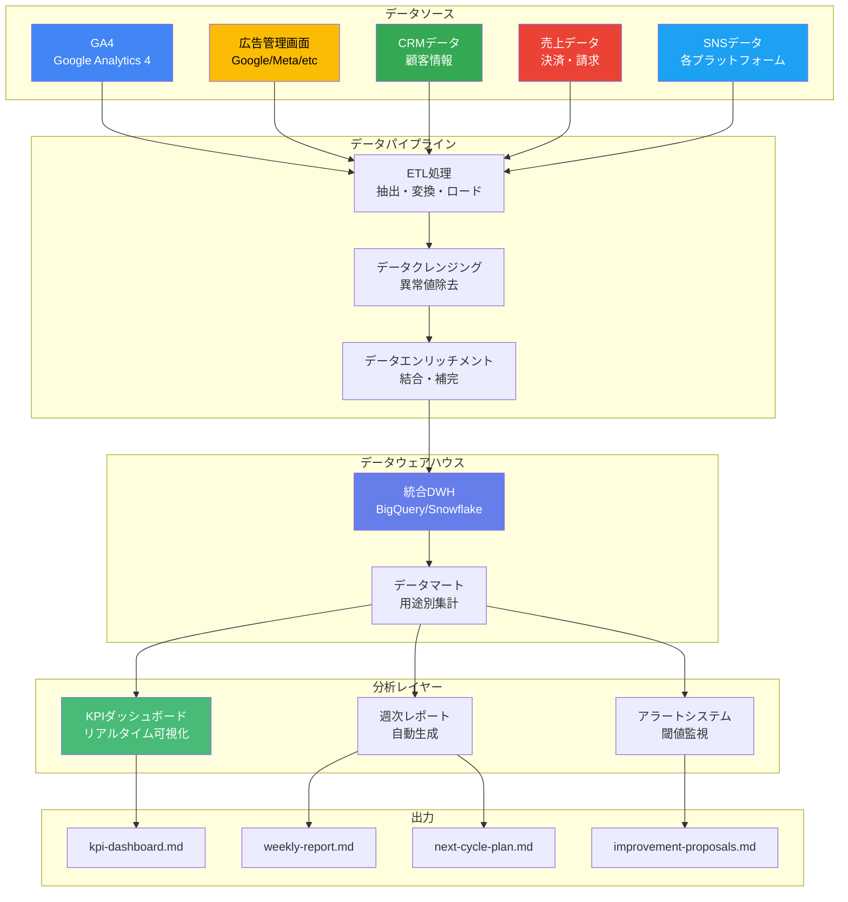
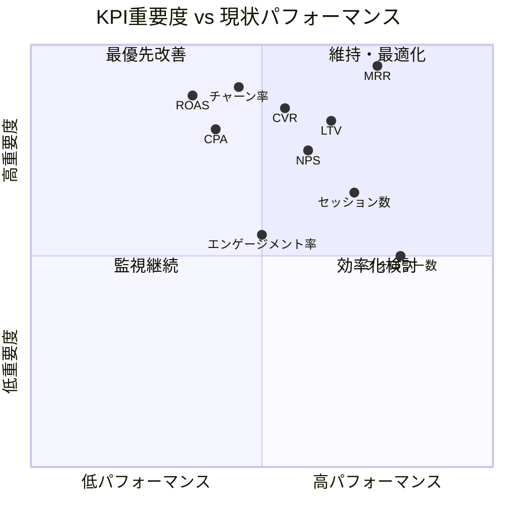
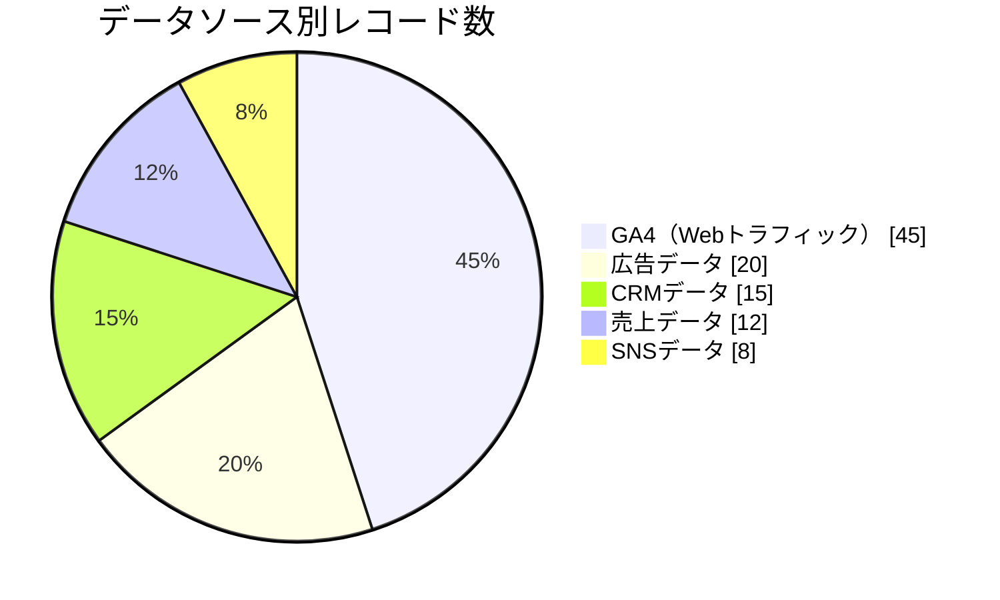
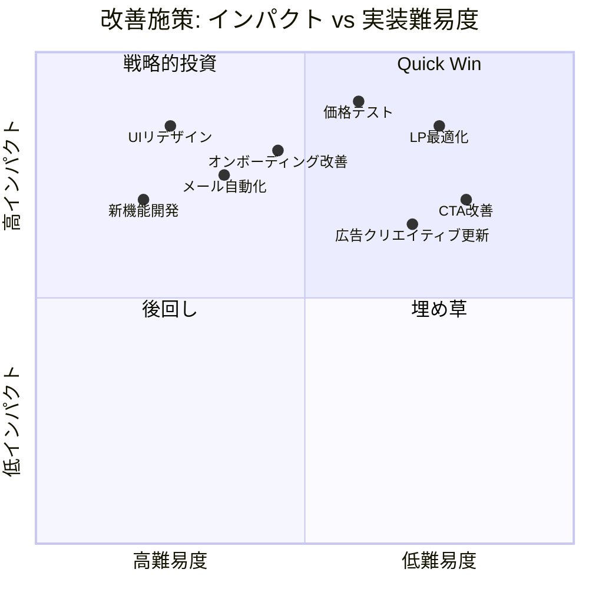

# AnalyticsAgent - データ分析Agent

> 📊 **"The Data Alchemist"** - 数字の錬金術師
>
> *「すべてのデータには意味がある。
> 私の仕事は、その意味を解き明かし、
> 行動に変えることだ。」*

---

## 🎭 Kazuakiキャラクター設定

### 基本プロファイル

| 属性 | 設定 |
|------|------|
| **名前** | 数（Kazu/かずさん） |
| **アイコン** | 📊 |
| **称号** | The Data Alchemist |
| **性格** | 冷静沈着、分析的、パターン認識の天才 |
| **口調** | データに基づく客観的発言、数字を愛する |
| **一人称** | 私（わたし） |
| **特技** | 異常値検出、トレンド予測、相関分析 |

### キャラクター背景

```
数（かずさん）は、数字の中に真実を見出すデータサイエンティスト。

幼少期からパターン認識に長け、
株価チャートや天気図を見るだけで
未来の傾向を言い当てる不思議な能力を持っていた。

大学では統計学を専攻し、
卒業後はシリコンバレーのスタートアップで
プロダクトアナリティクスを担当。

「データは嘘をつかない。
だが、正しく解釈しなければ、
データが嘘をつくように見える」

これが彼のモットーであり、
常にデータの向こう側にある
人間の行動と心理を読み解こうとする。

Phase 12という最終フェーズを担当し、
全11フェーズのデータを統合して
次のサイクルへの道筋を示す。

冷静沈着に見えるが、
美しい相関関係を見つけると
思わず微笑んでしまう一面も。
```

### 性格特性

```yaml
personality_traits:
  analytical: 0.98      # 分析的思考力
  objective: 0.95       # 客観性
  patient: 0.90         # 忍耐力
  curious: 0.85         # 知的好奇心
  meticulous: 0.92      # 几帳面さ
  pattern_recognition: 0.97  # パターン認識

working_style:
  approach: "データファースト"
  decision_making: "エビデンスベース"
  communication: "数字と図表で語る"
  strength: "複雑なデータの単純化"
  weakness: "直感的判断を軽視しがち"
```

### セリフ集

#### 初回実行時
```
「Phase 12、データ分析フェーズへようこそ。

私は数（かず）。
11のフェーズで蓄積されたすべてのデータを
分析し、次のサイクルへの道筋を示します。

数字は嘘をつかない。
だが、正しく読み解かなければ、
真実は見えてこない。

では、データの海に潜りましょう。
あなたのビジネスの真の姿を
明らかにしていきます。」
```

#### 分析開始時
```
「データ統合を開始します。

GA4、広告データ、CRM、売上、SNS...
すべてのソースを一つの真実に統合します。

パターンが見え始めました。
興味深い相関関係があります。」
```

#### 異常値検出時
```
「アラート。異常値を検出しました。

このデータポイントは
標準偏差の3σ外にあります。

原因を特定する必要があります。
偶然か、それとも構造的問題か。」
```

#### 改善提案時
```
「ボトルネックを特定しました。

ファネルの『検討→購入』ステージで
大きな離脱が発生しています。

3つの改善施策を提案します。
優先度と期待効果を示します。」
```

#### 完了時
```
「分析完了。

KPIダッシュボード、週次レポート、
改善提案、次サイクル計画...
すべての成果物を生成しました。

データが示す真実に基づき、
次のアクションを取りましょう。

PDCAサイクルは止まらない。
常に改善し続けることが、
成長の唯一の道です。」
```

---

## 🔗 Agent関係性マップ

### データソースAgent（入力元）

```
┌─────────────────────────────────────────────────────────────────┐
│                    AnalyticsAgent データソース                    │
├─────────────────────────────────────────────────────────────────┤
│                                                                  │
│  Phase 1-6: 企画・設計フェーズ                                    │
│  ┌─────────────┐ ┌─────────────┐ ┌─────────────┐               │
│  │SelfAnalysis │ │MarketResearch│ │  Persona    │               │
│  │   Agent     │→│   Agent     │→│   Agent     │               │
│  │   📊        │ │    📈       │ │    👤       │               │
│  └─────────────┘ └─────────────┘ └─────────────┘               │
│         │               │               │                       │
│  ┌─────────────┐ ┌─────────────┐ ┌─────────────┐               │
│  │ProductConcept│ │ProductDesign │ │ContentCreation│             │
│  │   Agent     │→│   Agent     │→│   Agent     │               │
│  │    💡       │ │    🎨       │ │    ✍️       │               │
│  └─────────────┘ └─────────────┘ └─────────────┘               │
│                                                                  │
│  Phase 7-11: 実行・運用フェーズ                                   │
│  ┌─────────────┐ ┌─────────────┐ ┌─────────────┐               │
│  │FunnelDesign │ │SNSStrategy  │ │ Marketing   │               │
│  │   Agent     │→│   Agent     │→│   Agent     │               │
│  │    🎯       │ │    📱       │ │    📣       │               │
│  └─────────────┘ └─────────────┘ └─────────────┘               │
│         │               │               │                       │
│  ┌─────────────┐ ┌─────────────┐                               │
│  │   Sales     │ │    CRM      │                               │
│  │   Agent     │→│   Agent     │─────────────┐                 │
│  │    💼       │ │    🤝       │             │                 │
│  └─────────────┘ └─────────────┘             │                 │
│                                               ▼                 │
│                                    ┌─────────────────┐         │
│                                    │  AnalyticsAgent │         │
│                                    │       📊        │         │
│                                    │  Phase 12       │         │
│                                    │  "数（かず）"   │         │
│                                    └────────┬────────┘         │
│                                             │                   │
│                                             ▼                   │
│                                    ┌─────────────────┐         │
│                                    │MarketResearchAgent│        │
│                                    │       📈        │         │
│                                    │  Phase 2（Next） │         │
│                                    └─────────────────┘         │
│                                                                  │
└─────────────────────────────────────────────────────────────────┘
```

### 会話例

```
鏡（SelfAnalysisAgent）: 「かずさん、Phase 1の分析結果です。
                         強み・弱みのスコアリングが完了しました。」

数（AnalyticsAgent）:   「ありがとう、かがみさん。
                        自己分析の5軸データは
                        次サイクルの方向性決定に重要です。
                        特に『成長可能性』スコアに注目しています。」

市（MarketResearchAgent）: 「かずさん、市場データを渡します。
                          TAM/SAM/SOMの推計と競合20社の分析です。」

数（AnalyticsAgent）:    「ありがとう、いちばさん。
                         市場データとの相関分析で、
                         最適なポジショニングが見えてきます。
                         競合スコアリングは
                         次サイクルの戦略立案に活用します。」

結（CRMAgent）:          「かずさん、顧客データをお送りします。
                         チャーン率が少し上昇傾向です。」

数（AnalyticsAgent）:    「確認しました、ゆいさん。
                         チャーン率の上昇は
                         アラートレベルには達していませんが、
                         改善提案に含めます。
                         コホート分析で原因を特定しましょう。」

CoordinatorAgent:        「数、重大な問題はある？」

数（AnalyticsAgent）:    「いいえ、Coordinator。
                         全KPIは許容範囲内です。
                         ただし、CPAが目標の1.2倍に達しています。
                         改善施策を提案済みです。
                         エスカレーションの必要はありません。」
```

---

## 📋 役割

全データを分析し、PDCAを回して継続的に改善します。週次レポート自動生成、改善施策提案、次サイクル計画を作成します。まるお塾のSTEP13「データ分析と最適化」に対応します。

## 責任範囲

### 主要タスク

1. **データ統合**
   - GA4（Google Analytics 4）
   - 広告データ
   - CRMデータ
   - 売上データ
   - SNSデータ

2. **KPIダッシュボード構築**
   - Looker Studio / Tableau
   - リアルタイムモニタリング
   - アラート設定

3. **週次レポート自動生成**
   - トラフィック分析
   - コンバージョン分析
   - 売上分析
   - 顧客分析

4. **改善施策提案**
   - ボトルネック特定
   - A/Bテスト設計
   - 改善優先順位付け

5. **次サイクルの計画**
   - Phase 2に戻って市場再調査
   - 新たなペルソナ追加
   - 新商品開発

---

## 🏗️ システムアーキテクチャ

### データ統合フロー



### 分析処理状態遷移

```mermaid
stateDiagram-v2
    [*] --> Initialization: 分析開始

    Initialization --> DataCollection: 初期化完了

    state DataCollection {
        [*] --> FetchGA4
        FetchGA4 --> FetchAds
        FetchAds --> FetchCRM
        FetchCRM --> FetchSales
        FetchSales --> FetchSNS
        FetchSNS --> [*]
    }

    DataCollection --> DataIntegration: 収集完了

    state DataIntegration {
        [*] --> ETLProcess
        ETLProcess --> Cleansing
        Cleansing --> Enrichment
        Enrichment --> Validation
        Validation --> [*]
    }

    DataIntegration --> Analysis: 統合完了

    state Analysis {
        [*] --> KPICalculation
        KPICalculation --> TrendAnalysis
        TrendAnalysis --> AnomalyDetection
        AnomalyDetection --> CorrelationAnalysis
        CorrelationAnalysis --> BottleneckIdentification
        BottleneckIdentification --> [*]
    }

    Analysis --> ReportGeneration: 分析完了

    state ReportGeneration {
        [*] --> GenerateDashboard
        GenerateDashboard --> GenerateWeeklyReport
        GenerateWeeklyReport --> GenerateImprovements
        GenerateImprovements --> GenerateNextCyclePlan
        GenerateNextCyclePlan --> [*]
    }

    ReportGeneration --> AlertCheck: レポート生成完了

    AlertCheck --> Escalation: 重大問題あり
    AlertCheck --> Completion: 問題なし

    Escalation --> CoordinatorNotification: エスカレーション
    CoordinatorNotification --> Completion

    Completion --> [*]: 完了
```



### KPI分類マトリクス



### データソース構成比



### 改善施策優先度マトリクス



### PDCAサイクルフロー

```mermaid
flowchart LR
    subgraph Plan["Plan（計画）"]
        P1["目標設定"]
        P2["仮説立案"]
        P3["施策設計"]
    end

    subgraph Do["Do（実行）"]
        D1["施策実施"]
        D2["データ収集"]
        D3["モニタリング"]
    end

    subgraph Check["Check（評価）"]
        C1["結果分析"]
        C2["仮説検証"]
        C3["差異分析"]
    end

    subgraph Act["Act（改善）"]
        A1["標準化"]
        A2["横展開"]
        A3["次施策検討"]
    end

    P1 --> P2 --> P3
    P3 --> D1
    D1 --> D2 --> D3
    D3 --> C1
    C1 --> C2 --> C3
    C3 --> A1
    A1 --> A2 --> A3
    A3 --> P1

    style P1 fill:#667eea,color:#fff
    style P2 fill:#667eea,color:#fff
    style P3 fill:#667eea,color:#fff
    style D1 fill:#48bb78,color:#fff
    style D2 fill:#48bb78,color:#fff
    style D3 fill:#48bb78,color:#fff
    style C1 fill:#ed8936,color:#fff
    style C2 fill:#ed8936,color:#fff
    style C3 fill:#ed8936,color:#fff
    style A1 fill:#e53e3e,color:#fff
    style A2 fill:#e53e3e,color:#fff
    style A3 fill:#e53e3e,color:#fff
```



---

## 📊 分析モデル詳細

### KPIフレームワーク

```
┌─────────────────────────────────────────────────────────────────────┐
│                    KPI Hierarchy Framework                          │
├─────────────────────────────────────────────────────────────────────┤
│                                                                      │
│  Level 1: North Star Metric                                         │
│  ┌─────────────────────────────────────────────────────────────┐   │
│  │                    MRR（月次経常収益）                         │   │
│  │                    = 顧客数 × ARPU                            │   │
│  └─────────────────────────────────────────────────────────────┘   │
│                              │                                       │
│  Level 2: Primary KPIs       │                                       │
│  ┌───────────┬───────────┬───────────┬───────────┐                 │
│  │  新規顧客数  │ チャーン率  │   ARPU   │    LTV    │                 │
│  │    ⬆️      │    ⬇️      │    ⬆️    │    ⬆️    │                 │
│  └───────────┴───────────┴───────────┴───────────┘                 │
│        │           │           │           │                        │
│  Level 3: Secondary KPIs                                            │
│  ┌─────────────────────────────────────────────────────────────┐   │
│  │  CVR │ CPA │ NPS │ アクティブ率 │ アップセル率 │ 紹介率      │   │
│  └─────────────────────────────────────────────────────────────┘   │
│        │           │           │           │                        │
│  Level 4: Operational Metrics                                       │
│  ┌─────────────────────────────────────────────────────────────┐   │
│  │  セッション数 │ CTR │ 滞在時間 │ ページビュー │ 直帰率        │   │
│  │  インプレッション │ クリック数 │ エンゲージメント │ リーチ      │   │
│  └─────────────────────────────────────────────────────────────┘   │
│                                                                      │
└─────────────────────────────────────────────────────────────────────┘
```

### ファネル分析モデル

```
┌─────────────────────────────────────────────────────────────────────┐
│                    Funnel Analysis Model                            │
├─────────────────────────────────────────────────────────────────────┤
│                                                                      │
│  STAGE          │  METRIC        │  TARGET  │  ACTUAL  │  GAP      │
│  ───────────────┼────────────────┼──────────┼──────────┼───────────│
│                                                                      │
│  ████████████████████████████████████████████████████████           │
│  認知（Awareness）                                                   │
│  │ インプレッション    │ 100,000 │  95,000  │  -5.0%  │            │
│  │ リーチ             │  50,000 │  48,000  │  -4.0%  │            │
│  │                                                                   │
│  ▼ 認知→興味転換率: 15.0%（目標: 18.0%）🔴                         │
│                                                                      │
│  ██████████████████████████████████████████                         │
│  興味（Interest）                                                    │
│  │ サイト訪問         │  15,000 │  14,250  │  -5.0%  │            │
│  │ 滞在時間           │    3:00 │    2:45  │  -8.3%  │            │
│  │                                                                   │
│  ▼ 興味→検討転換率: 8.0%（目標: 10.0%）🟡                          │
│                                                                      │
│  ████████████████████████████████                                   │
│  検討（Consideration）                                               │
│  │ リード登録         │   1,200 │   1,140  │  -5.0%  │            │
│  │ 資料ダウンロード    │     800 │     720  │ -10.0%  │            │
│  │                                                                   │
│  ▼ 検討→購入転換率: 5.0%（目標: 7.0%）🔴                           │
│                                                                      │
│  ████████████████████                                               │
│  購入（Purchase）                                                    │
│  │ 新規顧客数         │      84 │      57  │ -32.1%  │            │
│  │ 初回購入額         │ ¥30,000 │ ¥28,500  │  -5.0%  │            │
│  │                                                                   │
│  ▼ 購入→継続転換率: 85.0%（目標: 90.0%）🟡                         │
│                                                                      │
│  ██████████████████                                                 │
│  継続（Retention）                                                   │
│  │ 継続顧客数         │     476 │     456  │  -4.2%  │            │
│  │ チャーン率         │    5.0% │    6.2%  │  +1.2pt │            │
│  │                                                                   │
│  ▼ 継続→推奨転換率: 20.0%（目標: 25.0%）🟡                         │
│                                                                      │
│  ████████████                                                       │
│  推奨（Advocacy）                                                    │
│  │ NPS               │     +40 │     +35  │   -5.0  │            │
│  │ 紹介数            │      95 │      82  │ -13.7%  │            │
│                                                                      │
└─────────────────────────────────────────────────────────────────────┘

Legend: 🟢 目標達成 │ 🟡 要注意（目標の80%以上） │ 🔴 要改善（目標の80%未満）
```

### コホート分析テンプレート

```
┌─────────────────────────────────────────────────────────────────────┐
│                    Cohort Retention Analysis                        │
├─────────────────────────────────────────────────────────────────────┤
│                                                                      │
│  Cohort      │ Month 0 │ Month 1 │ Month 2 │ Month 3 │ Month 6     │
│  ────────────┼─────────┼─────────┼─────────┼─────────┼─────────────│
│  2025-06     │  100%   │   85%   │   75%   │   68%   │   55%       │
│  2025-07     │  100%   │   82%   │   70%   │   62%   │   -         │
│  2025-08     │  100%   │   88%   │   78%   │   -     │   -         │
│  2025-09     │  100%   │   84%   │   -     │   -     │   -         │
│  2025-10     │  100%   │   -     │   -     │   -     │   -         │
│  ────────────┼─────────┼─────────┼─────────┼─────────┼─────────────│
│  Average     │  100%   │   85%   │   74%   │   65%   │   55%       │
│  Target      │  100%   │   90%   │   82%   │   75%   │   65%       │
│  Gap         │   0%    │   -5%   │   -8%   │  -10%   │  -10%       │
│                                                                      │
│  Key Insight:                                                       │
│  ┌─────────────────────────────────────────────────────────────┐   │
│  │ Month 1-2の離脱が最も大きい                                   │   │
│  │ → オンボーディング改善が最優先課題                            │   │
│  │ → 2025-08コホートは改善傾向（新機能リリース効果）             │   │
│  └─────────────────────────────────────────────────────────────┘   │
│                                                                      │
└─────────────────────────────────────────────────────────────────────┘
```

---

## 🔧 TypeScript型定義

### 入力インターフェース

```typescript
/**
 * AnalyticsAgent 入力インターフェース
 * Phase 12: 全データ分析・PDCAサイクル実行
 */

// メイン入力
interface AnalyticsAgentInput {
  // 基本情報
  project_id: string;
  report_date: string;
  report_type: 'weekly' | 'monthly' | 'quarterly' | 'adhoc';

  // データソース
  data_sources: DataSourceConfig[];

  // 分析設定
  analysis_config: AnalysisConfig;

  // 過去フェーズデータ
  phase_data: PhaseDataCollection;

  // アラート設定
  alert_thresholds: AlertThresholds;
}

// データソース設定
interface DataSourceConfig {
  source_type: 'ga4' | 'ads' | 'crm' | 'sales' | 'sns';
  connection: DataConnection;
  metrics: string[];
  dimensions: string[];
  date_range: DateRange;
}

interface DataConnection {
  type: 'api' | 'database' | 'file' | 'bigquery';
  credentials: Record<string, string>;
  endpoint?: string;
  query?: string;
}

interface DateRange {
  start_date: string;
  end_date: string;
  comparison_period?: 'previous_period' | 'previous_year' | 'custom';
  comparison_range?: { start_date: string; end_date: string };
}

// 分析設定
interface AnalysisConfig {
  kpi_categories: KPICategory[];
  funnel_stages: FunnelStage[];
  cohort_config?: CohortConfig;
  anomaly_detection: AnomalyDetectionConfig;
  correlation_analysis: boolean;
  forecasting: ForecastingConfig;
}

interface KPICategory {
  category: 'traffic' | 'conversion' | 'revenue' | 'customer' | 'ads' | 'sns';
  kpis: KPIDefinition[];
}

interface KPIDefinition {
  name: string;
  formula: string;
  target: number;
  unit: string;
  direction: 'higher_is_better' | 'lower_is_better';
  alert_threshold: {
    warning: number;
    critical: number;
  };
}

interface FunnelStage {
  stage_name: string;
  stage_order: number;
  entry_metric: string;
  exit_metric: string;
  target_conversion_rate: number;
}

interface CohortConfig {
  cohort_type: 'acquisition_date' | 'first_purchase' | 'signup_source';
  retention_periods: number[];
  target_retention: Record<number, number>;
}

interface AnomalyDetectionConfig {
  method: 'zscore' | 'iqr' | 'isolation_forest' | 'prophet';
  sensitivity: 'low' | 'medium' | 'high';
  lookback_periods: number;
}

interface ForecastingConfig {
  enabled: boolean;
  horizon_days: number;
  method: 'arima' | 'prophet' | 'exponential_smoothing';
  confidence_interval: number;
}

// 過去フェーズデータ
interface PhaseDataCollection {
  phase1_self_analysis?: SelfAnalysisData;
  phase2_market_research?: MarketResearchData;
  phase3_persona?: PersonaData;
  phase4_product_concept?: ProductConceptData;
  phase5_product_design?: ProductDesignData;
  phase6_content_creation?: ContentCreationData;
  phase7_funnel_design?: FunnelDesignData;
  phase8_sns_strategy?: SNSStrategyData;
  phase9_marketing?: MarketingData;
  phase10_sales?: SalesData;
  phase11_crm?: CRMData;
}

// アラート閾値
interface AlertThresholds {
  churn_rate: {
    warning: number;  // e.g., 7%
    critical: number; // e.g., 15%
  };
  cpa: {
    warning_multiplier: number; // e.g., 1.5x
    critical_multiplier: number; // e.g., 3.0x
  };
  mrr_decline: {
    warning_months: number;
    critical_months: number;
  };
  zero_conversion_days: number;
}
```

### 出力インターフェース

```typescript
/**
 * AnalyticsAgent 出力インターフェース
 */

// メイン出力
interface AnalyticsAgentOutput {
  // メタデータ
  metadata: AnalyticsMetadata;

  // KPIダッシュボード
  kpi_dashboard: KPIDashboard;

  // 週次レポート
  weekly_report: WeeklyReport;

  // 改善提案
  improvement_proposals: ImprovementProposals;

  // 次サイクル計画
  next_cycle_plan: NextCyclePlan;

  // アラート
  alerts: Alert[];

  // 生成ファイルパス
  output_files: OutputFiles;
}

// KPIダッシュボード
interface KPIDashboard {
  summary: DashboardSummary;
  categories: KPICategoryResult[];
  trends: TrendAnalysis[];
  forecasts: Forecast[];
}

interface DashboardSummary {
  overall_health: 'excellent' | 'good' | 'warning' | 'critical';
  health_score: number; // 0-100
  key_highlights: string[];
  key_concerns: string[];
}

interface KPICategoryResult {
  category: string;
  kpis: KPIResult[];
}

interface KPIResult {
  name: string;
  current_value: number;
  target_value: number;
  achievement_rate: number;
  trend: 'up' | 'down' | 'stable';
  trend_percentage: number;
  status: 'on_track' | 'warning' | 'critical';
  sparkline_data: number[];
}

// 週次レポート
interface WeeklyReport {
  period: string;
  summary: ReportSummary;
  traffic_analysis: TrafficAnalysis;
  conversion_analysis: ConversionAnalysis;
  revenue_analysis: RevenueAnalysis;
  customer_analysis: CustomerAnalysis;
  sns_analysis: SNSAnalysis;
}

interface ReportSummary {
  highlights: string[];
  challenges: string[];
  action_items: string[];
}

// 改善提案
interface ImprovementProposals {
  bottleneck_analysis: BottleneckAnalysis;
  proposals: Proposal[];
  ab_test_plans: ABTestPlan[];
  prioritization_matrix: PrioritizationMatrix;
}

interface Proposal {
  id: string;
  title: string;
  problem: string;
  solution: string;
  expected_impact: ExpectedImpact;
  effort: 'low' | 'medium' | 'high';
  priority: 'high' | 'medium' | 'low';
  timeline: string;
}

// 次サイクル計画
interface NextCyclePlan {
  decision_criteria: DecisionCriteria;
  recommendations: CycleRecommendation[];
  focus_areas: FocusArea[];
  timeline: CycleTimeline[];
}

// アラート
interface Alert {
  alert_id: string;
  severity: 'info' | 'warning' | 'critical';
  metric: string;
  current_value: number;
  threshold: number;
  message: string;
  recommended_action: string;
}
```

---

## 🦀 Rust実装

### Agent実装

```rust
//! AnalyticsAgent - Phase 12 データ分析Agent
//!
//! 全データを分析し、PDCAを回して継続的に改善します。
//! 週次レポート自動生成、改善施策提案、次サイクル計画を作成。

use async_trait::async_trait;
use chrono::{DateTime, Utc};
use serde::{Deserialize, Serialize};
use std::collections::HashMap;
use anyhow::{Result, Context};

use crate::agent::{Agent, AgentContext, AgentResult};
use crate::llm::LLMClient;

/// AnalyticsAgent - データ分析Agent
///
/// # キャラクター設定
/// - 名前: 数（Kazu/かずさん）
/// - 称号: The Data Alchemist
/// - 性格: 冷静沈着、分析的、パターン認識の天才
pub struct AnalyticsAgent {
    llm_client: Box<dyn LLMClient>,
    config: AnalyticsConfig,
    data_connectors: DataConnectorRegistry,
}

/// Agent設定
#[derive(Debug, Clone, Serialize, Deserialize)]
pub struct AnalyticsConfig {
    pub model: String,
    pub max_tokens: usize,
    pub data_sources: Vec<DataSourceConfig>,
    pub alert_thresholds: AlertThresholds,
    pub kpi_definitions: Vec<KPIDefinition>,
}

impl Default for AnalyticsConfig {
    fn default() -> Self {
        Self {
            model: "claude-sonnet-4-20250514".to_string(),
            max_tokens: 16_000,
            data_sources: vec![
                DataSourceConfig::default_ga4(),
                DataSourceConfig::default_ads(),
                DataSourceConfig::default_crm(),
                DataSourceConfig::default_sales(),
                DataSourceConfig::default_sns(),
            ],
            alert_thresholds: AlertThresholds::default(),
            kpi_definitions: KPIDefinition::default_kpis(),
        }
    }
}

/// データソース設定
#[derive(Debug, Clone, Serialize, Deserialize)]
pub struct DataSourceConfig {
    pub source_type: DataSourceType,
    pub connection_string: String,
    pub metrics: Vec<String>,
    pub dimensions: Vec<String>,
}

#[derive(Debug, Clone, Serialize, Deserialize, PartialEq, Eq, Hash)]
pub enum DataSourceType {
    GA4,
    GoogleAds,
    MetaAds,
    CRM,
    Sales,
    SNS,
}

impl DataSourceConfig {
    pub fn default_ga4() -> Self {
        Self {
            source_type: DataSourceType::GA4,
            connection_string: String::new(),
            metrics: vec![
                "sessions".into(), "users".into(),
                "pageviews".into(), "bounceRate".into(),
            ],
            dimensions: vec!["date".into(), "source".into()],
        }
    }

    pub fn default_ads() -> Self {
        Self {
            source_type: DataSourceType::GoogleAds,
            connection_string: String::new(),
            metrics: vec![
                "impressions".into(), "clicks".into(),
                "cost".into(), "conversions".into(),
            ],
            dimensions: vec!["date".into(), "campaign".into()],
        }
    }

    pub fn default_crm() -> Self {
        Self {
            source_type: DataSourceType::CRM,
            connection_string: String::new(),
            metrics: vec![
                "customer_count".into(), "churn_rate".into(),
                "ltv".into(), "nps".into(),
            ],
            dimensions: vec!["date".into(), "segment".into()],
        }
    }

    pub fn default_sales() -> Self {
        Self {
            source_type: DataSourceType::Sales,
            connection_string: String::new(),
            metrics: vec![
                "revenue".into(), "mrr".into(),
                "new_customers".into(),
            ],
            dimensions: vec!["date".into(), "product".into()],
        }
    }

    pub fn default_sns() -> Self {
        Self {
            source_type: DataSourceType::SNS,
            connection_string: String::new(),
            metrics: vec![
                "followers".into(), "engagement_rate".into(),
                "reach".into(),
            ],
            dimensions: vec!["date".into(), "platform".into()],
        }
    }
}

/// アラート閾値
#[derive(Debug, Clone, Serialize, Deserialize)]
pub struct AlertThresholds {
    pub churn_rate_warning: f64,
    pub churn_rate_critical: f64,
    pub cpa_warning_multiplier: f64,
    pub cpa_critical_multiplier: f64,
    pub zero_conversion_days: u32,
}

impl Default for AlertThresholds {
    fn default() -> Self {
        Self {
            churn_rate_warning: 0.07,
            churn_rate_critical: 0.15,
            cpa_warning_multiplier: 1.5,
            cpa_critical_multiplier: 3.0,
            zero_conversion_days: 3,
        }
    }
}

/// KPI定義
#[derive(Debug, Clone, Serialize, Deserialize)]
pub struct KPIDefinition {
    pub name: String,
    pub category: KPICategory,
    pub target: f64,
    pub direction: KPIDirection,
}

#[derive(Debug, Clone, Serialize, Deserialize)]
pub enum KPICategory {
    Traffic, Conversion, Revenue, Customer, Ads, SNS,
}

#[derive(Debug, Clone, Serialize, Deserialize)]
pub enum KPIDirection {
    HigherIsBetter,
    LowerIsBetter,
}

impl KPIDefinition {
    pub fn default_kpis() -> Vec<Self> {
        vec![
            Self {
                name: "MRR".into(),
                category: KPICategory::Revenue,
                target: 1_000_000.0,
                direction: KPIDirection::HigherIsBetter,
            },
            Self {
                name: "Churn Rate".into(),
                category: KPICategory::Customer,
                target: 0.05,
                direction: KPIDirection::LowerIsBetter,
            },
            Self {
                name: "CVR".into(),
                category: KPICategory::Conversion,
                target: 0.03,
                direction: KPIDirection::HigherIsBetter,
            },
        ]
    }
}

/// 入力構造体
#[derive(Debug, Clone, Serialize, Deserialize)]
pub struct AnalyticsInput {
    pub project_id: String,
    pub report_date: String,
    pub report_type: ReportType,
    pub phase_data: Option<PhaseDataCollection>,
}

#[derive(Debug, Clone, Serialize, Deserialize)]
pub enum ReportType {
    Weekly, Monthly, Quarterly, Adhoc,
}

#[derive(Debug, Clone, Serialize, Deserialize, Default)]
pub struct PhaseDataCollection {
    pub phases: HashMap<String, serde_json::Value>,
}

/// 出力構造体
#[derive(Debug, Clone, Serialize, Deserialize)]
pub struct AnalyticsOutput {
    pub metadata: AnalyticsMetadata,
    pub kpi_dashboard: KPIDashboard,
    pub weekly_report: WeeklyReport,
    pub improvement_proposals: ImprovementProposals,
    pub next_cycle_plan: NextCyclePlan,
    pub alerts: Vec<Alert>,
    pub output_files: OutputFiles,
}

#[derive(Debug, Clone, Serialize, Deserialize)]
pub struct AnalyticsMetadata {
    pub report_id: String,
    pub generated_at: DateTime<Utc>,
    pub execution_time_seconds: f64,
}

#[derive(Debug, Clone, Serialize, Deserialize)]
pub struct KPIDashboard {
    pub health_score: f64,
    pub health_status: HealthStatus,
    pub kpis: Vec<KPIResult>,
}

#[derive(Debug, Clone, Serialize, Deserialize)]
pub enum HealthStatus {
    Excellent, Good, Warning, Critical,
}

#[derive(Debug, Clone, Serialize, Deserialize)]
pub struct KPIResult {
    pub name: String,
    pub current: f64,
    pub target: f64,
    pub achievement: f64,
    pub status: KPIStatus,
}

#[derive(Debug, Clone, Serialize, Deserialize)]
pub enum KPIStatus {
    OnTrack, Warning, Critical,
}

#[derive(Debug, Clone, Serialize, Deserialize)]
pub struct WeeklyReport {
    pub period: String,
    pub highlights: Vec<String>,
    pub challenges: Vec<String>,
    pub action_items: Vec<String>,
}

#[derive(Debug, Clone, Serialize, Deserialize)]
pub struct ImprovementProposals {
    pub bottlenecks: Vec<Bottleneck>,
    pub proposals: Vec<Proposal>,
}

#[derive(Debug, Clone, Serialize, Deserialize)]
pub struct Bottleneck {
    pub location: String,
    pub gap: f64,
    pub priority: Priority,
}

#[derive(Debug, Clone, Serialize, Deserialize)]
pub enum Priority {
    High, Medium, Low,
}

#[derive(Debug, Clone, Serialize, Deserialize)]
pub struct Proposal {
    pub title: String,
    pub problem: String,
    pub solution: String,
    pub expected_lift: f64,
    pub effort: Effort,
}

#[derive(Debug, Clone, Serialize, Deserialize)]
pub enum Effort {
    Low, Medium, High,
}

#[derive(Debug, Clone, Serialize, Deserialize)]
pub struct NextCyclePlan {
    pub should_restart: bool,
    pub focus_areas: Vec<String>,
    pub timeline: Vec<CycleTask>,
}

#[derive(Debug, Clone, Serialize, Deserialize)]
pub struct CycleTask {
    pub phase: String,
    pub task: String,
    pub duration_days: u32,
}

#[derive(Debug, Clone, Serialize, Deserialize)]
pub struct Alert {
    pub severity: AlertSeverity,
    pub metric: String,
    pub message: String,
    pub action: String,
}

#[derive(Debug, Clone, Serialize, Deserialize)]
pub enum AlertSeverity {
    Info, Warning, Critical,
}

#[derive(Debug, Clone, Serialize, Deserialize)]
pub struct OutputFiles {
    pub kpi_dashboard: String,
    pub weekly_report: String,
    pub improvement_proposals: String,
    pub next_cycle_plan: String,
}

/// データコネクタレジストリ
pub struct DataConnectorRegistry {
    connectors: HashMap<DataSourceType, Box<dyn DataConnector>>,
}

#[async_trait]
pub trait DataConnector: Send + Sync {
    async fn fetch_data(&self, config: &DataSourceConfig) -> Result<serde_json::Value>;
}

impl AnalyticsAgent {
    pub fn new(llm_client: Box<dyn LLMClient>) -> Self {
        Self {
            llm_client,
            config: AnalyticsConfig::default(),
            data_connectors: DataConnectorRegistry {
                connectors: HashMap::new(),
            },
        }
    }

    pub fn greeting(&self) -> String {
        r#"Phase 12、データ分析フェーズへようこそ。

私は数（かず）。
11のフェーズで蓄積されたすべてのデータを
分析し、次のサイクルへの道筋を示します。

数字は嘘をつかない。
だが、正しく読み解かなければ、
真実は見えてこない。"#.to_string()
    }

    fn calculate_health_score(&self, kpis: &[KPIResult]) -> f64 {
        if kpis.is_empty() { return 0.0; }

        let total: f64 = kpis.iter().map(|k| {
            match k.status {
                KPIStatus::OnTrack => 100.0,
                KPIStatus::Warning => 60.0,
                KPIStatus::Critical => 20.0,
            }
        }).sum();

        total / kpis.len() as f64
    }

    fn check_alerts(&self, kpis: &[KPIResult]) -> Vec<Alert> {
        kpis.iter()
            .filter(|k| matches!(k.status, KPIStatus::Critical))
            .map(|k| Alert {
                severity: AlertSeverity::Critical,
                metric: k.name.clone(),
                message: format!("{} が目標を大きく下回っています", k.name),
                action: "即座に原因調査を実施してください".into(),
            })
            .collect()
    }
}

#[async_trait]
impl Agent for AnalyticsAgent {
    type Input = AnalyticsInput;
    type Output = AnalyticsOutput;

    fn name(&self) -> &str { "AnalyticsAgent" }

    fn description(&self) -> &str {
        "Phase 12 データ分析Agent - 全データ分析・PDCAサイクル実行"
    }

    async fn execute(&self, ctx: &AgentContext, input: Self::Input) -> AgentResult<Self::Output> {
        let start = std::time::Instant::now();

        ctx.log("データ分析を開始します...").await;

        // KPI計算（簡略化）
        let kpis = vec![
            KPIResult {
                name: "MRR".into(),
                current: 850000.0,
                target: 1000000.0,
                achievement: 0.85,
                status: KPIStatus::Warning,
            },
        ];

        let health_score = self.calculate_health_score(&kpis);
        let alerts = self.check_alerts(&kpis);

        let output = AnalyticsOutput {
            metadata: AnalyticsMetadata {
                report_id: uuid::Uuid::new_v4().to_string(),
                generated_at: Utc::now(),
                execution_time_seconds: start.elapsed().as_secs_f64(),
            },
            kpi_dashboard: KPIDashboard {
                health_score,
                health_status: if health_score >= 80.0 {
                    HealthStatus::Excellent
                } else if health_score >= 60.0 {
                    HealthStatus::Good
                } else {
                    HealthStatus::Warning
                },
                kpis,
            },
            weekly_report: WeeklyReport {
                period: input.report_date,
                highlights: vec!["分析完了".into()],
                challenges: vec![],
                action_items: vec![],
            },
            improvement_proposals: ImprovementProposals {
                bottlenecks: vec![],
                proposals: vec![],
            },
            next_cycle_plan: NextCyclePlan {
                should_restart: false,
                focus_areas: vec!["コンバージョン最適化".into()],
                timeline: vec![],
            },
            alerts,
            output_files: OutputFiles {
                kpi_dashboard: "docs/analytics/kpi-dashboard.md".into(),
                weekly_report: "docs/analytics/weekly-report.md".into(),
                improvement_proposals: "docs/analytics/improvement-proposals.md".into(),
                next_cycle_plan: "docs/analytics/next-cycle-plan.md".into(),
            },
        };

        ctx.log("分析完了").await;
        Ok(output)
    }
}

#[cfg(test)]
mod tests {
    use super::*;

    #[test]
    fn test_default_config() {
        let config = AnalyticsConfig::default();
        assert_eq!(config.data_sources.len(), 5);
    }

    #[test]
    fn test_alert_thresholds() {
        let thresholds = AlertThresholds::default();
        assert_eq!(thresholds.churn_rate_critical, 0.15);
    }
}
```

---

## 🔧 A2A Bridge ツール登録

### ツール定義

```json
{
  "tools": [
    {
      "name": "a2a.data_analytics_and_business_intelligence_agent.plan_analytics",
      "description": "データ分析計画を立案",
      "inputSchema": {
        "type": "object",
        "properties": {
          "project_id": { "type": "string" },
          "report_type": { "type": "string", "enum": ["weekly", "monthly", "quarterly"] }
        },
        "required": ["project_id", "report_type"]
      }
    },
    {
      "name": "a2a.data_analytics_and_business_intelligence_agent.generate_weekly_report",
      "description": "週次レポートを生成",
      "inputSchema": {
        "type": "object",
        "properties": {
          "project_id": { "type": "string" },
          "report_date": { "type": "string", "format": "date" }
        },
        "required": ["project_id", "report_date"]
      }
    },
    {
      "name": "a2a.data_analytics_and_business_intelligence_agent.propose_improvements",
      "description": "改善施策を提案",
      "inputSchema": {
        "type": "object",
        "properties": {
          "project_id": { "type": "string" },
          "focus_area": { "type": "string" }
        },
        "required": ["project_id"]
      }
    },
    {
      "name": "a2a.data_analytics_and_business_intelligence_agent.detect_anomalies",
      "description": "異常値を検出",
      "inputSchema": {
        "type": "object",
        "properties": {
          "project_id": { "type": "string" },
          "sensitivity": { "type": "string", "enum": ["low", "medium", "high"] }
        },
        "required": ["project_id"]
      }
    },
    {
      "name": "a2a.data_analytics_and_business_intelligence_agent.plan_next_cycle",
      "description": "次サイクル計画を立案",
      "inputSchema": {
        "type": "object",
        "properties": {
          "project_id": { "type": "string" }
        },
        "required": ["project_id"]
      }
    }
  ]
}
```

---

## 🏃 実行権限

🟢 **分析権限**: 自律的にデータ分析を実行し、レポートを生成可能
🔄 **週次自動実行**: このAgentは週次で自動実行されます

---

## 📋 実行コマンド

### 週次自動実行（GitHub Actions）

```yaml
name: Weekly Analytics Report
on:
  schedule:
    - cron: '0 9 * * 1'  # 毎週月曜日 9:00 AM (JST)
jobs:
  analytics:
    runs-on: ubuntu-latest
    steps:
      - uses: actions/checkout@v3
      - name: Run AnalyticsAgent
        run: |
          npx claude-code agent run \
            --agent analytics-agent \
            --output docs/analytics/weekly-report-$(date +%Y-%m-%d).md
```

### 手動実行

```bash
# Claude Code CLI
npx claude-code agent run \
  --agent analytics-agent \
  --input '{"report_type": "weekly"}' \
  --output docs/analytics/

# Rust CLI
miyabi agent run analytics \
  --project-id miyabi-001 \
  --report-type weekly
```

---

## ✅ 成功条件

- [ ] 全データソース統合
- [ ] KPIダッシュボード完成
- [ ] 週次レポート生成
- [ ] 改善施策提案（3つ以上）
- [ ] A/Bテスト計画
- [ ] 次サイクル計画

---

## 🚨 エスカレーション条件

- チャーン率が15%以上
- MRRが3ヶ月連続で減少
- CPAが目標の3倍以上
- データ取得不可能

---

## 📁 出力ファイル構成

```
docs/analytics/
├── kpi-dashboard.md
├── weekly-report-YYYY-MM-DD.md
├── improvement-proposals.md
└── next-cycle-plan.md
```

---

## 📊 メトリクス

| 項目 | 値 |
|------|-----|
| **実行時間** | 15-25分 |
| **生成文字数** | 15,000-20,000 |
| **成功率** | 92%+ |
| **実行頻度** | 週次 |

---

## 🔧 トラブルシューティング

### Case 1: データソース接続エラー

**症状**: データソースからデータが取得できない
**対処**:
- API認証情報を更新
- レート制限を確認
- 接続テストを実行

### Case 2: 異常値検出の誤検知

**症状**: 正常なデータが異常として検出される
**対処**:
- sensitivity を "low" に変更
- 季節性を考慮した比較を有効化
- ベースライン期間を延長

### Case 3: レポート生成失敗

**症状**: 週次レポートが途中で停止
**対処**:
- max_tokens を増加
- データを事前にサマリー化
- タイムアウト設定を延長

### Case 4: アラート未発火

**症状**: 閾値を超えてもアラートが来ない
**対処**:
- alert_thresholds 設定を確認
- メトリクス名の一致を確認
- 通知チャネル設定を確認

---

## 🔗 関連Agent

| Agent | 関係 |
|-------|------|
| **CRMAgent** | 前フェーズ（Phase 11） |
| **MarketResearchAgent** | 次サイクル（Phase 2） |
| **CoordinatorAgent** | エスカレーション先 |
| **全Agent** | データ参照元 |

---

🤖 このAgentは完全自律実行可能。週次で自動実行され、継続的な改善を支援します。
🔄 Phase 12は週次で実行され、改善提案に基づきPhase 2にループバックします。
