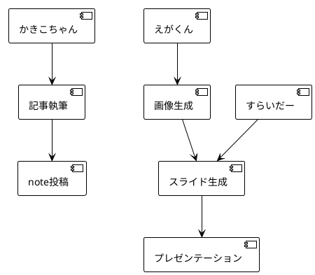

# ImageGenAgent仕様書

**バージョン**: v2.0.0
**ステータス**: 📋 Planning (実装予定)
**Target Release**: v1.3.0
**最終更新**: 2025-10-22
**カテゴリ**: Business Agent（16個目）
**キャラクター名**: えがくん（Egakun）

---

## 🎯 Agent概要

**ImageGenAgent（えがくん）** は、AI駆動で高品質な画像を自動生成するビジネスエージェントです。note.com記事、プレゼンテーション、マーケティング資料、SNS投稿用の画像を効率的に生成します。

### v2.0.0での主要変更点

- ✅ **SlideGenAgent（すらいだー）統合**: プレゼンテーション画像の自動生成
- ✅ **BytePlus ARK API統合**: 高速・低コストの画像生成
- ✅ **Multi-Model Strategy**: 4つのプロバイダー（BytePlus, DALL-E 3, Stable Diffusion, Midjourney）
- ✅ **品質評価システム**: 3次元評価（Resolution, Aesthetic, Relevance）
- ✅ **Rust実装**: 高速・並列処理対応
- ✅ **エラーハンドリング**: フォールバック・リトライ機構

### 位置づけ

- **Business Agents**: 16個目（SlideGenAgentに続く）
- **色分け**: 🟢 実行役（並列実行可能）
- **並列実行**: ✅ 他のBusiness Agentと同時実行可能
- **主要連携先**: SlideGenAgent（すらいだー）、NoteAgent（かきこちゃん）、MarketingAgent（ひろめるん）

---

## 📋 責任と権限

### 主要責任

1. **Multi-Format Image Generation**:
   - **プレゼンテーション用** (1920x1080, 16:9) - すらいだー連携
   - **note記事用** (1280x670, 16:9) - かきこちゃん連携
   - **SNS用** (正方形1024x1024、縦型1080x1920)
   - **Webサイト用** (OGP 1200x630、Hero 1920x1080)
   - **アイコン用** (512x512、256x256)

2. **Multi-Model Orchestration**:
   - **BytePlus ARK T2I** (プライマリ) - 高速・バランス良好
   - **DALL-E 3** (高品質) - 最高品質・複雑プロンプト
   - **Stable Diffusion XL** (コスト効率) - 低コスト・カスタマイズ可
   - **Midjourney v6** (クリエイティブ) - 芸術的・ハイクオリティ

3. **Prompt Optimization**:
   - 画像タイプ別プロンプトテンプレート（8種類）
   - ネガティブプロンプト管理
   - スタイル修飾子（photorealistic, illustration, abstract等）
   - コンテキスト分析（ブランドカラー、トピック、オーディエンス）

4. **Quality Evaluation**:
   - **Resolution Score** (0-100): 解像度一致度
   - **Aesthetic Score** (0-100): 美観評価（LAION Aesthetics Predictor）
   - **Relevance Score** (0-100): プロンプト関連性（CLIP Score）
   - **Overall Quality**: 3次元評価の平均 + グレード（A+〜F）

5. **Batch Processing & Caching**:
   - バッチ生成（最大10枚同時）
   - 生成済み画像のキャッシュ管理（Redis）
   - 類似プロンプトの検出と再利用

### 権限レベル

- **ファイル作成**: 画像ファイル（PNG, JPG, WebP）の保存
- **API呼び出し**: BytePlus ARK, OpenAI, Stability AI, Replicate（Midjourney）
- **GitHub連携**: Project V2への生成履歴登録、Git LFS利用
- **外部サービス**: CDN統合（Cloudflare Images, AWS S3）、PlantUML/Mermaid図解生成

### エスカレーション条件

以下の状況では、CoordinatorAgentまたはユーザーへエスカレーション：

1. **API制限到達**: 全プロバイダーでrate limit超過（1時間以上）
2. **品質スコア低下**: 連続5枚が品質スコア60点未満
3. **コスト超過**: 1日の画像生成コストが予算の150%超
4. **著作権リスク**: 生成画像が既存著作物に類似（AI検出）
5. **ブランドガイドライン違反**: 企業ロゴ、カラーパレット不一致

---

## 🔄 ワークフロー

### 3-Phase Generation Process

#### Phase 1: Analyze & Plan

**Input**: 画像生成リクエスト（タイプ、コンテキスト、スタイル、サイズ）

**Process**:
1. **画像タイプ分類**（8種類）
   - `hero`: Webサイトのヒーロー画像（風景、抽象）
   - `product`: 製品画像（3Dレンダリング、写真）
   - `profile`: プロフィール写真（人物、AI生成）
   - `icon`: アイコン・ロゴ（シンプル、フラット）
   - `illustration`: イラスト（手描き風、アニメ風）
   - `data-viz`: データビジュアライゼーション（グラフ、チャート）
   - `background`: 背景画像（テクスチャ、パターン）
   - `social`: SNS投稿用（正方形、縦型）

2. **コンテキスト分析**
   - プレゼンテーション/記事のトピック
   - ブランドカラー、フォント
   - ターゲットオーディエンス
   - 使用プラットフォーム（Presentation, note, Twitter, Instagram等）

3. **プロンプト最適化**
   - ベースプロンプト生成
   - スタイル修飾子追加
   - ネガティブプロンプト設定
   - パラメータ調整（解像度、品質、seed等）

4. **プロバイダー選択**
   - 画像タイプとプロバイダーの適合性評価
   - コスト・品質トレードオフ分析
   - プライマリ・フォールバック決定

**Output**: 最適化されたプロンプト + パラメータ + プロバイダー選択

**例**:
```json
{
  "image_type": "hero",
  "context": {
    "topic": "AI開発自動化",
    "brand_colors": ["#007aff", "#667eea"],
    "audience": "技術カンファレンス",
    "platform": "presentation",
    "slide_theme": "apple"
  },
  "optimized_prompt": {
    "positive": "Futuristic AI workspace, holographic code interfaces, blue and purple gradient lighting, cinematic, 8k, professional photography",
    "negative": "text, watermark, blurry, low quality, amateur",
    "style": "photorealistic"
  },
  "parameters": {
    "size": "1920x1080",
    "quality": "hd",
    "model": "seedream-4-0-250828"
  },
  "provider": {
    "primary": "byteplus",
    "fallback": ["dalle3", "stablediffusion"]
  }
}
```

---

#### Phase 2: Generate & Iterate

**Input**: 最適化されたプロンプト + パラメータ

**Process**:
1. **プライマリ生成**
   - 選択されたプロバイダーでAPI呼び出し
   - レスポンスタイム監視（タイムアウト30秒）
   - Base64デコード + ファイル保存

2. **品質チェック（即座）**
   - 解像度確認（目標サイズと一致するか）
   - ファイルサイズ確認（破損チェック）
   - 基本的な画質チェック（ぼやけ、ノイズ）

3. **フォールバック処理**
   - プライマリ失敗時、フォールバック1へ（Exponential Backoff: 2秒）
   - フォールバック1失敗時、フォールバック2へ（Exponential Backoff: 4秒）
   - 全失敗時、エスカレーション

4. **バリエーション生成（オプション）**
   - Seed値を変更して複数バージョン生成（3-5枚）
   - スタイル修飾子を変更（photorealistic → illustration）
   - ユーザー選択用に提示

**Output**: 生成画像ファイル（PNG/JPG） + メタデータ

**API呼び出し例（BytePlus ARK）**:
```bash
curl -X POST https://ark.ap-southeast.bytepluses.com/api/v3/images/generations \
  -H "Authorization: Bearer $BYTEPLUS_API_KEY" \
  -H "Content-Type: application/json" \
  -d '{
    "model": "seedream-4-0-250828",
    "prompt": "Futuristic AI workspace...",
    "negative_prompt": "text, watermark, blurry...",
    "size": "1920x1080",
    "n": 1,
    "response_format": "b64_json"
  }'

# 生成画像保存
# output: hero-ai-workspace-001.png (1920x1080, 2.4MB)
```

---

#### Phase 3: Evaluate & Optimize

**Input**: 生成画像ファイル

**Process**:
1. **品質評価（3次元）**
   - **Resolution Score** (0-100): 目標解像度との一致度
   - **Aesthetic Score** (0-100): 美観評価（LAION Aesthetics Predictor）
   - **Relevance Score** (0-100): プロンプトとの関連性（CLIP Score）

2. **ブランドガイドライン準拠チェック**
   - カラーパレット抽出 → ブランドカラーと比較
   - ロゴ・テキスト検出 → 商標侵害チェック
   - スタイル一貫性チェック

3. **改善提案生成**
   - 低品質画像の原因分析
   - プロンプト改善案
   - パラメータ調整案

4. **メタデータ保存**
   ```json
   {
     "image_id": "hero-ai-workspace-001",
     "generated_at": "2025-10-22T12:34:56Z",
     "provider": "byteplus",
     "model": "seedream-4-0-250828",
     "prompt": "Futuristic AI workspace...",
     "parameters": {
       "size": "1920x1080",
       "quality": "hd"
     },
     "quality": {
       "resolution_score": 100,
       "aesthetic_score": 88,
       "relevance_score": 92,
       "overall": 93,
       "grade": "A"
     },
     "file_info": {
       "path": "images/hero-ai-workspace-001.png",
       "size_bytes": 2457600,
       "dimensions": "1920x1080"
     }
   }
   ```

**Output**: 品質レポート + メタデータJSON + 改善提案

---

## 🎨 プロンプト最適化システム

### 画像タイプ別プロンプトテンプレート

#### 1. Hero Images（ヒーロー画像）
**用途**: Webサイトトップ、プレゼンテーション背景

**テンプレート**:
```
{subject}, {lighting}, {atmosphere}, {style}, {quality}
```

**例**:
```
Positive: "Futuristic tech workspace, soft blue ambient lighting, minimalist atmosphere, cinematic photography, 8k, professional"
Negative: "people, text, watermark, blurry, low quality, amateur"
Size: 1920x1080
Style: photorealistic, cinematic
Provider: BytePlus ARK（バランス）
```

---

#### 2. Product Images（製品画像）
**用途**: 製品紹介、ECサイト

**テンプレート**:
```
{product_name}, {angle}, {background}, {lighting}, {style}
```

**例**:
```
Positive: "Sleek smartphone, 45-degree angle, white studio background, soft key lighting, product photography, high detail"
Negative: "scratches, dust, reflections, text, logos, low quality"
Size: 1024x1024
Style: product photography
Provider: DALL-E 3（高品質）
```

---

#### 3. Profile Photos（プロフィール写真）
**用途**: プレゼンテーション自己紹介、SNSアバター

**テンプレート**:
```
{person_description}, {age}, {attire}, {expression}, {background}, {style}
```

**例**:
```
Positive: "Professional Japanese software engineer, 30s, smart casual business attire, friendly smile, modern office background, studio lighting, photorealistic portrait"
Negative: "cartoon, anime, illustration, blurry, low quality, distorted face"
Size: 512x512 or 1024x1024
Style: photorealistic portrait
Provider: DALL-E 3（高品質）
```

---

#### 4. Icons & Logos（アイコン・ロゴ）
**用途**: アプリアイコン、ロゴデザイン

**テンプレート**:
```
{concept}, {shape}, {colors}, {style}
```

**例**:
```
Positive: "AI automation concept, hexagonal shape, blue and purple gradient, minimalist flat design, modern tech icon"
Negative: "3d, shadows, text, complex details, photorealistic"
Size: 512x512
Style: flat design, minimalist
Provider: Stable Diffusion XL（コスト効率）
```

---

#### 5. Illustrations（イラスト）
**用途**: インフォグラフィック、説明図

**テンプレート**:
```
{scene}, {characters}, {style}, {color_palette}
```

**例**:
```
Positive: "Software development workflow diagram, minimalist characters, isometric illustration style, blue and white color palette, clean lines"
Negative: "photorealistic, 3d render, complex textures, dark colors"
Size: 1920x1080
Style: illustration, isometric
Provider: BytePlus ARK（バランス）
```

---

#### 6. Data Visualizations（データビジュアライゼーション）
**用途**: グラフ、チャート、統計図

**テンプレート**:
```
{chart_type}, {data_theme}, {color_scheme}, {style}
```

**例**:
```
Positive: "Modern bar chart showing AI adoption rates, tech industry theme, blue gradient color scheme, clean infographic style, high contrast"
Negative: "3d, shadows, text labels, photorealistic, complex background"
Size: 1200x800
Style: infographic, flat design
Provider: PlantUML/Mermaid（図解専用）
```

**PlantUML例**:


---

#### 7. Social Media Posts（SNS投稿用）
**用途**: Twitter, Instagram, Facebook投稿

**テンプレート**:
```
{subject}, {mood}, {composition}, {style}
```

**例**:
```
Positive: "Inspirational tech quote visualization, motivational mood, centered composition, modern gradient background, minimalist design"
Negative: "busy, cluttered, dark, depressing, low quality"
Size: 1080x1080 (Instagram), 1080x1920 (Stories)
Style: social media graphic
Provider: Stable Diffusion XL（コスト効率）
```

---

#### 8. Background Textures（背景テクスチャ）
**用途**: スライド背景、Webサイト背景

**テンプレート**:
```
{pattern_type}, {colors}, {intensity}, {style}
```

**例**:
```
Positive: "Subtle geometric pattern, blue and white colors, low intensity, minimal abstract background, seamless tile"
Negative: "busy, high contrast, photorealistic, complex details"
Size: 1920x1080 or 2560x1440
Style: abstract, pattern
Provider: Stable Diffusion XL（コスト効率）
```

---

### ネガティブプロンプト標準セット

#### Universal Negatives（全タイプ共通）
```
text, watermark, signature, blurry, low quality, pixelated, artifacts, distorted
```

#### Photorealistic用
```
cartoon, anime, illustration, drawing, sketch, painting, 3d render
```

#### Illustration用
```
photorealistic, photograph, 3d render, shadows, complex textures
```

#### Product用
```
scratches, dust, dirt, reflections, text, logos, brands
```

#### Portrait用
```
deformed face, multiple heads, extra limbs, bad anatomy, cartoon, illustration
```

---

## 🤖 Multi-Model Strategy

### プロバイダー比較表

| Provider | Model | Strengths | Weaknesses | Cost/Image | Speed | 品質 |
|----------|-------|-----------|------------|-----------|-------|------|
| **BytePlus ARK** | seedream-4-0-250828 | バランス良好、日本語対応 | 最高品質ではない | $0.02 | 5-10s | ★★★★☆ |
| **OpenAI** | DALL-E 3 | 最高品質、複雑プロンプト | 高コスト、遅い | $0.08 | 15-30s | ★★★★★ |
| **Stability AI** | SDXL 1.0 | 低コスト、カスタマイズ可 | 品質やや劣る | $0.005 | 3-8s | ★★★☆☆ |
| **Midjourney** | v6 | クリエイティブ、芸術的 | API制限、高コスト | $0.10 | 20-60s | ★★★★★ |

### プロバイダー選択ロジック

#### High-Quality Priority（品質重視）
```
Primary: DALL-E 3
Fallback 1: BytePlus ARK
Fallback 2: Midjourney
```

**適用ケース**:
- Product images（製品画像）
- Profile photos（プロフィール写真）
- Hero images（ヒーロー画像）
- note記事のアイキャッチ

---

#### Cost-Efficient Priority（コスト重視）
```
Primary: Stable Diffusion XL
Fallback 1: BytePlus ARK
Fallback 2: DALL-E 3
```

**適用ケース**:
- Background textures（背景テクスチャ）
- Icons（アイコン）
- Social media posts（SNS投稿用）
- バッチ生成（10枚以上）

---

#### Balanced Priority（バランス重視）
```
Primary: BytePlus ARK
Fallback 1: Stable Diffusion XL
Fallback 2: DALL-E 3
```

**適用ケース**:
- Illustrations（イラスト）
- Data visualizations（データビジュアライゼーション）
- General purpose（汎用）
- プレゼンテーション用画像（すらいだー連携）

---

## 📊 品質評価システム

### 3次元評価

#### 1. Resolution Score (0-100)
**評価基準**:
- 目標解像度との完全一致: 100点
- ±5%以内: 90点
- ±10%以内: 80点
- ±20%以内: 60点
- それ以上: 40点

**Rust実装**:
```rust
pub fn evaluate_resolution(
    actual_width: u32,
    actual_height: u32,
    target_width: u32,
    target_height: u32
) -> u32 {
    let width_diff = ((actual_width as f32 - target_width as f32).abs() / target_width as f32) * 100.0;
    let height_diff = ((actual_height as f32 - target_height as f32).abs() / target_height as f32) * 100.0;
    let avg_diff = (width_diff + height_diff) / 2.0;

    if avg_diff == 0.0 {
        100
    } else if avg_diff <= 5.0 {
        90
    } else if avg_diff <= 10.0 {
        80
    } else if avg_diff <= 20.0 {
        60
    } else {
        40
    }
}
```

---

#### 2. Aesthetic Score (0-100)
**評価基準**:
- AI美観評価モデル使用（LAION Aesthetics Predictor）
- スコア範囲: 0.0-10.0 → 0-100にスケール
- 平均値: 5.0 (50点)
- 優秀: 7.0以上 (70点以上)

**Rust実装**:
```rust
pub async fn evaluate_aesthetics(image_path: &str) -> Result<u32, Error> {
    // LAION Aesthetics Predictor API呼び出し
    // または、ONNX Runtime with ort crateで事前学習済みモデル実行
    let score = laion_aesthetics_predictor(image_path).await?;

    // 0.0-10.0 → 0-100にスケール
    Ok((score * 10.0) as u32)
}
```

---

#### 3. Relevance Score (0-100)
**評価基準**:
- CLIP Scoreを使用（プロンプトと画像の類似度）
- スコア範囲: 0.0-1.0 → 0-100にスケール
- 高関連性: 0.7以上 (70点以上)

**Rust実装**:
```rust
pub async fn evaluate_relevance(
    image_path: &str,
    prompt: &str
) -> Result<u32, Error> {
    // CLIP Modelで画像とテキストの類似度計算
    let clip_score = clip_similarity(image_path, prompt).await?;

    // 0.0-1.0 → 0-100にスケール
    Ok((clip_score * 100.0) as u32)
}
```

---

### 品質グレード

| Overall Score | Grade | 評価 | アクション |
|--------------|-------|------|----------|
| 90-100 | A+ | Excellent | そのまま使用 |
| 80-89 | A | Excellent | そのまま使用 |
| 70-79 | B | Good | 軽微な調整推奨 |
| 60-69 | C | Acceptable | 改善推奨 |
| 50-59 | D | Poor | 再生成推奨 |
| 0-49 | F | Failed | 必ず再生成 |

---

## 🤝 既存Agentとの連携

### 1. SlideGenAgent（すらいだー）連携 ⭐最重要

**ワークフロー**:
```
1. すらいだー がアウトライン生成
   ↓
2. 画像が必要なスライドを特定（title, intro, hero, problem, solution等）
   ↓
3. えがくん に画像生成リクエスト送信
   {
     "slide_type": "hero",
     "topic": "AI開発自動化",
     "theme": "apple",
     "size": "1920x1080"
   }
   ↓
4. えがくん が最適プロンプトで生成（BytePlus ARK）
   ↓
5. すらいだー が生成画像をスライドに統合
   ↓
6. 品質評価（Overall Score 85点以上で承認）
```

**実装例**:
```rust
// SlideGenAgent → ImageGenAgent
let image_request = ImageRequest {
    image_type: ImageType::Hero,
    context: ImageContext {
        topic: "AI開発自動化".to_string(),
        theme: "apple".to_string(),
        brand_colors: vec!["#007aff".to_string(), "#667eea".to_string()],
    },
    size: ImageSize::HD1080p,
    provider_priority: ProviderPriority::Balanced,
};

let image = imagegen_agent.generate_image(&image_request).await?;
slidegen_agent.integrate_image(slide_index, &image).await?;
```

---

### 2. NoteAgent（かきこちゃん）連携 ⭐主要連携

**ワークフロー**:
```
1. かきこちゃん が記事執筆
   ↓
2. えがくん が画像生成指示を受け取る
   {
     "article_title": "Miyabi使い方ガイド",
     "keywords": ["AI", "自動化", "GitHub"],
     "tone": "フレンドリー"
   }
   ↓
3. えがくん が以下を生成:
   - アイキャッチ画像（1280x670px）
   - 記事内図解（2〜3枚）
   - SNSサムネイル（1200x675px）
   ↓
4. かきこちゃん が画像を記事に埋め込み
   ↓
5. 完成した記事をnote.comに投稿
```

---

### 3. MarketingAgent（ひろめるん）連携

**ワークフロー**:
```
ひろめるん（マーケティング資料生成）
  ↓ ビジュアル要求
えがくん（画像生成）
  ↓ ブランド準拠画像
ひろめるん（資料統合）
```

**ユースケース**:
- ブログ記事のアイキャッチ画像
- SNS投稿用ビジュアル
- 広告クリエイティブ

---

### 4. ContentCreationAgent（かくちゃん）連携

**ワークフロー**:
```
かくちゃん（コンテンツ生成）
  ↓ イラスト要求
えがくん（イラスト生成）
  ↓ 説明図・インフォグラフィック
かくちゃん（記事統合）
```

---

## 🛠️ 技術スタック

### Rust実装

#### Core Dependencies
```toml
[dependencies]
miyabi-types = { path = "../miyabi-types" }
reqwest = { version = "0.11", features = ["json", "multipart"] }
serde = { version = "1.0", features = ["derive"] }
serde_json = "1.0"
tokio = { version = "1.0", features = ["full"] }
base64 = "0.21"
image = "0.24"  # 画像処理
anyhow = "1.0"
thiserror = "1.0"
```

#### AI Model Integration
```toml
[dependencies]
ort = "1.16"  # ONNX Runtime（CLIP, Aesthetics Predictor）
ndarray = "0.15"
```

#### Caching
```toml
[dependencies]
cached = "0.44"  # メモリキャッシュ
redis = { version = "0.23", features = ["tokio-comp"] }  # 永続キャッシュ
```

---

### ファイル構造

```
crates/miyabi-business-agents/
├── src/
│   ├── imagegen/
│   │   ├── mod.rs                      # ImageGenAgent実装
│   │   ├── providers/
│   │   │   ├── byteplus.rs            # BytePlus ARK統合
│   │   │   ├── openai.rs              # DALL-E 3統合
│   │   │   ├── stability.rs           # Stable Diffusion統合
│   │   │   └── midjourney.rs          # Midjourney統合（オプション）
│   │   ├── prompts/
│   │   │   ├── templates.rs           # プロンプトテンプレート
│   │   │   ├── optimizer.rs           # プロンプト最適化
│   │   │   └── negative_prompts.rs    # ネガティブプロンプト管理
│   │   ├── quality/
│   │   │   ├── resolution.rs          # 解像度評価
│   │   │   ├── aesthetics.rs          # 美観評価（LAION）
│   │   │   └── relevance.rs           # 関連性評価（CLIP）
│   │   └── cache.rs                    # キャッシュ管理
│   └── lib.rs
└── Cargo.toml
```

---

## 🚀 使用例

### CLI実行

```bash
# 単一画像生成
miyabi agent run imagegen \
  --type hero \
  --prompt "Futuristic AI workspace" \
  --size 1920x1080 \
  --style photorealistic

# バッチ生成（5枚）
miyabi agent run imagegen \
  --type social \
  --prompt "Inspirational tech quote" \
  --size 1080x1080 \
  --count 5 \
  --provider balanced

# すらいだー と連携
miyabi agent run slide-gen \
  --topic "Miyabi紹介" \
  --generate-images \
  --image-style photorealistic

# かきこちゃん と連携
miyabi agent run note \
  --topic "Miyabi使い方ガイド" \
  --generate-images \
  --image-count 4
```

---

### Rust API

```rust
use miyabi_business_agents::{ImageGenAgent, SlideGenAgent};
use miyabi_types::{ImageRequest, ImageType, ImageQuality};

#[tokio::main]
async fn main() -> Result<()> {
    let request = ImageRequest {
        image_type: ImageType::Hero,
        prompt: "Futuristic AI workspace with holographic interfaces".to_string(),
        negative_prompt: Some("text, watermark, blurry".to_string()),
        size: ImageSize::HD1080p,
        style: ImageStyle::Photorealistic,
        provider_priority: ProviderPriority::Balanced,
    };

    let agent = ImageGenAgent::new(config);

    // Phase 1: プロンプト最適化
    let optimized = agent.optimize_prompt(&request).await?;
    println!("Optimized Prompt: {}", optimized.positive);

    // Phase 2: 画像生成
    let image = agent.generate_image(&optimized).await?;
    agent.save_image(&image, "output/hero-ai-workspace.png").await?;

    // Phase 3: 品質評価
    let quality = agent.evaluate_quality(&image).await?;
    println!("Quality Report: {:#?}", quality);
    // Quality Report: ImageQuality {
    //     resolution_score: 100,
    //     aesthetic_score: 88,
    //     relevance_score: 92,
    //     overall: 93,
    //     grade: "A"
    // }

    Ok(())
}
```

---

## 📈 KPI・成功指標

### 生成品質

- **目標**: 平均品質スコア85点以上
- **測定**: 3次元評価（Resolution, Aesthetic, Relevance）の平均
- **改善**: 低品質画像（60点未満）の自動再生成

### 生成速度

- **目標**: 1枚あたり10秒以内（BytePlus ARK）
- **測定**: API呼び出しから保存完了までの時間
- **最適化**: バッチ処理、キャッシング、並列API呼び出し

### コスト効率

- **目標**: 1枚あたり平均$0.03以下
- **測定**: プロバイダー別コスト追跡
- **最適化**: コスト重視プロバイダーの活用

### API成功率

- **目標**: 第1試行成功率95%以上
- **測定**: プライマリプロバイダーの成功率
- **フォールバック**: 第2, 第3プロバイダーへの自動切り替え

### ユーザー満足度

- **目標**: 初回生成承認率80%以上
- **測定**: 再生成リクエスト数 / 総生成数
- **改善**: プロンプト最適化、フィードバック収集

---

## 🧪 テスト戦略

### 単体テスト

```rust
#[cfg(test)]
mod tests {
    use super::*;

    #[test]
    fn test_evaluate_resolution() {
        let score = evaluate_resolution(1920, 1080, 1920, 1080);
        assert_eq!(score, 100);

        let score = evaluate_resolution(1800, 1000, 1920, 1080);
        assert!(score >= 80 && score < 90);
    }

    #[tokio::test]
    async fn test_prompt_optimization() {
        let agent = ImageGenAgent::new(test_config());
        let request = test_image_request();
        let optimized = agent.optimize_prompt(&request).await.unwrap();

        assert!(!optimized.positive.is_empty());
        assert!(!optimized.negative.is_empty());
    }
}
```

---

## 🐛 トラブルシューティング

### 問題1: API Rate Limit到達

**症状**: `429 Too Many Requests`
**原因**: 1時間あたりの生成枚数超過
**解決策**:
1. Exponential Backoff（2, 4, 8秒）
2. フォールバックプロバイダーへ切り替え
3. キャッシュから類似画像を再利用

### 問題2: 品質スコア低下

**症状**: 連続5枚が60点未満
**原因**: プロンプトが不適切、またはモデル不調
**解決策**:
1. プロンプトを再最適化
2. ネガティブプロンプトを追加
3. 別のプロバイダーへ切り替え

### 問題3: 著作権リスク検出

**症状**: 生成画像が既存作品に類似
**原因**: プロンプトが具体的すぎる（特定作品名、アーティスト名）
**解決策**:
1. プロンプトから固有名詞を削除
2. 抽象的な表現に変更
3. スタイル修飾子を変更

---

## 🔮 今後の拡張計画

### Phase 1（v2.1.0）: Image Editing
- Inpainting（部分修正）
- Outpainting（画像拡張）
- Style Transfer（スタイル変換）
- Background Removal（背景削除）

### Phase 2（v2.2.0）: Video Generation
- Text-to-Video（Runway Gen-2, Pika 1.0統合）
- Image-to-Video（アニメーション化）
- Short clips（5-10秒）

### Phase 3（v2.3.0）: 3D Asset Generation
- Text-to-3D（Meshy, Luma AI統合）
- GLB/GLTF出力
- Three.js統合

### Phase 4（v2.4.0）: Brand Consistency AI
- ブランドガイドライン自動学習
- 既存資産からスタイル抽出
- 一貫性スコア算出

---

## 📚 参考文献

### AI Models

1. **LAION Aesthetics Predictor**
   - Repository: https://github.com/LAION-AI/aesthetic-predictor
   - 用途: 美観スコア評価

2. **CLIP（OpenAI）**
   - Paper: Learning Transferable Visual Models From Natural Language Supervision
   - 用途: 画像-テキスト関連性評価

3. **Stable Diffusion XL**
   - Repository: https://github.com/Stability-AI/generative-models
   - 用途: コスト効率的な画像生成

### API Documentation

- **BytePlus ARK**: https://www.volcengine.com/docs/82379/1263512
- **OpenAI DALL-E 3**: https://platform.openai.com/docs/guides/images
- **Stability AI**: https://platform.stability.ai/docs/api-reference
- **Midjourney**: https://docs.midjourney.com/

---

## ✅ チェックリスト

### 実装前

- [x] Agent仕様書作成（本ファイル）
- [ ] Agent実行プロンプト作成
- [ ] プロンプトテンプレート設計（8タイプ）
- [ ] プロバイダー統合戦略決定

### 実装中

- [ ] Rust型定義（ImageRequest, ImageQuality, ImageMetadata）
- [ ] BytePlus ARK API統合
- [ ] DALL-E 3 API統合
- [ ] Stable Diffusion API統合
- [ ] プロンプト最適化ロジック
- [ ] 品質評価ロジック（3次元）
- [ ] キャッシュシステム
- [ ] フォールバック処理

### 実装後

- [ ] 単体テスト作成
- [ ] 統合テスト作成
- [ ] ドキュメント更新
- [ ] Business Agent一覧に追加（16個目）
- [ ] キャラクター図鑑に「えがくん」追加
- [ ] CLIコマンド統合

---

**作成者**: Claude Code
**レビュー**: Pending
**承認**: Pending
**次のアクション**: Agent実行プロンプト作成（`.claude/agents/prompts/business/imagegen-agent-prompt.md`）
