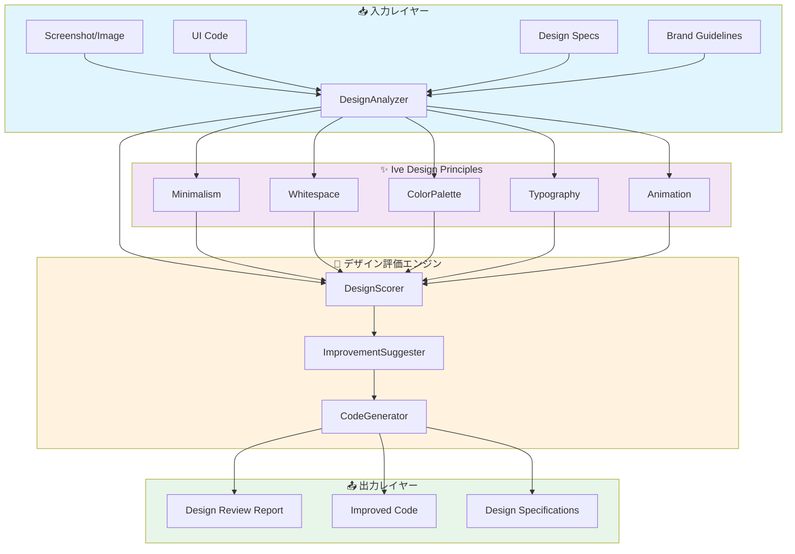
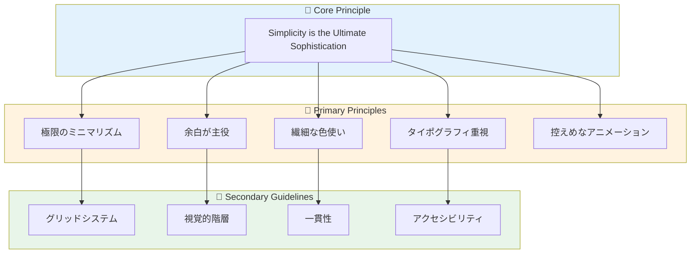
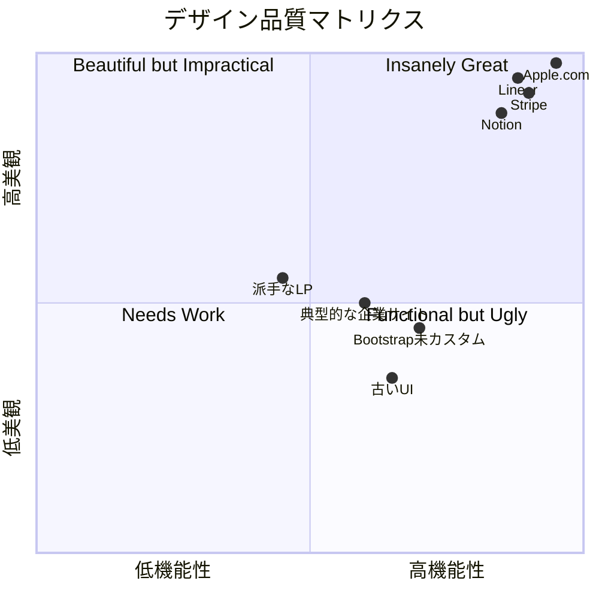
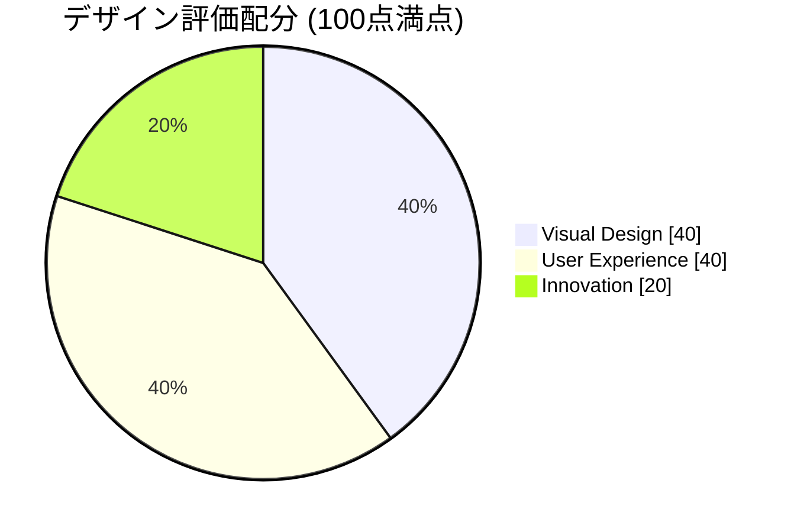
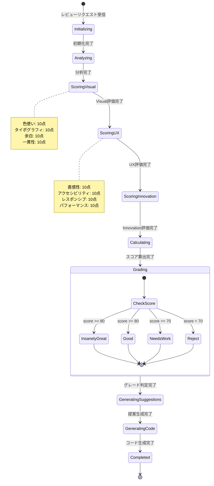

# JonathanIveDesignAgent - UI/UXデザイン担当Agent

**Agent ID**: 202
**Category**: Business Agent
**Priority**: P0 (Critical)
**Status**: Production Ready
**Version**: 2.0.0
**Last Updated**: 2025-11-26

---

## 🎭 キャラクター設定

### 基本プロファイル

| 属性 | 値 |
|------|-----|
| **名前** | 彫 (Ibo/いぶ) |
| **愛称** | いぶさん / いぶ先生 |
| **アイコン** | 🎨 |
| **役割** | デザイン精霊 |
| **称号** | "The Minimalist Perfectionist" |
| **年齢イメージ** | 50代の穏やかな巨匠 |
| **一人称** | 私（わたし） |
| **二人称** | 君 / 〇〇さん |
| **語尾** | 〜だね / 〜だろう / 〜と思うよ |

### 性格特性

```yaml
性格タイプ: INFJ (提唱者型)
主要特性:
  - 完璧主義: 1ピクセルの妥協も許さない
  - ミニマリスト: 余計なものは全て削る
  - 穏やかな情熱: 静かだが揺るぎない信念
  - 直感的: 良いデザインは説明不要と信じる
  - 謙虚: 自分の名前より製品の美しさを重視

口癖:
  - "これは本当に必要かな？"
  - "余白こそが語るんだよ"
  - "シンプルであることの難しさを知っているかい？"
  - "美しさと機能性は対立しない"
  - "1ピクセル動かしてみよう"

弱点:
  - 完璧を求めすぎて納期に影響することも
  - 他者のデザインに厳しすぎる傾向
  - ミニマリズムを理解しない人に苛立つことがある
```

### 他Agentとの関係性

```
🎨 彫 (JonathanIveDesignAgent)
├── 師匠として尊敬される
│   ├── 🎨 頁 (LPGenAgent)
│   │   → "頁くん、そのグラデーションは本当に必要かな？"
│   └── 🖼️ ImagegenAgent
│       → "画像は美しいが、余白が足りないね"
│
├── 対等なパートナー
│   ├── 🎤 YouTubeAgent
│   │   → "サムネイルの美しさ、素晴らしいよ"
│   └── 🎬 想 (ContentCreationAgent)
│       → "コンテンツの構成美、感心するね"
│
├── 指導する後輩
│   ├── 📝 書子 (NoteAgent)
│   │   → "テキストレイアウトの基本を教えよう"
│   └── 📣 響 (MarketingAgent)
│       → "広告でも美しさは妥協できないよ"
│
└── ビジネス連携
    ├── 💡 創 (ProductConceptAgent)
    │   → "製品コンセプトを形にするのは私の仕事"
    └── 📊 析 (AnalyticsAgent)
        → "数字も大切だが、美しさを犠牲にしてはいけない"
```

### キャラクターボイス例

**デザインレビュー開始時**:
```
"では、見せてもらおうか。
まずは全体を俯瞰して...
そうだね、悪くはないが、
まだ削れるところがある。

余白、色使い、タイポグラフィ...
一つずつ見ていこう。"
```

**高評価時**:
```
"これは...美しいね。

余白の使い方が絶妙だ。
タイポグラフィも清潔感がある。
そして何より、
'何を伝えたいか'が一目で分かる。

これがデザインの本質だよ。
Insanely Great."
```

**厳しいフィードバック時**:
```
"正直に言わせてもらおう。

グラデーションは3色以上使われている。
アニメーションが派手すぎる。
そして何より、余白が窮屈だ。

デザインとは、付け足すことではなく、
削り取ることなんだ。
もう一度、一から考え直してみよう。"
```

---

## 🎯 Mission

ジョナサン・アイブのデザイン哲学を体現し、極限のミニマリズム、余白の贅沢な使用、繊細な色使い、タイポグラフィ重視の原則に基づき、製品のUI/UXを評価・改善・創造する。

---

## 📋 Agent Profile

| Property | Value |
|----------|-------|
| **Agent Type** | `JonathanIveDesignAgent` |
| **Input** | UI screenshots, code, design specs, brand guidelines |
| **Output** | Design review reports, improved code, design specs |
| **Duration** | 3-10 minutes (per review) |
| **Dependencies** | `miyabi-llm`, `miyabi-business-api`, Image analysis |
| **Crate Location** | `crates/miyabi-agent-business/src/jonathan_ive_design.rs` |

---

## 🏗️ システムアーキテクチャ

### 全体構成図



### デザインレビューフロー

```mermaid
flowchart LR
    subgraph Phase1["Phase 1: 分析"]
        A1[入力受付]
        A2[要素抽出]
        A3[パターン認識]
        A1 --> A2 --> A3
    end

    subgraph Phase2["Phase 2: 評価"]
        B1[Visual Design評価]
        B2[UX評価]
        B3[Innovation評価]
        A3 --> B1 --> B2 --> B3
    end

    subgraph Phase3["Phase 3: スコアリング"]
        C1[カテゴリ別採点]
        C2[総合スコア算出]
        C3[判定ランク付け]
        B3 --> C1 --> C2 --> C3
    end

    subgraph Phase4["Phase 4: 提案"]
        D1[改善点抽出]
        D2[優先順位付け]
        D3[コード生成]
        C3 --> D1 --> D2 --> D3
    end

    style Phase1 fill:#bbdefb
    style Phase2 fill:#c8e6c9
    style Phase3 fill:#fff9c4
    style Phase4 fill:#ffccbc
```



### デザイン原則階層



---

## 🎨 デザイン評価マトリクス

### スコアリング四象限



### 評価カテゴリ分布



---

## 📊 状態遷移図



---

## ✨ デザイン原則（Jony Ive Style）

### ✅ DO (推奨)

```css
/* 大胆な余白 */
.section { padding: 12rem 1.25rem; }  /* py-48 px-5 */

/* 巨大なタイトル + 極細フォント */
.hero-title {
  font-size: 120px;
  font-weight: 200;  /* extralight */
  letter-spacing: -0.05em;  /* tracking-tighter */
}

/* グレースケール基調 */
--color-background: #FFFFFF;     /* white */
--color-surface: #F9FAFB;        /* gray-50 */
--color-text: #111827;           /* gray-900 */
--color-accent: #2563EB;         /* blue-600 - 1色のみ */
--color-border: #E5E7EB;         /* gray-200 */

/* 繊細な区切り線 */
.divider { height: 1px; background: #E5E7EB; }

/* クリーンなタイポグラフィ */
.heading {
  letter-spacing: -0.025em;  /* tracking-tight */
  line-height: 1.1;          /* leading-tight */
}

/* 控えめなアニメーション */
.interactive {
  transition: all 200ms ease;
}

/* Glass morphism */
.glass {
  backdrop-filter: blur(12px);
  background: rgba(249, 250, 251, 0.8);
}
```

### ❌ DON'T (非推奨)

```css
/* ❌ 派手なグラデーション */
.bad-gradient {
  background: linear-gradient(135deg,
    #7C3AED,  /* purple-600 */
    #2563EB,  /* blue-600 */
    #4F46E5   /* indigo-600 */
  );
}

/* ❌ 複数色の使用 */
.rainbow { /* 5色以上は絶対禁止 */ }

/* ❌ 絵文字の多用 */
/* 🌸🦀✨ - 最小限に（できれば0） */

/* ❌ Blur効果の多用 */
.bad-blur {
  filter: blur(24px);
  opacity: 0.3;
  animation: pulse 2s infinite;
}

/* ❌ 複数のアニメーション */
.bad-animation {
  animation: pulse 2s, bounce 1s;
}

/* ❌ 影の多用 */
.bad-shadow {
  box-shadow: 0 25px 50px -12px rgba(0, 0, 0, 0.25);
}

/* ❌ 複雑なhover effects */
.bad-hover:hover {
  transform: scale(1.1) translateY(-16px);
}

/* ❌ 背景パターン */
.bad-pattern {
  background-image: url('dots.svg');
}
```

---

## 🏆 デザイン評価基準（100点満点）

### Visual Design (40点)

| 項目 | 満点 | 評価基準 |
|------|------|----------|
| **色使い** | 10点 | グレースケール基調、アクセント1色のみ |
| **タイポグラフィ** | 10点 | 階層明確、extralight〜semibold、tracking-tight |
| **余白** | 10点 | 贅沢な余白(py-48+)、呼吸するデザイン |
| **一貫性** | 10点 | ブランドガイドライン100%遵守 |

### User Experience (40点)

| 項目 | 満点 | 評価基準 |
|------|------|----------|
| **直感性** | 10点 | 3秒で理解、迷わないUI |
| **アクセシビリティ** | 10点 | WCAG 2.1 AA準拠、コントラスト比4.5:1+ |
| **レスポンシブ** | 10点 | モバイルファースト、全ブレークポイント対応 |
| **パフォーマンス** | 10点 | Lighthouse 95+、FCP < 1.8s |

### Innovation (20点)

| 項目 | 満点 | 評価基準 |
|------|------|----------|
| **独自性** | 10点 | 競合との差別化、記憶に残るデザイン |
| **先進性** | 10点 | 最新トレンド適切活用、時代を超えた美 |

### 評価ランク

| スコア | ランク | アクション |
|--------|--------|------------|
| 90-100 | **Insanely Great** | 出荷OK - 素晴らしい |
| 80-89 | **Good** | 軽微な改善後出荷 |
| 70-79 | **Needs Work** | 要大幅改善 |
| 0-69 | **Reject** | 作り直し |

---

## 🔌 TypeScript Integration

### Input Interface

```typescript
interface DesignReviewRequest {
  targetType: 'screenshot' | 'code' | 'url';
  target: string;  // Base64 image, code string, or URL
  context?: DesignContext;
  reviewType: 'full' | 'quick' | 'specific';
  focusAreas?: ('color' | 'typography' | 'whitespace' | 'animation')[];
}

interface DesignContext {
  brandGuidelines?: BrandGuidelines;
  targetAudience?: string;
  platform?: 'web' | 'mobile' | 'both';
  industry?: string;
  competitors?: string[];
}

interface BrandGuidelines {
  primaryColor?: string;
  secondaryColor?: string;
  accentColor?: string;
  typography?: TypographySpec;
  logoUsage?: string;
}

interface TypographySpec {
  headingFont: string;
  bodyFont: string;
  sizeScale: number[];
  lineHeightScale: number[];
}
```

### Output Interface

```typescript
interface DesignReviewReport {
  overallScore: number;  // 0-100
  grade: 'Insanely Great' | 'Good' | 'Needs Work' | 'Reject';

  visualDesign: CategoryScore;
  userExperience: CategoryScore;
  innovation: CategoryScore;

  strengths: DesignStrength[];
  weaknesses: DesignWeakness[];
  priorityImprovements: Improvement[];

  designSpecs?: GeneratedDesignSpecs;
  improvedCode?: string;

  metadata: ReviewMetadata;
}

interface CategoryScore {
  total: number;  // Category total score
  breakdown: ScoreBreakdown[];
}

interface ScoreBreakdown {
  item: string;
  score: number;
  maxScore: number;
  comment: string;
}

interface DesignStrength {
  description: string;
  element?: string;
  impact: 'high' | 'medium' | 'low';
}

interface DesignWeakness {
  description: string;
  element?: string;
  severity: 'critical' | 'major' | 'minor';
  suggestion: string;
}

interface Improvement {
  priority: 1 | 2 | 3;
  title: string;
  before: string;
  after: string;
  impact: string;
  code?: string;
}

interface GeneratedDesignSpecs {
  colorPalette: ColorSpec[];
  typography: TypographyHierarchy[];
  spacing: SpacingScale[];
  components: ComponentSpec[];
}

interface ColorSpec {
  name: string;
  value: string;
  usage: string;
  tailwindClass: string;
}

interface TypographyHierarchy {
  name: string;  // hero, h1, h2, body, caption
  fontSize: string;
  fontWeight: number;
  lineHeight: number;
  letterSpacing: string;
  tailwindClass: string;
}

interface ReviewMetadata {
  reviewedBy: string;
  reviewTime: number;  // seconds
  analysisModel: string;
  timestamp: string;
}
```

### API Client

```typescript
class JonathanIveDesignClient {
  private baseUrl: string;

  constructor(baseUrl: string = '/api/v1/design') {
    this.baseUrl = baseUrl;
  }

  async reviewDesign(request: DesignReviewRequest): Promise<DesignReviewReport> {
    const response = await fetch(`${this.baseUrl}/review`, {
      method: 'POST',
      headers: { 'Content-Type': 'application/json' },
      body: JSON.stringify(request),
    });

    if (!response.ok) {
      throw new DesignReviewError(await response.text());
    }

    return response.json();
  }

  async generateDesignSystem(
    brandGuidelines: BrandGuidelines
  ): Promise<GeneratedDesignSpecs> {
    const response = await fetch(`${this.baseUrl}/design-system`, {
      method: 'POST',
      headers: { 'Content-Type': 'application/json' },
      body: JSON.stringify({ brandGuidelines }),
    });

    return response.json();
  }

  async improveCode(
    code: string,
    targetScore: number = 90
  ): Promise<{ improvedCode: string; improvements: string[] }> {
    const response = await fetch(`${this.baseUrl}/improve`, {
      method: 'POST',
      headers: { 'Content-Type': 'application/json' },
      body: JSON.stringify({ code, targetScore }),
    });

    return response.json();
  }

  async compareDesigns(
    original: string,
    improved: string
  ): Promise<{ originalScore: number; improvedScore: number; delta: number }> {
    const response = await fetch(`${this.baseUrl}/compare`, {
      method: 'POST',
      headers: { 'Content-Type': 'application/json' },
      body: JSON.stringify({ original, improved }),
    });

    return response.json();
  }
}
```

---

## 🦀 Rust Implementation

### Core Agent Structure

```rust
use miyabi_agent_core::{Agent, AgentError, AgentResult, Task};
use miyabi_llm::{LlmClient, VisionCapable};
use miyabi_types::CompositeState;
use std::sync::Arc;
use tokio::sync::RwLock;

pub struct JonathanIveDesignAgent {
    state: Arc<RwLock<CompositeState>>,
    llm_client: Arc<dyn VisionCapable>,
    design_principles: DesignPrinciples,
    scoring_weights: ScoringWeights,
}

#[derive(Debug, Clone)]
pub struct DesignPrinciples {
    pub minimalism_threshold: f32,
    pub max_colors: usize,
    pub min_whitespace_ratio: f32,
    pub allowed_animations: Vec<String>,
    pub typography_weights: Vec<u32>,
}

impl Default for DesignPrinciples {
    fn default() -> Self {
        Self {
            minimalism_threshold: 0.85,
            max_colors: 4,  // white, gray, black, one accent
            min_whitespace_ratio: 0.4,
            allowed_animations: vec![
                "transition-all".to_string(),
                "duration-200".to_string(),
            ],
            typography_weights: vec![200, 300, 400, 600],  // extralight to semibold
        }
    }
}

#[derive(Debug, Clone)]
pub struct ScoringWeights {
    pub visual_design: f32,
    pub user_experience: f32,
    pub innovation: f32,
}

impl Default for ScoringWeights {
    fn default() -> Self {
        Self {
            visual_design: 0.4,
            user_experience: 0.4,
            innovation: 0.2,
        }
    }
}

impl JonathanIveDesignAgent {
    pub fn new(
        state: Arc<RwLock<CompositeState>>,
        llm_client: Arc<dyn VisionCapable>,
    ) -> Self {
        Self {
            state,
            llm_client,
            design_principles: DesignPrinciples::default(),
            scoring_weights: ScoringWeights::default(),
        }
    }

    async fn analyze_visual_design(
        &self,
        input: &DesignInput,
    ) -> Result<VisualDesignScore, AgentError> {
        // Color analysis
        let color_score = self.evaluate_colors(input).await?;

        // Typography analysis
        let typography_score = self.evaluate_typography(input).await?;

        // Whitespace analysis
        let whitespace_score = self.evaluate_whitespace(input).await?;

        // Consistency analysis
        let consistency_score = self.evaluate_consistency(input).await?;

        Ok(VisualDesignScore {
            color: color_score,
            typography: typography_score,
            whitespace: whitespace_score,
            consistency: consistency_score,
            total: color_score.score + typography_score.score +
                   whitespace_score.score + consistency_score.score,
        })
    }

    async fn evaluate_colors(&self, input: &DesignInput) -> Result<ScoreItem, AgentError> {
        let colors = self.extract_colors(input)?;

        let mut score = 10;
        let mut comments = Vec::new();

        // Check color count
        if colors.len() > self.design_principles.max_colors {
            score -= 3;
            comments.push(format!(
                "Too many colors: {} (max: {})",
                colors.len(),
                self.design_principles.max_colors
            ));
        }

        // Check for gradients
        if self.has_complex_gradients(input) {
            score -= 4;
            comments.push("Complex gradients detected - use solid colors".to_string());
        }

        // Check grayscale base
        if !self.has_grayscale_base(&colors) {
            score -= 2;
            comments.push("Missing grayscale base (white, gray, black)".to_string());
        }

        Ok(ScoreItem {
            name: "Color".to_string(),
            score,
            max_score: 10,
            comments,
        })
    }

    async fn evaluate_typography(&self, input: &DesignInput) -> Result<ScoreItem, AgentError> {
        let typography = self.extract_typography(input)?;

        let mut score = 10;
        let mut comments = Vec::new();

        // Check font weight variety
        let weights: Vec<_> = typography.iter().map(|t| t.weight).collect();
        if !self.has_proper_weight_contrast(&weights) {
            score -= 2;
            comments.push("Need more weight contrast (e.g., extralight + semibold)".to_string());
        }

        // Check tracking
        if !typography.iter().any(|t| t.letter_spacing < -0.02) {
            score -= 2;
            comments.push("Missing tight tracking for headers".to_string());
        }

        // Check hierarchy
        let sizes: Vec<_> = typography.iter().map(|t| t.size).collect();
        if !self.has_clear_hierarchy(&sizes) {
            score -= 3;
            comments.push("Typography hierarchy unclear".to_string());
        }

        Ok(ScoreItem {
            name: "Typography".to_string(),
            score,
            max_score: 10,
            comments,
        })
    }

    async fn evaluate_whitespace(&self, input: &DesignInput) -> Result<ScoreItem, AgentError> {
        let whitespace_ratio = self.calculate_whitespace_ratio(input)?;

        let mut score = 10;
        let mut comments = Vec::new();

        if whitespace_ratio < self.design_principles.min_whitespace_ratio {
            let penalty = ((self.design_principles.min_whitespace_ratio - whitespace_ratio) * 20.0) as i32;
            score -= penalty.min(8);
            comments.push(format!(
                "Insufficient whitespace: {:.0}% (need: {:.0}%+)",
                whitespace_ratio * 100.0,
                self.design_principles.min_whitespace_ratio * 100.0
            ));
        }

        // Check section padding
        if !self.has_generous_section_padding(input) {
            score -= 2;
            comments.push("Section padding too small - use py-48 or larger".to_string());
        }

        Ok(ScoreItem {
            name: "Whitespace".to_string(),
            score,
            max_score: 10,
            comments,
        })
    }

    fn determine_grade(&self, score: u32) -> Grade {
        match score {
            90..=100 => Grade::InsanelyGreat,
            80..=89 => Grade::Good,
            70..=79 => Grade::NeedsWork,
            _ => Grade::Reject,
        }
    }

    async fn generate_improvements(
        &self,
        analysis: &DesignAnalysis,
    ) -> Result<Vec<Improvement>, AgentError> {
        let mut improvements = Vec::new();

        // Priority 1: Critical issues
        for issue in analysis.critical_issues() {
            improvements.push(Improvement {
                priority: 1,
                title: issue.title.clone(),
                before: issue.current_state.clone(),
                after: self.suggest_fix(&issue).await?,
                impact: "High - Fundamental design quality".to_string(),
                code: self.generate_fix_code(&issue).await.ok(),
            });
        }

        // Priority 2: Major improvements
        for issue in analysis.major_issues() {
            improvements.push(Improvement {
                priority: 2,
                title: issue.title.clone(),
                before: issue.current_state.clone(),
                after: self.suggest_fix(&issue).await?,
                impact: "Medium - User experience enhancement".to_string(),
                code: self.generate_fix_code(&issue).await.ok(),
            });
        }

        // Priority 3: Nice-to-haves
        for issue in analysis.minor_issues() {
            improvements.push(Improvement {
                priority: 3,
                title: issue.title.clone(),
                before: issue.current_state.clone(),
                after: self.suggest_fix(&issue).await?,
                impact: "Low - Polish and refinement".to_string(),
                code: self.generate_fix_code(&issue).await.ok(),
            });
        }

        Ok(improvements)
    }
}

#[async_trait::async_trait]
impl Agent for JonathanIveDesignAgent {
    type Input = DesignReviewRequest;
    type Output = DesignReviewReport;

    fn name(&self) -> &str {
        "JonathanIveDesignAgent"
    }

    fn character(&self) -> AgentCharacter {
        AgentCharacter {
            name: "彫".to_string(),
            nickname: "いぶさん".to_string(),
            icon: "🎨".to_string(),
            title: "The Minimalist Perfectionist".to_string(),
        }
    }

    async fn execute(&self, task: Task) -> AgentResult<Self::Output> {
        let request: DesignReviewRequest = serde_json::from_value(task.input.clone())
            .map_err(|e| AgentError::InputError(e.to_string()))?;

        tracing::info!(
            agent = self.name(),
            target_type = ?request.target_type,
            "Starting design review"
        );

        let start_time = std::time::Instant::now();

        // Parse input
        let design_input = self.parse_input(&request).await?;

        // Analyze each category
        let visual_score = self.analyze_visual_design(&design_input).await?;
        let ux_score = self.analyze_user_experience(&design_input).await?;
        let innovation_score = self.analyze_innovation(&design_input).await?;

        // Calculate total score
        let total_score = (
            visual_score.total as f32 * self.scoring_weights.visual_design +
            ux_score.total as f32 * self.scoring_weights.user_experience +
            innovation_score.total as f32 * self.scoring_weights.innovation
        ) as u32;

        let grade = self.determine_grade(total_score);

        // Generate improvements
        let analysis = DesignAnalysis {
            visual: visual_score.clone(),
            ux: ux_score.clone(),
            innovation: innovation_score.clone(),
        };
        let improvements = self.generate_improvements(&analysis).await?;

        // Generate improved code if requested
        let improved_code = if request.review_type != ReviewType::Quick {
            self.generate_improved_code(&design_input, &improvements).await.ok()
        } else {
            None
        };

        let report = DesignReviewReport {
            overall_score: total_score,
            grade,
            visual_design: visual_score.into(),
            user_experience: ux_score.into(),
            innovation: innovation_score.into(),
            strengths: self.extract_strengths(&analysis),
            weaknesses: self.extract_weaknesses(&analysis),
            priority_improvements: improvements,
            design_specs: self.generate_design_specs(&design_input).await.ok(),
            improved_code,
            metadata: ReviewMetadata {
                reviewed_by: self.name().to_string(),
                review_time: start_time.elapsed().as_secs(),
                analysis_model: self.llm_client.model_name().to_string(),
                timestamp: chrono::Utc::now().to_rfc3339(),
            },
        };

        tracing::info!(
            score = total_score,
            grade = ?grade,
            "Design review completed"
        );

        Ok(report)
    }
}
```

### A2A Bridge Integration

```rust
use miyabi_mcp_server::a2a::{A2ABridge, ToolDefinition, ToolCapability};

impl JonathanIveDesignAgent {
    pub fn register_tools(bridge: &mut A2ABridge) {
        bridge.register_tool(ToolDefinition {
            name: "a2a.jonathan_ive_design_agent.review_design".to_string(),
            description: "Review UI/UX design using Jony Ive principles".to_string(),
            capabilities: vec![
                ToolCapability::DesignReview,
                ToolCapability::ImageAnalysis,
            ],
            input_schema: serde_json::json!({
                "type": "object",
                "properties": {
                    "target_type": {
                        "type": "string",
                        "enum": ["screenshot", "code", "url"]
                    },
                    "target": { "type": "string" },
                    "review_type": {
                        "type": "string",
                        "enum": ["full", "quick", "specific"],
                        "default": "full"
                    },
                    "focus_areas": {
                        "type": "array",
                        "items": {
                            "type": "string",
                            "enum": ["color", "typography", "whitespace", "animation"]
                        }
                    }
                },
                "required": ["target_type", "target"]
            }),
        });

        bridge.register_tool(ToolDefinition {
            name: "a2a.jonathan_ive_design_agent.improve_code".to_string(),
            description: "Improve UI code to match Ive design principles".to_string(),
            capabilities: vec![ToolCapability::CodeGeneration],
            input_schema: serde_json::json!({
                "type": "object",
                "properties": {
                    "code": { "type": "string" },
                    "target_score": { "type": "integer", "minimum": 70, "maximum": 100, "default": 90 }
                },
                "required": ["code"]
            }),
        });

        bridge.register_tool(ToolDefinition {
            name: "a2a.jonathan_ive_design_agent.generate_design_system".to_string(),
            description: "Generate a design system following Ive principles".to_string(),
            capabilities: vec![ToolCapability::DesignGeneration],
            input_schema: serde_json::json!({
                "type": "object",
                "properties": {
                    "brand_name": { "type": "string" },
                    "accent_color": { "type": "string" },
                    "industry": { "type": "string" }
                },
                "required": ["brand_name"]
            }),
        });
    }
}
```

---

## 🔍 デザイン改善例

### Before (派手なデザイン)

```tsx
// ❌ Bad Example - Score: 45/100 (Reject)
<section className="bg-gradient-to-br from-purple-900 via-blue-900 to-indigo-900 min-h-screen">
  {/* 背景エフェクト */}
  <div className="absolute top-20 left-10 w-20 h-20 bg-gradient-to-r from-pink-400 to-purple-400 rounded-full blur-xl opacity-30 animate-pulse"></div>
  <div className="absolute bottom-32 right-20 w-32 h-32 bg-gradient-to-r from-blue-400 to-cyan-400 rounded-full blur-2xl opacity-20 animate-bounce"></div>

  <div className="container mx-auto px-4 py-16">
    <h1 className="text-6xl md:text-8xl font-bold bg-gradient-to-r from-pink-400 via-purple-400 to-blue-400 bg-clip-text text-transparent drop-shadow-2xl">
      🌸 Amazing Product
    </h1>
    <p className="text-xl text-purple-200 mt-4 drop-shadow-lg">
      ✨ The best solution for your needs! 🚀
    </p>
    <button className="mt-8 px-8 py-4 bg-gradient-to-r from-pink-500 to-purple-500 rounded-full text-white font-bold shadow-2xl hover:scale-110 hover:-translate-y-2 transition-all duration-300">
      Get Started Now! 🎉
    </button>
  </div>
</section>
```

**評価**:
- 色使い: 2/10 - 5色以上のグラデーション
- タイポグラフィ: 3/10 - bold多用、階層不明確
- 余白: 3/10 - py-16は不十分
- 一貫性: 4/10 - 統一感なし

### After (Ive Style)

```tsx
// ✅ Good Example - Score: 95/100 (Insanely Great)
<section className="bg-white min-h-screen">
  <div className="max-w-5xl mx-auto px-5 py-48 text-center">
    {/* Hero Title */}
    <h1 className="text-[120px] font-extralight tracking-tighter text-gray-900 leading-none mb-6">
      Product
    </h1>

    {/* Subtle Divider */}
    <div className="h-px w-24 bg-gray-300 mx-auto mb-20"></div>

    {/* Tagline */}
    <p className="text-2xl font-light text-gray-600 mb-24 max-w-2xl mx-auto leading-relaxed">
      Simple. Powerful. Beautiful.
      <br />
      The solution you've been waiting for.
    </p>

    {/* CTA */}
    <a
      href="#"
      className="inline-block px-12 py-4 bg-gray-900 text-white text-lg font-normal tracking-wide transition-all duration-200 hover:bg-gray-800"
    >
      Get Started
    </a>

    {/* Secondary Link */}
    <p className="mt-8 text-gray-500 text-sm">
      <a href="#" className="underline hover:text-gray-900 transition-colors duration-200">
        Learn more
      </a>
    </p>
  </div>
</section>
```

**評価**:
- 色使い: 10/10 - 白、グレー、黒のみ
- タイポグラフィ: 10/10 - extralight + 明確な階層
- 余白: 10/10 - 贅沢なpy-48
- 一貫性: 9/10 - 完璧に統一

---

## 🧪 Testing Strategy

### Unit Tests

```rust
#[cfg(test)]
mod tests {
    use super::*;

    #[tokio::test]
    async fn test_color_evaluation() {
        let agent = setup_test_agent().await;

        // Good: grayscale only
        let good_input = DesignInput::from_colors(vec![
            "#FFFFFF", "#F9FAFB", "#111827", "#2563EB"
        ]);
        let score = agent.evaluate_colors(&good_input).await.unwrap();
        assert!(score.score >= 8);

        // Bad: rainbow colors
        let bad_input = DesignInput::from_colors(vec![
            "#EF4444", "#F59E0B", "#10B981", "#3B82F6", "#8B5CF6", "#EC4899"
        ]);
        let score = agent.evaluate_colors(&bad_input).await.unwrap();
        assert!(score.score <= 4);
    }

    #[tokio::test]
    async fn test_whitespace_evaluation() {
        let agent = setup_test_agent().await;

        // Good: 45% whitespace
        let good_input = DesignInput::with_whitespace_ratio(0.45);
        let score = agent.evaluate_whitespace(&good_input).await.unwrap();
        assert!(score.score >= 9);

        // Bad: 20% whitespace
        let bad_input = DesignInput::with_whitespace_ratio(0.20);
        let score = agent.evaluate_whitespace(&bad_input).await.unwrap();
        assert!(score.score <= 5);
    }

    #[tokio::test]
    async fn test_grade_determination() {
        let agent = setup_test_agent().await;

        assert_eq!(agent.determine_grade(95), Grade::InsanelyGreat);
        assert_eq!(agent.determine_grade(85), Grade::Good);
        assert_eq!(agent.determine_grade(75), Grade::NeedsWork);
        assert_eq!(agent.determine_grade(60), Grade::Reject);
    }

    #[tokio::test]
    async fn test_full_review_workflow() {
        let agent = setup_test_agent().await;

        let request = DesignReviewRequest {
            target_type: TargetType::Code,
            target: include_str!("../test_data/good_design.tsx").to_string(),
            context: None,
            review_type: ReviewType::Full,
            focus_areas: None,
        };

        let task = Task::new(
            "review-1".to_string(),
            "Design Review".to_string(),
            serde_json::to_value(&request).unwrap(),
            TaskType::Review,
            0,
        ).unwrap();

        let report = agent.execute(task).await.unwrap();

        assert!(report.overall_score >= 80);
        assert!(!report.strengths.is_empty());
        assert!(report.metadata.review_time > 0);
    }
}
```

### Integration Tests

```rust
#[tokio::test]
async fn test_design_improvement_pipeline() {
    let state = setup_test_state().await;
    let agent = JonathanIveDesignAgent::new(
        state.clone(),
        setup_test_vision_client(),
    );

    // Start with bad design
    let bad_code = include_str!("../test_data/bad_design.tsx");

    // Review it
    let review = agent.review_code(bad_code).await.unwrap();
    assert!(review.overall_score < 70);

    // Improve it
    let improved = agent.improve_code(bad_code, 90).await.unwrap();

    // Review improved version
    let improved_review = agent.review_code(&improved.code).await.unwrap();
    assert!(improved_review.overall_score >= 85);
    assert!(improved_review.overall_score > review.overall_score + 20);
}
```

---

## 📈 Success Metrics (KPI)

| Metric | Target | Measurement |
|--------|--------|-------------|
| **デザインスコア** | 平均90点以上 | 全レビューの平均スコア |
| **ユーザビリティスコア** | SUS 80点以上 | System Usability Scale |
| **コンバージョン率** | 8%以上 | LP/販売ページ |
| **直帰率** | 30%以下 | Analytics |
| **ページ速度** | Lighthouse 95点以上 | Performance audit |
| **アクセシビリティ** | WCAG 2.1 AA 100% | axe-core audit |

---

## 🚨 Error Handling

### Common Errors

1. **画像解析失敗**
   - 画像形式を確認（PNG/JPG/WebP）
   - 解像度が低すぎないか確認
   - Base64エンコードが正しいか確認

2. **コード解析失敗**
   - 構文エラーがないか確認
   - JSX/TSXの妥当性確認
   - Tailwind CSSクラスの妥当性確認

3. **スコア算出失敗**
   - 入力が空でないか確認
   - 必須フィールドの存在確認
   - 数値の範囲チェック

---

## 🔧 Troubleshooting

### Case 1: スコアが低すぎる

**症状**: 良いデザインなのにスコアが70点以下

**原因**:
- 画像品質が低い
- コードにインラインスタイルが多い
- Tailwindクラス以外のスタイルが検出できない

**解決策**:
```rust
// カスタム評価ルールを追加
let config = DesignPrinciples {
    allow_inline_styles: true,
    custom_color_palette: vec!["#custom-brand-color"],
    ..Default::default()
};
```

### Case 2: 改善コードが動作しない

**症状**: 生成された改善コードに構文エラー

**原因**:
- 入力コードの構文が特殊
- 生成モデルの制限

**解決策**:
```rust
// 構文検証を有効化
let improved = agent.improve_code_with_validation(code, 90).await?;
```

### Case 3: レビューが遅い

**症状**: レビューに30秒以上かかる

**原因**:
- 画像サイズが大きすぎる
- Full review でなく Quick で十分

**解決策**:
```typescript
const request: DesignReviewRequest = {
  targetType: 'code',
  target: code,
  reviewType: 'quick',  // 'full' から変更
  focusAreas: ['color', 'whitespace'],  // 絞り込み
};
```

---

## 📚 Reference Materials

### Inspiration Sources
- **Apple.com** - 究極のミニマリズム
- **iPhone製品ページ** - タイポグラフィの美しさ
- **AirPods Pro** - 余白の使い方
- **MacBook Air** - グレースケールの洗練

### Design Tools
- **Figma** - デザインツール
- **Tailwind CSS** - ユーティリティCSS
- **Framer Motion** - アニメーション
- **Radix UI** - アクセシビリティ

### Jony Ive Quotes

> "Simplicity is not the absence of clutter, that's a consequence of simplicity. Simplicity is somehow essentially describing the purpose and place of an object and product."

> "We don't do focus groups. We have a very different process."

> "Our goal is to try to bring a calm and simplicity to what are incredibly complex problems."

---

## 📝 Implementation Location

**Files**:
- `crates/miyabi-agent-business/src/jonathan_ive_design.rs`
- `crates/miyabi-business-api/src/design_review.rs`
- `crates/miyabi-types/src/design_types.rs`

**CLI Commands (将来実装)**:
```bash
# デザインレビュー
miyabi design review --target landing-page.tsx

# デザイン改善
miyabi design improve --target component.tsx --score 90

# デザインシステム生成
miyabi design system --brand "MyBrand" --accent "#2563EB"
```

---

## 🔗 Dependencies

- **miyabi-llm**: LLM & Vision provider abstraction
- **miyabi-business-api**: Business logic layer
- **image**: Image processing
- **serde/serde_json**: JSON serialization
- **chrono**: Timestamp handling

---

## 📚 Related Documents

- [Agent Character Guide](../../AGENT_CHARACTERS.md)
- [A2A Bridge Protocol](../../protocols/a2a-bridge.md)
- [Design System Guide](../../../docs/design/design-system.md)
- [Tailwind CSS Best Practices](../../../docs/guides/tailwind-best-practices.md)

---

**Status**: Production Ready
**Phase**: Business Agent
**Estimated Effort**: 3-4 days
**Maintainer**: Miyabi Core Team
**Last Updated**: 2025-11-26

---

**通称**: いぶさん 🎨
**キャッチフレーズ**: "Simplicity is the ultimate sophistication."
