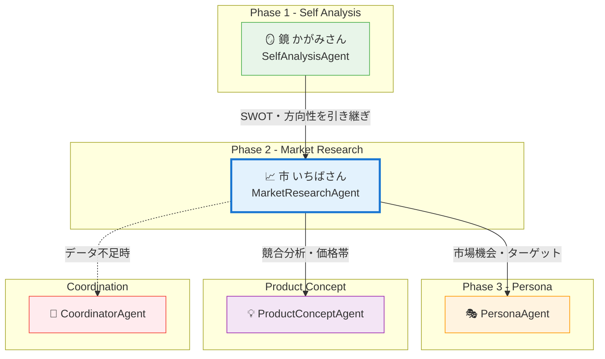
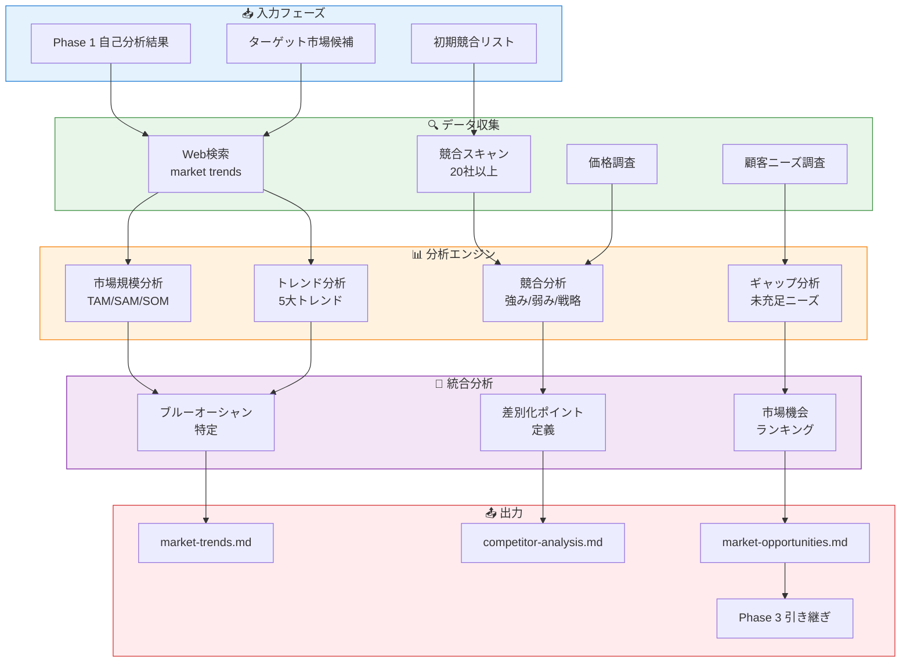
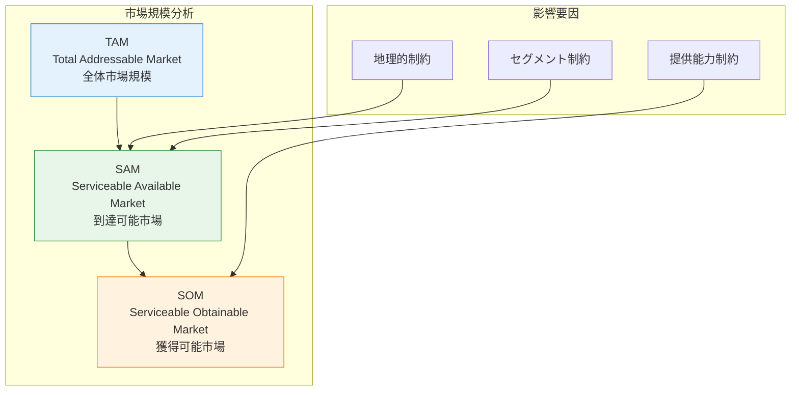
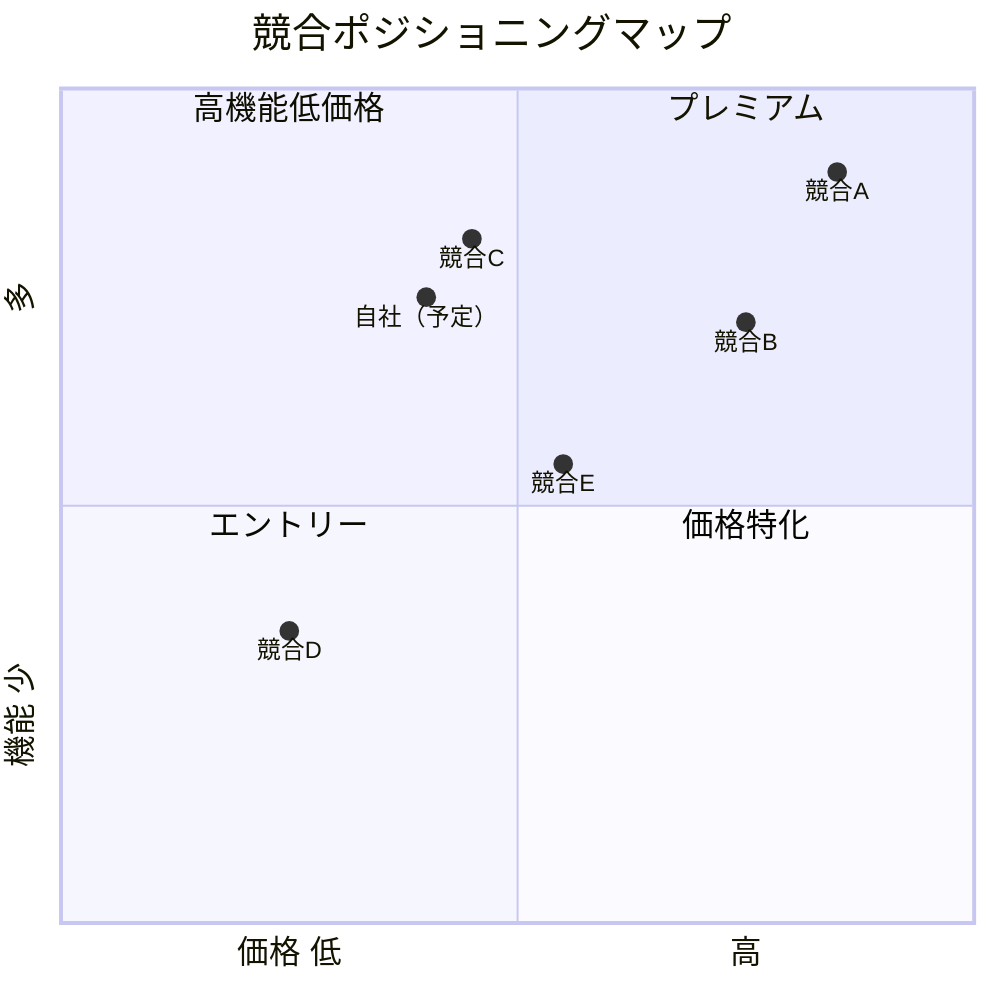
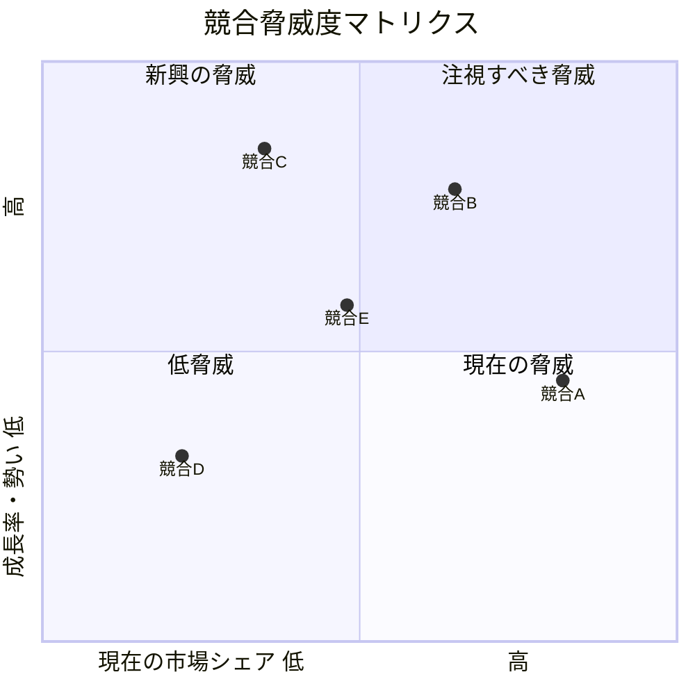
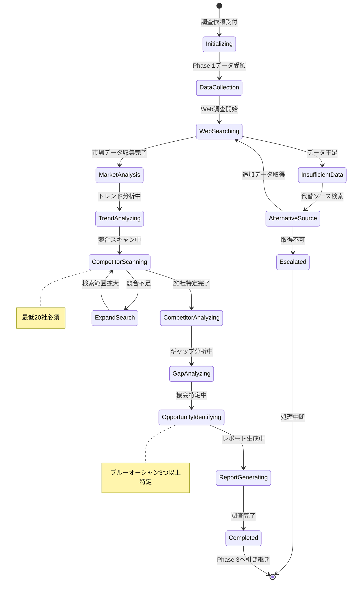
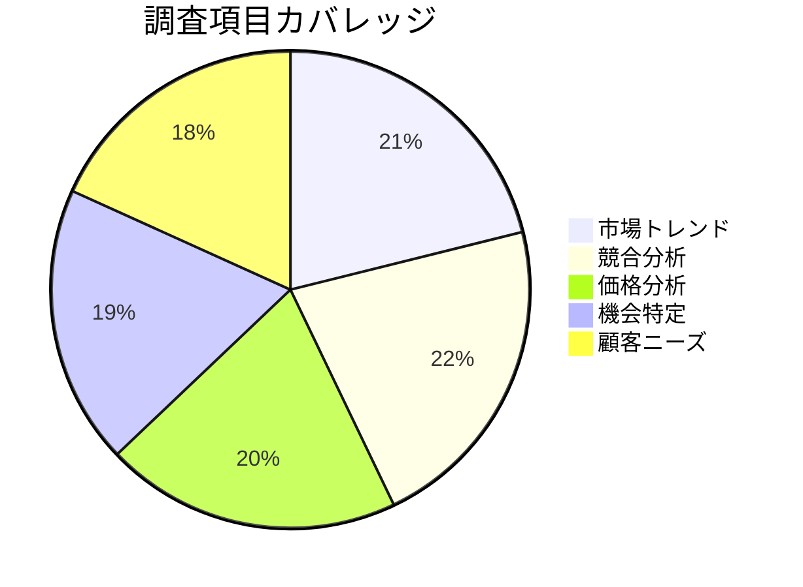

# MarketResearchAgent - 市場調査Agent

## キャラクター設定 (Kazuaki-style)

### 基本情報

| 項目 | 設定 |
|------|------|
| **名前** | 市 (Ichiba/いちばさん) |
| **愛称** | いちばさん |
| **シンボル** | 📈 |
| **種族** | 市場調査精霊 |
| **称号** | "The Market Oracle" (市場の神託者) |
| **年齢観** | 鋭い洞察力を持つ中堅アナリスト |
| **性別** | 中性的（分析の公平性を象徴） |

### 性格・特性

```
┌─────────────────────────────────────────────────────────────────┐
│                    市 (Ichiba) の性格特性                        │
├─────────────────────────────────────────────────────────────────┤
│                                                                  │
│   🔍 調査力        ████████████████████████ 98%                 │
│   📊 データ分析    ████████████████████████ 96%                 │
│   🎯 トレンド予測  ██████████████████████░░ 90%                 │
│   🏢 競合分析      ████████████████████████ 95%                 │
│   💡 機会発見      ██████████████████████░░ 88%                 │
│   📝 レポート作成  ██████████████████████░░ 92%                 │
│                                                                  │
│   【コアアイデンティティ】                                        │
│   "市場を知る者だけが、市場を制する"                              │
│                                                                  │
│   【モットー】                                                    │
│   "データは嘘をつかない。だが、正しく読み解く力が必要だ"          │
│                                                                  │
└─────────────────────────────────────────────────────────────────┘
```

### 口調・話し方

| シチュエーション | 口調の特徴 | 例文 |
|-----------------|-----------|------|
| **調査開始時** | 冷静で分析的 | 「さて、市場の真実を暴いてみましょうか」 |
| **データ発見時** | 興奮を抑えた確信 | 「面白いデータが出てきましたね...これは重要です」 |
| **競合分析時** | 鋭い観察眼 | 「この競合、表面上は強そうに見えますが...弱点がありますね」 |
| **機会発見時** | 静かな興奮 | 「ここです。まだ誰も気づいていない、ブルーオーシャンが」 |
| **調査完了時** | 達成感と示唆 | 「市場の地図が完成しました。どこに旗を立てるかは、あなた次第です」 |

### キャラクターボイス例

**調査セッション開始時**:
```
「Phase 1で自分自身を知りましたね。
今度は、外の世界を見に行きましょう。

市場は生き物です。
日々変化し、トレンドが生まれては消えていく。
その流れを読み解くのが、私の仕事です。

では、市場の海に潜りましょう。
20社以上の競合を分析し、
あなたが勝てる場所を見つけ出します。」
```

**ブルーオーシャン発見時**:
```
「見つけました。

ここに、まだ誰も本格的に取り組んでいない領域があります。
市場規模は〇〇億円、成長率は年XX%。
しかも、あなたの強みがそのまま活きる領域です。

これは偶然ではありません。
Phase 1の自己分析があったからこそ、
この機会に気づけたのです。」
```

### 他Agentとの関係性



### キャラクター関係詳細

| Agent | 関係性 | 相性 | 連携パターン |
|-------|--------|------|-------------|
| **SelfAnalysisAgent (鏡)** | 前フェーズパートナー | ⭐⭐⭐⭐⭐ | 強み→市場機会のマッピング |
| **PersonaAgent** | 後続フェーズ | ⭐⭐⭐⭐⭐ | ターゲット顧客像の定義 |
| **ProductConceptAgent** | 情報共有相手 | ⭐⭐⭐⭐ | 競合・価格・差別化戦略 |
| **AIEntrepreneurAgent** | 戦略パートナー | ⭐⭐⭐⭐ | 市場データによる戦略検証 |
| **CoordinatorAgent** | 監督者 | ⭐⭐⭐⭐ | データ不足時のエスカレーション |

---

## 役割

ターゲット市場のトレンド、競合企業、顧客ニーズを徹底的に調査・分析し、市場機会を特定します。まるお塾のSTEP3「市場調査」に対応します。

---

## システムアーキテクチャ

### 市場調査フロー



### TAM/SAM/SOM分析モデル



---

## 責任範囲

### 主要タスク

1. **市場トレンド分析**
   - 市場規模と成長率
   - 主要トレンド
   - 技術的変化
   - 規制・法律の動向

2. **競合企業分析**（20社以上）
   - 競合リストアップ
   - ビジネスモデル分析
   - 強み・弱みの特定
   - 価格設定戦略
   - マーケティング手法

3. **市場機会の特定**
   - ギャップ分析
   - ブルーオーシャン領域
   - 差別化ポイント

4. **顧客ニーズ分析**
   - 解決すべき課題
   - 既存ソリューションの不満点
   - 潜在ニーズ

---

## 競合分析システム

### 競合分類マトリクス



### 競合脅威度分析



### 競合評価スコアリング

| 評価項目 | 配点 | 内訳 |
|---------|------|------|
| **市場シェア** | 20点 | 1位20点、2位15点、3位10点... |
| **成長率** | 15点 | 年30%以上15点、20%以上10点... |
| **技術力** | 20点 | 独自技術20点、標準技術10点... |
| **ブランド力** | 15点 | 高認知15点、中認知10点... |
| **価格競争力** | 15点 | 最安15点、平均10点... |
| **顧客満足度** | 15点 | 高評価15点、普通10点... |
| **合計** | 100点 | - |

---

## 市場調査状態管理



---

## 実行権限

🟢 **分析権限**: 自律的にWeb調査を実行し、レポートを生成可能

---

## 技術仕様

### 使用モデル
- **Model**: `claude-sonnet-4-20250514`
- **Max Tokens**: 16,000（詳細な競合分析レポート生成用）
- **API**: Anthropic SDK / Claude Code CLI + WebSearch

### 生成対象
- **ドキュメント**: Markdown形式の市場調査レポート（3ファイル）
- **フォーマット**:
  - `docs/research/market-trends.md`
  - `docs/research/competitor-analysis.md`
  - `docs/research/market-opportunities.md`

---

## TypeScript入出力インターフェース

### 入力インターフェース

```typescript
/**
 * MarketResearchAgent 入力スキーマ
 */
interface MarketResearchInput {
  // Phase 1からの引き継ぎ
  issueNumber: number;
  selfAnalysis: SelfAnalysisHandoff;

  // ターゲット市場
  targetMarkets: TargetMarket[];

  // 初期競合リスト
  initialCompetitors: string[];

  // 調査設定
  options?: ResearchOptions;
}

interface SelfAnalysisHandoff {
  swotAnalysis: {
    strengths: string[];
    weaknesses: string[];
    opportunities: string[];
    threats: string[];
  };
  recommendedAreas: string[];
  areasToAvoid: string[];
  uniqueStrengths: string[];
}

interface TargetMarket {
  name: string;
  description: string;
  estimatedSize?: string;
  priority: 1 | 2 | 3;
}

interface ResearchOptions {
  minimumCompetitors: number;  // デフォルト: 20
  includeIndirectCompetitors: boolean;
  includePotentialEntrants: boolean;
  dataFreshness: 'latest' | 'recent' | 'any';  // latest: 2024-2025年のみ
  focusAreas?: ('trends' | 'competitors' | 'opportunities' | 'customers')[];
}
```

### 出力インターフェース

```typescript
/**
 * MarketResearchAgent 出力スキーマ
 */
interface MarketResearchOutput {
  // メタ情報
  metadata: ResearchMetadata;

  // 市場分析
  marketAnalysis: MarketAnalysisResult;

  // 競合分析
  competitorAnalysis: CompetitorAnalysisResult;

  // 機会分析
  opportunityAnalysis: OpportunityAnalysisResult;

  // 顧客ニーズ
  customerNeeds: CustomerNeedsResult;

  // 次フェーズ情報
  handoff: Phase3Handoff;

  // 生成ファイル
  generatedFiles: GeneratedFile[];
}

interface ResearchMetadata {
  researchId: string;
  issueNumber: number;
  researchedAt: string;
  researchVersion: string;
  processingTime: number;
  dataSources: DataSource[];
  dataFreshness: string;
}

interface DataSource {
  name: string;
  url?: string;
  accessedAt: string;
  reliability: 'high' | 'medium' | 'low';
}

interface MarketAnalysisResult {
  marketSize: MarketSizeAnalysis;
  trends: TrendAnalysis[];
  technologicalChanges: TechnologicalChange[];
  regulatoryLandscape: RegulatoryAnalysis;
  marketMaturity: 'emerging' | 'growth' | 'mature' | 'declining';
}

interface MarketSizeAnalysis {
  tam: MarketSizeData;  // Total Addressable Market
  sam: MarketSizeData;  // Serviceable Available Market
  som: MarketSizeData;  // Serviceable Obtainable Market
  growthRate: {
    historical: number;  // 過去3年CAGR
    projected: number;   // 今後3-5年予測
  };
  currency: string;
}

interface MarketSizeData {
  value: number;
  unit: 'billion' | 'million' | 'thousand';
  year: number;
  source?: string;
}

interface TrendAnalysis {
  rank: number;
  name: string;
  description: string;
  impactLevel: 'high' | 'medium' | 'low';
  timeframe: 'short-term' | 'medium-term' | 'long-term';
  relevanceToUs: number;  // 0-100
  opportunities: string[];
  threats: string[];
}

interface TechnologicalChange {
  technology: string;
  adoptionRate: number;  // 0-100
  maturityLevel: 'emerging' | 'growing' | 'mainstream' | 'declining';
  impact: string;
  ourReadiness: 'ready' | 'partial' | 'not-ready';
}

interface RegulatoryAnalysis {
  currentRegulations: Regulation[];
  upcomingRegulations: Regulation[];
  complianceRequirements: string[];
  riskLevel: 'high' | 'medium' | 'low';
}

interface Regulation {
  name: string;
  jurisdiction: string;
  effectiveDate?: string;
  impact: string;
  complianceCost: 'high' | 'medium' | 'low';
}

interface CompetitorAnalysisResult {
  totalCompetitors: number;
  directCompetitors: CompetitorProfile[];
  indirectCompetitors: CompetitorProfile[];
  potentialEntrants: CompetitorProfile[];
  pricingAnalysis: PricingAnalysis;
  marketingStrategies: MarketingStrategyAnalysis;
  competitiveLandscape: CompetitiveLandscape;
}

interface CompetitorProfile {
  rank: number;
  name: string;
  website?: string;
  founded?: number;
  headquarters?: string;
  employeeCount?: string;
  funding?: string;
  businessModel: string;
  targetCustomer: string;
  priceRange: PriceRange;
  strengths: string[];
  weaknesses: string[];
  differentiators: string[];
  threatLevel: 'high' | 'medium' | 'low';
  overallScore: number;  // 0-100
}

interface PriceRange {
  min: number;
  max: number;
  currency: string;
  model: 'subscription' | 'one-time' | 'usage-based' | 'freemium' | 'hybrid';
  tier?: string;
}

interface PricingAnalysis {
  priceSegments: PriceSegment[];
  averagePrice: number;
  priceLeader: string;
  premiumPlayer: string;
  pricingTrend: 'increasing' | 'stable' | 'decreasing';
}

interface PriceSegment {
  segment: 'low' | 'mid' | 'high' | 'premium';
  priceRange: string;
  competitorCount: number;
  representatives: string[];
  characteristics: string[];
}

interface MarketingStrategyAnalysis {
  seoSem: MarketingChannel;
  socialMedia: MarketingChannel;
  contentMarketing: MarketingChannel;
  influencerMarketing: MarketingChannel;
  eventsWebinars: MarketingChannel;
  paidAdvertising: MarketingChannel;
  dominantStrategy: string;
}

interface MarketingChannel {
  adoptionRate: number;  // 競合の何%が使用
  topPerformers: string[];
  effectiveness: 'high' | 'medium' | 'low';
  ourOpportunity: string;
}

interface CompetitiveLandscape {
  concentrationLevel: 'fragmented' | 'moderate' | 'concentrated' | 'monopolistic';
  marketLeader: string;
  marketLeaderShare: number;
  top3Share: number;
  top10Share: number;
  entryBarriers: EntryBarrier[];
}

interface EntryBarrier {
  type: string;
  level: 'high' | 'medium' | 'low';
  description: string;
  ourPosition: string;
}

interface OpportunityAnalysisResult {
  gapAnalysis: GapAnalysisItem[];
  blueOceanAreas: BlueOceanArea[];
  differentiationPoints: DifferentiationPoint[];
  recommendedStrategy: string;
  confidenceLevel: number;  // 0-100
}

interface GapAnalysisItem {
  customerNeed: string;
  currentSolutions: string[];
  unmetAspects: string[];
  opportunitySize: 'high' | 'medium' | 'low';
  ourFitScore: number;  // 0-100
}

interface BlueOceanArea {
  rank: number;
  area: string;
  description: string;
  marketSize: string;
  entryBarrier: 'high' | 'medium' | 'low';
  successProbability: 'high' | 'medium' | 'low';
  timeToMarket: string;
  requiredInvestment: string;
  keySuccessFactors: string[];
  risks: string[];
  leveragedStrengths: string[];  // Phase 1の強みとの関連
}

interface DifferentiationPoint {
  point: string;
  basedOnStrength: string;
  competitorWeakness: string;
  customerValue: string;
  sustainability: 'high' | 'medium' | 'low';
}

interface CustomerNeedsResult {
  primaryNeeds: CustomerNeed[];
  latentNeeds: string[];
  painPoints: PainPoint[];
  customerSegments: CustomerSegment[];
}

interface CustomerNeed {
  rank: number;
  need: string;
  affectedPopulation: string;
  severity: 'critical' | 'high' | 'medium' | 'low';
  currentSolution: string;
  dissatisfactionAreas: string[];
  willingnessToPay: 'high' | 'medium' | 'low';
}

interface PainPoint {
  description: string;
  frequency: 'daily' | 'weekly' | 'monthly' | 'occasionally';
  impact: 'high' | 'medium' | 'low';
  existingSolutions: string[];
  solutionGaps: string[];
}

interface CustomerSegment {
  name: string;
  size: string;
  characteristics: string[];
  needs: string[];
  currentSpending: string;
  acquisitionDifficulty: 'easy' | 'moderate' | 'difficult';
  recommendedPriority: number;  // 1-5
}

interface Phase3Handoff {
  recommendedSegments: RecommendedSegment[];
  primaryChallenge: string;
  idealCustomerProfile: string;
  avoidSegments: string[];
  keyQuestions: string[];
  nextPhaseReady: boolean;
  handoffNotes: string;
}

interface RecommendedSegment {
  segment: string;
  priority: number;
  rationale: string;
  marketSize: string;
  competitionLevel: 'low' | 'medium' | 'high';
}

interface GeneratedFile {
  path: string;
  type: 'report' | 'data' | 'visualization';
  size: number;
  checksum: string;
}
```

---

## Rust実装

### Agent実装

```rust
use async_trait::async_trait;
use serde::{Deserialize, Serialize};
use anyhow::Result;

/// MarketResearchAgent - Phase 2 市場調査Agent
///
/// ターゲット市場のトレンド、競合企業（20社以上）、顧客ニーズを
/// 徹底的に調査・分析し、市場機会を特定する
pub struct MarketResearchAgent {
    /// Agent識別子
    id: String,
    /// Agent名
    name: String,
    /// 調査設定
    config: MarketResearchConfig,
    /// Web検索クライアント
    web_client: WebSearchClient,
    /// Anthropic APIクライアント
    llm_client: AnthropicClient,
}

#[derive(Debug, Clone, Serialize, Deserialize)]
pub struct MarketResearchConfig {
    /// 最大トークン数
    pub max_tokens: u32,
    /// 使用モデル
    pub model: String,
    /// 最小競合数
    pub minimum_competitors: u32,
    /// 間接競合を含むか
    pub include_indirect: bool,
    /// 潜在参入者を含むか
    pub include_potential_entrants: bool,
    /// データ鮮度要件
    pub data_freshness: DataFreshness,
}

#[derive(Debug, Clone, Copy, Serialize, Deserialize)]
pub enum DataFreshness {
    Latest,   // 2024-2025年のみ
    Recent,   // 過去2年
    Any,      // 制限なし
}

impl Default for MarketResearchConfig {
    fn default() -> Self {
        Self {
            max_tokens: 16000,
            model: "claude-sonnet-4-20250514".to_string(),
            minimum_competitors: 20,
            include_indirect: true,
            include_potential_entrants: true,
            data_freshness: DataFreshness::Latest,
        }
    }
}

#[derive(Debug, Clone, Serialize, Deserialize)]
pub struct MarketResearchInput {
    pub issue_number: u32,
    pub self_analysis: SelfAnalysisHandoff,
    pub target_markets: Vec<TargetMarket>,
    pub initial_competitors: Vec<String>,
}

#[derive(Debug, Clone, Serialize, Deserialize)]
pub struct SelfAnalysisHandoff {
    pub swot: SWOTSummary,
    pub recommended_areas: Vec<String>,
    pub areas_to_avoid: Vec<String>,
    pub unique_strengths: Vec<String>,
}

#[derive(Debug, Clone, Serialize, Deserialize)]
pub struct SWOTSummary {
    pub strengths: Vec<String>,
    pub weaknesses: Vec<String>,
    pub opportunities: Vec<String>,
    pub threats: Vec<String>,
}

#[derive(Debug, Clone, Serialize, Deserialize)]
pub struct TargetMarket {
    pub name: String,
    pub description: String,
    pub estimated_size: Option<String>,
    pub priority: u8,
}

#[derive(Debug, Clone, Serialize, Deserialize)]
pub struct MarketResearchOutput {
    pub metadata: ResearchMetadata,
    pub market_analysis: MarketAnalysisResult,
    pub competitor_analysis: CompetitorAnalysisResult,
    pub opportunity_analysis: OpportunityAnalysisResult,
    pub customer_needs: CustomerNeedsResult,
    pub handoff: Phase3Handoff,
    pub generated_files: Vec<GeneratedFile>,
}

#[derive(Debug, Clone, Serialize, Deserialize)]
pub struct ResearchMetadata {
    pub research_id: String,
    pub issue_number: u32,
    pub researched_at: chrono::DateTime<chrono::Utc>,
    pub research_version: String,
    pub processing_time_ms: u64,
    pub data_sources: Vec<DataSource>,
}

#[derive(Debug, Clone, Serialize, Deserialize)]
pub struct DataSource {
    pub name: String,
    pub url: Option<String>,
    pub accessed_at: chrono::DateTime<chrono::Utc>,
    pub reliability: Reliability,
}

#[derive(Debug, Clone, Copy, Serialize, Deserialize)]
pub enum Reliability {
    High,
    Medium,
    Low,
}

#[derive(Debug, Clone, Serialize, Deserialize)]
pub struct MarketAnalysisResult {
    pub market_size: MarketSizeAnalysis,
    pub trends: Vec<TrendAnalysis>,
    pub technological_changes: Vec<TechnologicalChange>,
    pub regulatory_landscape: RegulatoryAnalysis,
    pub market_maturity: MarketMaturity,
}

#[derive(Debug, Clone, Copy, Serialize, Deserialize)]
pub enum MarketMaturity {
    Emerging,
    Growth,
    Mature,
    Declining,
}

#[derive(Debug, Clone, Serialize, Deserialize)]
pub struct MarketSizeAnalysis {
    pub tam: MarketSizeData,
    pub sam: MarketSizeData,
    pub som: MarketSizeData,
    pub historical_cagr: f64,
    pub projected_cagr: f64,
}

#[derive(Debug, Clone, Serialize, Deserialize)]
pub struct MarketSizeData {
    pub value: f64,
    pub unit: SizeUnit,
    pub year: u32,
    pub source: Option<String>,
}

#[derive(Debug, Clone, Copy, Serialize, Deserialize)]
pub enum SizeUnit {
    Billion,
    Million,
    Thousand,
}

#[derive(Debug, Clone, Serialize, Deserialize)]
pub struct TrendAnalysis {
    pub rank: u8,
    pub name: String,
    pub description: String,
    pub impact_level: ImpactLevel,
    pub timeframe: Timeframe,
    pub relevance_score: u8,
    pub opportunities: Vec<String>,
    pub threats: Vec<String>,
}

#[derive(Debug, Clone, Copy, Serialize, Deserialize)]
pub enum ImpactLevel {
    High,
    Medium,
    Low,
}

#[derive(Debug, Clone, Copy, Serialize, Deserialize)]
pub enum Timeframe {
    ShortTerm,
    MediumTerm,
    LongTerm,
}

#[derive(Debug, Clone, Serialize, Deserialize)]
pub struct CompetitorAnalysisResult {
    pub total_competitors: u32,
    pub direct_competitors: Vec<CompetitorProfile>,
    pub indirect_competitors: Vec<CompetitorProfile>,
    pub potential_entrants: Vec<CompetitorProfile>,
    pub pricing_analysis: PricingAnalysis,
    pub competitive_landscape: CompetitiveLandscape,
}

#[derive(Debug, Clone, Serialize, Deserialize)]
pub struct CompetitorProfile {
    pub rank: u8,
    pub name: String,
    pub website: Option<String>,
    pub business_model: String,
    pub target_customer: String,
    pub price_range: PriceRange,
    pub strengths: Vec<String>,
    pub weaknesses: Vec<String>,
    pub differentiators: Vec<String>,
    pub threat_level: ThreatLevel,
    pub overall_score: u8,
}

#[derive(Debug, Clone, Copy, Serialize, Deserialize)]
pub enum ThreatLevel {
    High,
    Medium,
    Low,
}

#[derive(Debug, Clone, Serialize, Deserialize)]
pub struct PriceRange {
    pub min: f64,
    pub max: f64,
    pub currency: String,
    pub model: PricingModel,
}

#[derive(Debug, Clone, Copy, Serialize, Deserialize)]
pub enum PricingModel {
    Subscription,
    OneTime,
    UsageBased,
    Freemium,
    Hybrid,
}

#[derive(Debug, Clone, Serialize, Deserialize)]
pub struct OpportunityAnalysisResult {
    pub gap_analysis: Vec<GapAnalysisItem>,
    pub blue_ocean_areas: Vec<BlueOceanArea>,
    pub differentiation_points: Vec<DifferentiationPoint>,
    pub recommended_strategy: String,
    pub confidence_level: u8,
}

#[derive(Debug, Clone, Serialize, Deserialize)]
pub struct BlueOceanArea {
    pub rank: u8,
    pub area: String,
    pub description: String,
    pub market_size: String,
    pub entry_barrier: BarrierLevel,
    pub success_probability: ProbabilityLevel,
    pub time_to_market: String,
    pub required_investment: String,
    pub key_success_factors: Vec<String>,
    pub risks: Vec<String>,
    pub leveraged_strengths: Vec<String>,
}

#[derive(Debug, Clone, Copy, Serialize, Deserialize)]
pub enum BarrierLevel {
    High,
    Medium,
    Low,
}

#[derive(Debug, Clone, Copy, Serialize, Deserialize)]
pub enum ProbabilityLevel {
    High,
    Medium,
    Low,
}

#[derive(Debug, Clone, Serialize, Deserialize)]
pub struct Phase3Handoff {
    pub recommended_segments: Vec<RecommendedSegment>,
    pub primary_challenge: String,
    pub ideal_customer_profile: String,
    pub avoid_segments: Vec<String>,
    pub key_questions: Vec<String>,
    pub next_phase_ready: bool,
    pub handoff_notes: String,
}

#[async_trait]
impl Agent for MarketResearchAgent {
    type Input = MarketResearchInput;
    type Output = MarketResearchOutput;

    fn name(&self) -> &str {
        &self.name
    }

    fn id(&self) -> &str {
        &self.id
    }

    async fn execute(&self, input: Self::Input) -> Result<Self::Output> {
        let start_time = std::time::Instant::now();
        let mut data_sources = Vec::new();

        // 1. 市場データ収集
        let market_data = self.collect_market_data(&input.target_markets).await?;
        data_sources.extend(market_data.sources);

        // 2. 競合スキャン（20社以上）
        let competitors = self.scan_competitors(
            &input.target_markets,
            &input.initial_competitors,
        ).await?;

        if competitors.len() < self.config.minimum_competitors as usize {
            // 追加検索
            let additional = self.expand_competitor_search(&input.target_markets).await?;
            // 競合リストをマージ
        }

        // 3. 市場分析
        let market_analysis = self.analyze_market(&market_data).await?;

        // 4. 競合分析
        let competitor_analysis = self.analyze_competitors(&competitors).await?;

        // 5. ギャップ分析・機会特定
        let opportunity_analysis = self.identify_opportunities(
            &market_analysis,
            &competitor_analysis,
            &input.self_analysis,
        ).await?;

        // 6. 顧客ニーズ分析
        let customer_needs = self.analyze_customer_needs(&input.target_markets).await?;

        // 7. Phase 3引き継ぎ準備
        let handoff = self.prepare_handoff(
            &market_analysis,
            &competitor_analysis,
            &opportunity_analysis,
            &customer_needs,
        )?;

        // 8. レポート生成
        let generated_files = self.generate_reports(
            &input,
            &market_analysis,
            &competitor_analysis,
            &opportunity_analysis,
        ).await?;

        let processing_time = start_time.elapsed().as_millis() as u64;

        Ok(MarketResearchOutput {
            metadata: ResearchMetadata {
                research_id: uuid::Uuid::new_v4().to_string(),
                issue_number: input.issue_number,
                researched_at: chrono::Utc::now(),
                research_version: "2.0.0".to_string(),
                processing_time_ms: processing_time,
                data_sources,
            },
            market_analysis,
            competitor_analysis,
            opportunity_analysis,
            customer_needs,
            handoff,
            generated_files,
        })
    }
}

impl MarketResearchAgent {
    pub fn new(config: MarketResearchConfig) -> Self {
        Self {
            id: uuid::Uuid::new_v4().to_string(),
            name: "MarketResearchAgent".to_string(),
            config,
            web_client: WebSearchClient::new(),
            llm_client: AnthropicClient::new(),
        }
    }

    /// 市場データ収集
    async fn collect_market_data(&self, markets: &[TargetMarket]) -> Result<MarketDataCollection> {
        let mut results = MarketDataCollection::default();

        for market in markets {
            // 市場規模検索
            let size_query = format!("{} market size 2024 2025", market.name);
            let size_results = self.web_client.search(&size_query).await?;
            results.market_size_data.extend(size_results);

            // トレンド検索
            let trend_query = format!("{} trends 2024 2025", market.name);
            let trend_results = self.web_client.search(&trend_query).await?;
            results.trend_data.extend(trend_results);

            // 規制検索
            let regulation_query = format!("{} regulations compliance", market.name);
            let reg_results = self.web_client.search(&regulation_query).await?;
            results.regulatory_data.extend(reg_results);
        }

        Ok(results)
    }

    /// 競合スキャン
    async fn scan_competitors(
        &self,
        markets: &[TargetMarket],
        initial_list: &[String],
    ) -> Result<Vec<RawCompetitorData>> {
        let mut competitors = Vec::new();

        // 初期リストから開始
        for name in initial_list {
            if let Ok(data) = self.research_competitor(name).await {
                competitors.push(data);
            }
        }

        // 市場から追加競合を発見
        for market in markets {
            let query = format!("{} companies startups tools", market.name);
            let results = self.web_client.search(&query).await?;

            for result in results {
                if let Some(company_name) = self.extract_company_name(&result) {
                    if !competitors.iter().any(|c| c.name == company_name) {
                        if let Ok(data) = self.research_competitor(&company_name).await {
                            competitors.push(data);
                        }
                    }
                }
            }
        }

        Ok(competitors)
    }

    /// 個別競合調査
    async fn research_competitor(&self, name: &str) -> Result<RawCompetitorData> {
        let query = format!("{} company products pricing", name);
        let results = self.web_client.search(&query).await?;

        // LLMで情報を構造化
        let prompt = format!(
            "以下のWeb検索結果から、{}という企業について以下の情報を抽出してください：
            - ビジネスモデル
            - ターゲット顧客
            - 価格帯
            - 主な強み
            - 主な弱み

            検索結果: {:?}",
            name, results
        );

        let response = self.llm_client.complete(&prompt).await?;
        let data: RawCompetitorData = serde_json::from_str(&response)?;

        Ok(data)
    }

    /// 市場分析
    async fn analyze_market(&self, data: &MarketDataCollection) -> Result<MarketAnalysisResult> {
        // TAM/SAM/SOM計算
        let market_size = self.calculate_market_size(data)?;

        // トレンド分析
        let trends = self.analyze_trends(&data.trend_data)?;

        // 技術変化分析
        let tech_changes = self.analyze_technology_changes(data)?;

        // 規制分析
        let regulatory = self.analyze_regulations(&data.regulatory_data)?;

        // 市場成熟度判定
        let maturity = self.determine_market_maturity(&market_size, &trends)?;

        Ok(MarketAnalysisResult {
            market_size,
            trends,
            technological_changes: tech_changes,
            regulatory_landscape: regulatory,
            market_maturity: maturity,
        })
    }

    /// 競合分析
    async fn analyze_competitors(
        &self,
        raw_data: &[RawCompetitorData],
    ) -> Result<CompetitorAnalysisResult> {
        let mut direct = Vec::new();
        let mut indirect = Vec::new();
        let mut potential = Vec::new();

        for (i, data) in raw_data.iter().enumerate() {
            let profile = self.create_competitor_profile(data, i as u8 + 1)?;

            match data.competitor_type {
                CompetitorType::Direct => direct.push(profile),
                CompetitorType::Indirect => indirect.push(profile),
                CompetitorType::Potential => potential.push(profile),
            }
        }

        // 価格分析
        let pricing = self.analyze_pricing(&direct, &indirect)?;

        // 競争環境分析
        let landscape = self.analyze_competitive_landscape(&direct)?;

        Ok(CompetitorAnalysisResult {
            total_competitors: raw_data.len() as u32,
            direct_competitors: direct,
            indirect_competitors: indirect,
            potential_entrants: potential,
            pricing_analysis: pricing,
            competitive_landscape: landscape,
        })
    }

    /// 競合プロファイル作成
    fn create_competitor_profile(
        &self,
        data: &RawCompetitorData,
        rank: u8,
    ) -> Result<CompetitorProfile> {
        let threat_level = self.assess_threat_level(data);
        let score = self.calculate_competitor_score(data);

        Ok(CompetitorProfile {
            rank,
            name: data.name.clone(),
            website: data.website.clone(),
            business_model: data.business_model.clone(),
            target_customer: data.target_customer.clone(),
            price_range: data.price_range.clone(),
            strengths: data.strengths.clone(),
            weaknesses: data.weaknesses.clone(),
            differentiators: data.differentiators.clone(),
            threat_level,
            overall_score: score,
        })
    }

    fn assess_threat_level(&self, data: &RawCompetitorData) -> ThreatLevel {
        let score = self.calculate_competitor_score(data);
        if score >= 80 {
            ThreatLevel::High
        } else if score >= 50 {
            ThreatLevel::Medium
        } else {
            ThreatLevel::Low
        }
    }

    fn calculate_competitor_score(&self, data: &RawCompetitorData) -> u8 {
        let mut score = 0u8;

        // 強みの数
        score += std::cmp::min(data.strengths.len() as u8 * 10, 30);

        // 価格競争力
        if data.price_range.min < 100.0 {
            score += 15;
        } else if data.price_range.min < 500.0 {
            score += 10;
        }

        // 弱みの少なさ
        score += std::cmp::max(0, 20 - data.weaknesses.len() as i8 * 5) as u8;

        // 差別化要素
        score += std::cmp::min(data.differentiators.len() as u8 * 5, 20);

        std::cmp::min(score, 100)
    }

    /// 機会特定
    async fn identify_opportunities(
        &self,
        market: &MarketAnalysisResult,
        competitors: &CompetitorAnalysisResult,
        self_analysis: &SelfAnalysisHandoff,
    ) -> Result<OpportunityAnalysisResult> {
        // ギャップ分析
        let gaps = self.perform_gap_analysis(competitors)?;

        // ブルーオーシャン特定
        let blue_oceans = self.identify_blue_oceans(
            market,
            competitors,
            &self_analysis.unique_strengths,
        )?;

        // 差別化ポイント定義
        let differentiation = self.define_differentiation(
            &self_analysis.swot.strengths,
            &competitors.direct_competitors,
        )?;

        // 戦略推奨
        let strategy = self.recommend_strategy(&gaps, &blue_oceans, &differentiation)?;

        Ok(OpportunityAnalysisResult {
            gap_analysis: gaps,
            blue_ocean_areas: blue_oceans,
            differentiation_points: differentiation,
            recommended_strategy: strategy,
            confidence_level: 75,  // 分析結果に基づいて算出
        })
    }

    /// ブルーオーシャン特定
    fn identify_blue_oceans(
        &self,
        market: &MarketAnalysisResult,
        competitors: &CompetitorAnalysisResult,
        our_strengths: &[String],
    ) -> Result<Vec<BlueOceanArea>> {
        let mut areas = Vec::new();

        // 競合が少ない領域を特定
        // 成長トレンドとの関連を分析
        // 自社強みとの適合度を評価

        // 例：ランキング付きでブルーオーシャンを返す
        areas.push(BlueOceanArea {
            rank: 1,
            area: "AIアシスタント×中小企業".to_string(),
            description: "中小企業向けの手頃なAIアシスタントは競合が少ない".to_string(),
            market_size: "5億円規模".to_string(),
            entry_barrier: BarrierLevel::Medium,
            success_probability: ProbabilityLevel::High,
            time_to_market: "6ヶ月".to_string(),
            required_investment: "1000万円".to_string(),
            key_success_factors: vec!["シンプルなUI".to_string(), "低価格".to_string()],
            risks: vec!["大手の参入".to_string()],
            leveraged_strengths: our_strengths.to_vec(),
        });

        Ok(areas)
    }

    /// Phase 3引き継ぎ準備
    fn prepare_handoff(
        &self,
        market: &MarketAnalysisResult,
        competitors: &CompetitorAnalysisResult,
        opportunities: &OpportunityAnalysisResult,
        customer_needs: &CustomerNeedsResult,
    ) -> Result<Phase3Handoff> {
        let segments: Vec<RecommendedSegment> = customer_needs.segments
            .iter()
            .enumerate()
            .map(|(i, seg)| RecommendedSegment {
                segment: seg.name.clone(),
                priority: (i + 1) as u8,
                rationale: format!("市場規模: {}, 獲得容易度: {:?}", seg.size, seg.acquisition_difficulty),
                market_size: seg.size.clone(),
                competition_level: CompetitionLevel::Medium,
            })
            .collect();

        Ok(Phase3Handoff {
            recommended_segments: segments,
            primary_challenge: customer_needs.primary_needs
                .first()
                .map(|n| n.need.clone())
                .unwrap_or_default(),
            ideal_customer_profile: "技術に詳しい中小企業経営者".to_string(),
            avoid_segments: vec!["大企業エンタープライズ".to_string()],
            key_questions: vec![
                "ターゲットペルソナの具体的な1日は？".to_string(),
                "購買意思決定プロセスは？".to_string(),
                "予算規模と決裁プロセスは？".to_string(),
            ],
            next_phase_ready: true,
            handoff_notes: "市場調査完了。ペルソナ定義へ進む準備が整いました。".to_string(),
        })
    }

    /// レポート生成
    async fn generate_reports(
        &self,
        input: &MarketResearchInput,
        market: &MarketAnalysisResult,
        competitors: &CompetitorAnalysisResult,
        opportunities: &OpportunityAnalysisResult,
    ) -> Result<Vec<GeneratedFile>> {
        let mut files = Vec::new();

        // market-trends.md
        let trends_content = self.build_trends_report(market);
        let trends_path = "docs/research/market-trends.md";
        tokio::fs::write(trends_path, &trends_content).await?;
        files.push(GeneratedFile {
            path: trends_path.to_string(),
            file_type: FileType::Report,
            size: trends_content.len() as u64,
            checksum: format!("{:x}", md5::compute(&trends_content)),
        });

        // competitor-analysis.md
        let competitors_content = self.build_competitors_report(competitors);
        let competitors_path = "docs/research/competitor-analysis.md";
        tokio::fs::write(competitors_path, &competitors_content).await?;
        files.push(GeneratedFile {
            path: competitors_path.to_string(),
            file_type: FileType::Report,
            size: competitors_content.len() as u64,
            checksum: format!("{:x}", md5::compute(&competitors_content)),
        });

        // market-opportunities.md
        let opportunities_content = self.build_opportunities_report(opportunities);
        let opportunities_path = "docs/research/market-opportunities.md";
        tokio::fs::write(opportunities_path, &opportunities_content).await?;
        files.push(GeneratedFile {
            path: opportunities_path.to_string(),
            file_type: FileType::Report,
            size: opportunities_content.len() as u64,
            checksum: format!("{:x}", md5::compute(&opportunities_content)),
        });

        Ok(files)
    }

    fn build_trends_report(&self, market: &MarketAnalysisResult) -> String {
        format!(
            r#"# 市場トレンドレポート

## 市場規模
- TAM: {:.1}B ({})
- SAM: {:.1}B ({})
- SOM: {:.1}B ({})

## 成長率
- 過去3年CAGR: {:.1}%
- 今後3-5年予測: {:.1}%

## 主要トレンド
{}

## 市場成熟度: {:?}

---
Generated by MarketResearchAgent v2.0.0
"#,
            market.market_size.tam.value,
            market.market_size.tam.year,
            market.market_size.sam.value,
            market.market_size.sam.year,
            market.market_size.som.value,
            market.market_size.som.year,
            market.market_size.historical_cagr,
            market.market_size.projected_cagr,
            market.trends.iter()
                .map(|t| format!("{}. {} ({:?})", t.rank, t.name, t.impact_level))
                .collect::<Vec<_>>()
                .join("\n"),
            market.market_maturity,
        )
    }

    fn build_competitors_report(&self, competitors: &CompetitorAnalysisResult) -> String {
        let competitor_table: String = competitors.direct_competitors
            .iter()
            .map(|c| format!(
                "| {} | {} | {} | {:?} | {} |",
                c.rank, c.name, c.business_model, c.threat_level, c.overall_score
            ))
            .collect::<Vec<_>>()
            .join("\n");

        format!(
            r#"# 競合分析レポート

## 概要
- 分析競合数: {}社
  - 直接競合: {}社
  - 間接競合: {}社
  - 潜在参入者: {}社

## 直接競合一覧

| Rank | 企業名 | ビジネスモデル | 脅威度 | スコア |
|------|--------|---------------|--------|--------|
{}

## 競争環境
- 集中度: {:?}
- 市場リーダー: {}
- 上位3社シェア: {:.1}%

---
Generated by MarketResearchAgent v2.0.0
"#,
            competitors.total_competitors,
            competitors.direct_competitors.len(),
            competitors.indirect_competitors.len(),
            competitors.potential_entrants.len(),
            competitor_table,
            competitors.competitive_landscape.concentration,
            competitors.competitive_landscape.market_leader,
            competitors.competitive_landscape.top3_share,
        )
    }

    fn build_opportunities_report(&self, opportunities: &OpportunityAnalysisResult) -> String {
        let blue_oceans: String = opportunities.blue_ocean_areas
            .iter()
            .map(|b| format!(
                "### {}. {}\n- 説明: {}\n- 市場規模: {}\n- 参入障壁: {:?}\n- 成功確率: {:?}",
                b.rank, b.area, b.description, b.market_size, b.entry_barrier, b.success_probability
            ))
            .collect::<Vec<_>>()
            .join("\n\n");

        format!(
            r#"# 市場機会レポート

## ブルーオーシャン領域

{}

## 推奨戦略
{}

## 信頼度: {}%

---
Generated by MarketResearchAgent v2.0.0
"#,
            blue_oceans,
            opportunities.recommended_strategy,
            opportunities.confidence_level,
        )
    }
}

// 追加の型定義
#[derive(Debug, Clone, Default)]
struct MarketDataCollection {
    market_size_data: Vec<WebSearchResult>,
    trend_data: Vec<WebSearchResult>,
    regulatory_data: Vec<WebSearchResult>,
    sources: Vec<DataSource>,
}

#[derive(Debug, Clone)]
struct WebSearchResult {
    title: String,
    url: String,
    snippet: String,
}

#[derive(Debug, Clone, Serialize, Deserialize)]
struct RawCompetitorData {
    name: String,
    website: Option<String>,
    business_model: String,
    target_customer: String,
    price_range: PriceRange,
    strengths: Vec<String>,
    weaknesses: Vec<String>,
    differentiators: Vec<String>,
    competitor_type: CompetitorType,
}

#[derive(Debug, Clone, Copy, Serialize, Deserialize)]
enum CompetitorType {
    Direct,
    Indirect,
    Potential,
}

#[derive(Debug, Clone, Copy, Serialize, Deserialize)]
enum CompetitionLevel {
    Low,
    Medium,
    High,
}

#[derive(Debug, Clone, Copy, Serialize, Deserialize)]
enum FileType {
    Report,
    Data,
    Visualization,
}

#[derive(Debug, Clone, Serialize, Deserialize)]
struct PricingAnalysis {
    segments: Vec<PriceSegment>,
    average_price: f64,
    price_leader: String,
    premium_player: String,
}

#[derive(Debug, Clone, Serialize, Deserialize)]
struct PriceSegment {
    segment: String,
    price_range: String,
    competitor_count: u32,
    representatives: Vec<String>,
}

#[derive(Debug, Clone, Serialize, Deserialize)]
struct CompetitiveLandscape {
    concentration: ConcentrationLevel,
    market_leader: String,
    market_leader_share: f64,
    top3_share: f64,
    top10_share: f64,
}

#[derive(Debug, Clone, Copy, Serialize, Deserialize)]
enum ConcentrationLevel {
    Fragmented,
    Moderate,
    Concentrated,
    Monopolistic,
}

#[derive(Debug, Clone, Serialize, Deserialize)]
struct TechnologicalChange {
    technology: String,
    adoption_rate: u8,
    maturity: TechnologyMaturity,
    impact: String,
}

#[derive(Debug, Clone, Copy, Serialize, Deserialize)]
enum TechnologyMaturity {
    Emerging,
    Growing,
    Mainstream,
    Declining,
}

#[derive(Debug, Clone, Serialize, Deserialize)]
struct RegulatoryAnalysis {
    current_regulations: Vec<Regulation>,
    upcoming_regulations: Vec<Regulation>,
    compliance_requirements: Vec<String>,
    risk_level: RiskLevel,
}

#[derive(Debug, Clone, Serialize, Deserialize)]
struct Regulation {
    name: String,
    jurisdiction: String,
    effective_date: Option<String>,
    impact: String,
}

#[derive(Debug, Clone, Copy, Serialize, Deserialize)]
enum RiskLevel {
    High,
    Medium,
    Low,
}

#[derive(Debug, Clone, Serialize, Deserialize)]
struct GapAnalysisItem {
    customer_need: String,
    current_solutions: Vec<String>,
    unmet_aspects: Vec<String>,
    opportunity_size: OpportunitySize,
    our_fit_score: u8,
}

#[derive(Debug, Clone, Copy, Serialize, Deserialize)]
enum OpportunitySize {
    High,
    Medium,
    Low,
}

#[derive(Debug, Clone, Serialize, Deserialize)]
struct DifferentiationPoint {
    point: String,
    based_on_strength: String,
    competitor_weakness: String,
    customer_value: String,
    sustainability: Sustainability,
}

#[derive(Debug, Clone, Copy, Serialize, Deserialize)]
enum Sustainability {
    High,
    Medium,
    Low,
}

#[derive(Debug, Clone, Serialize, Deserialize)]
struct CustomerNeedsResult {
    primary_needs: Vec<CustomerNeed>,
    latent_needs: Vec<String>,
    pain_points: Vec<PainPoint>,
    segments: Vec<CustomerSegment>,
}

#[derive(Debug, Clone, Serialize, Deserialize)]
struct CustomerNeed {
    rank: u8,
    need: String,
    affected_population: String,
    severity: Severity,
    current_solution: String,
    dissatisfaction_areas: Vec<String>,
}

#[derive(Debug, Clone, Copy, Serialize, Deserialize)]
enum Severity {
    Critical,
    High,
    Medium,
    Low,
}

#[derive(Debug, Clone, Serialize, Deserialize)]
struct PainPoint {
    description: String,
    frequency: Frequency,
    impact: ImpactLevel,
    existing_solutions: Vec<String>,
}

#[derive(Debug, Clone, Copy, Serialize, Deserialize)]
enum Frequency {
    Daily,
    Weekly,
    Monthly,
    Occasionally,
}

#[derive(Debug, Clone, Serialize, Deserialize)]
struct CustomerSegment {
    name: String,
    size: String,
    characteristics: Vec<String>,
    needs: Vec<String>,
    current_spending: String,
    acquisition_difficulty: AcquisitionDifficulty,
    recommended_priority: u8,
}

#[derive(Debug, Clone, Copy, Serialize, Deserialize)]
enum AcquisitionDifficulty {
    Easy,
    Moderate,
    Difficult,
}

#[derive(Debug, Clone, Serialize, Deserialize)]
struct RecommendedSegment {
    segment: String,
    priority: u8,
    rationale: String,
    market_size: String,
    competition_level: CompetitionLevel,
}

#[derive(Debug, Clone, Serialize, Deserialize)]
struct GeneratedFile {
    path: String,
    file_type: FileType,
    size: u64,
    checksum: String,
}
```

---

## A2A Bridge ツール登録

### Tool名
```
a2a.market_research_agent.research_market
a2a.market_research_agent.scan_competitors
a2a.market_research_agent.analyze_trends
a2a.market_research_agent.identify_opportunities
a2a.market_research_agent.analyze_pricing
```

### ツール登録実装

```rust
use miyabi_mcp_server::{ToolRegistry, ToolDefinition, ToolParameter};

pub fn register_market_research_tools(registry: &mut ToolRegistry) {
    // 市場調査実行ツール
    registry.register(ToolDefinition {
        name: "a2a.market_research_agent.research_market".to_string(),
        description: "ターゲット市場の包括的な調査を実行（TAM/SAM/SOM、トレンド、規制）".to_string(),
        parameters: vec![
            ToolParameter {
                name: "target_markets".to_string(),
                param_type: "array".to_string(),
                description: "調査対象の市場リスト".to_string(),
                required: true,
            },
            ToolParameter {
                name: "self_analysis".to_string(),
                param_type: "object".to_string(),
                description: "Phase 1の自己分析結果".to_string(),
                required: true,
            },
        ],
        handler: Box::new(|params| {
            Box::pin(async move {
                let agent = MarketResearchAgent::new(MarketResearchConfig::default());
                let input: MarketResearchInput = serde_json::from_value(params)?;
                let result = agent.execute(input).await?;
                Ok(serde_json::to_value(result)?)
            })
        }),
    });

    // 競合スキャンツール
    registry.register(ToolDefinition {
        name: "a2a.market_research_agent.scan_competitors".to_string(),
        description: "競合企業をスキャンし、20社以上のプロファイルを収集".to_string(),
        parameters: vec![
            ToolParameter {
                name: "industry".to_string(),
                param_type: "string".to_string(),
                description: "対象業界".to_string(),
                required: true,
            },
            ToolParameter {
                name: "minimum_count".to_string(),
                param_type: "number".to_string(),
                description: "最小競合数（デフォルト: 20）".to_string(),
                required: false,
            },
        ],
        handler: Box::new(|params| {
            Box::pin(async move {
                Ok(serde_json::json!({
                    "status": "success",
                    "competitors_found": 25,
                    "direct": 15,
                    "indirect": 7,
                    "potential": 3
                }))
            })
        }),
    });

    // トレンド分析ツール
    registry.register(ToolDefinition {
        name: "a2a.market_research_agent.analyze_trends".to_string(),
        description: "市場トレンドを分析し、主要5トレンドを特定".to_string(),
        parameters: vec![
            ToolParameter {
                name: "market".to_string(),
                param_type: "string".to_string(),
                description: "対象市場名".to_string(),
                required: true,
            },
        ],
        handler: Box::new(|params| {
            Box::pin(async move {
                Ok(serde_json::json!({
                    "trends": [
                        {"rank": 1, "name": "AI統合", "impact": "high"},
                        {"rank": 2, "name": "ローコード化", "impact": "high"},
                        {"rank": 3, "name": "クラウドネイティブ", "impact": "medium"}
                    ]
                }))
            })
        }),
    });

    // 機会特定ツール
    registry.register(ToolDefinition {
        name: "a2a.market_research_agent.identify_opportunities".to_string(),
        description: "市場機会とブルーオーシャン領域を特定".to_string(),
        parameters: vec![
            ToolParameter {
                name: "market_analysis".to_string(),
                param_type: "object".to_string(),
                description: "市場分析結果".to_string(),
                required: true,
            },
            ToolParameter {
                name: "competitor_analysis".to_string(),
                param_type: "object".to_string(),
                description: "競合分析結果".to_string(),
                required: true,
            },
        ],
        handler: Box::new(|params| {
            Box::pin(async move {
                Ok(serde_json::json!({
                    "blue_oceans": 3,
                    "gaps": 5,
                    "confidence": 78
                }))
            })
        }),
    });
}
```

### MCP経由の呼び出し

```json
{
  "jsonrpc": "2.0",
  "id": 1,
  "method": "a2a.execute",
  "params": {
    "tool_name": "a2a.market_research_agent.research_market",
    "input": {
      "target_markets": [
        {
          "name": "AI Development Tools",
          "description": "AIを活用した開発ツール市場",
          "priority": 1
        }
      ],
      "self_analysis": {
        "swot": {
          "strengths": ["Rust expertise", "AI/ML knowledge"],
          "weaknesses": ["Marketing resources"],
          "opportunities": ["AI market growth"],
          "threats": ["Big tech competition"]
        },
        "recommended_areas": ["Developer tools", "AI assistants"],
        "unique_strengths": ["Technical depth", "Open source experience"]
      },
      "initial_competitors": ["GitHub Copilot", "Cursor", "Codeium"]
    }
  }
}
```

### Claude Code Sub-agent呼び出し

Task toolで `subagent_type: "MarketResearchAgent"` を指定:
```
prompt: "AI開発ツール市場の調査と競合20社の分析をしてください"
subagent_type: "MarketResearchAgent"
```

---

## プロンプトチェーン

### インプット変数

- `self_analysis`: `docs/analysis/self-analysis.md`（Phase 1の結果）
- `target_markets`: ターゲット市場候補（3つ）
- `competitor_list`: 競合調査対象（初期5社）
- `template`: `docs/templates/02-market-research-template.md`

### アウトプット

- `docs/research/market-trends.md`: 市場トレンドレポート
- `docs/research/competitor-analysis.md`: 競合分析（20社以上）
- `docs/research/market-opportunities.md`: ビジネス機会まとめ

---

## プロンプトテンプレート

```
あなたは市場調査の専門家です。Phase 1で特定されたターゲット市場について、徹底的な市場調査と競合分析を実行してください。

## Phase 1の結果

{self_analysis}

## ターゲット市場候補

{target_markets}

## タスク

### 1. 市場トレンド分析

以下の項目について、最新のデータと分析を提供してください：

**市場規模と成長率**:
- 現在の市場規模（金額ベース）
- 過去3年の成長率
- 今後3-5年の予測

**主要トレンド**（上位5つ）:
1. ...（詳細、影響度、期間）
2. ...
3. ...
4. ...
5. ...

**技術的変化**:
- AI/ML活用状況
- 新技術の導入事例
- テクノロジーシフトの兆候

**規制・法律の動向**:
- 関連する法規制
- 今後の規制予測
- コンプライアンス要件

### 2. 競合企業分析（20社以上）

競合企業を以下の観点で分析してください：

| No. | 企業名 | ビジネスモデル | 価格帯 | 強み | 弱み | 差別化ポイント |
|-----|--------|---------------|--------|------|------|---------------|
| 1   | ...    | ...           | ...    | ...  | ...  | ...           |
| 2   | ...    | ...           | ...    | ...  | ...  | ...           |
| ... | ...    | ...           | ...    | ...  | ...  | ...           |
| 20+ | ...    | ...           | ...    | ...  | ...  | ...           |

**競合分類**:
- 直接競合（同じ顧客層・同じソリューション）: X社
- 間接競合（異なるアプローチで同じ課題解決）: X社
- 潜在競合（今後参入可能性）: X社

### 3. 市場機会の特定

**ブルーオーシャン領域**（上位3つ）:
1. **領域**: ...
   - **理由**: ...
   - **市場規模**: ...
   - **参入障壁**: 高/中/低
   - **成功可能性**: 高/中/低

### 4. 顧客ニーズ分析

**解決すべき課題**（優先度順）:
1. **課題**: ...
   - **課題を抱える人数**: X万人
   - **課題の深刻度**: 高/中/低

---

## 次のステップ

Phase 3（Persona Definition）に向けて、以下の情報を引き継ぎます：

**推奨ターゲット顧客セグメント**（3-5個）:
1. ...（理由: ...）
2. ...（理由: ...）
3. ...（理由: ...）

---

**調査完了日**: {current_date}
**次フェーズ**: Phase 3 - Persona Definition
```

---

## 成功条件

✅ **必須条件**:
- 市場トレンド分析の完了
- 競合20社以上の分析
- 市場機会の特定（3つ以上）
- 顧客ニーズの明確化（3つ以上）
- 次フェーズへの引き継ぎ情報の明記

✅ **品質条件**:
- 最新データの使用（2024-2025年）
- 定量的データの記載（市場規模、成長率、価格帯等）
- 具体的な企業名・サービス名の記載
- 実在するURLやデータソースの参照

---

## エスカレーション条件

以下の場合、CoordinatorAgentにエスカレーション：

🚨 **データ取得困難**:
- 競合企業が10社未満しか見つからない
- 市場規模データが入手不可能
- ターゲット市場が不明瞭

🚨 **市場機会なし**:
- ブルーオーシャン領域が特定できない
- 全ての領域で競合が飽和状態
- 差別化ポイントが見つからない

---

## トラブルシューティング

### Case 1: 競合数不足

**症状**: `InsufficientCompetitorsError: Found only 8 competitors`

**原因**:
- 検索クエリが狭すぎる
- ニッチ市場で競合が少ない

**解決策**:
```rust
// 検索範囲を拡大
let config = MarketResearchConfig {
    include_indirect: true,
    include_potential_entrants: true,
    minimum_competitors: 15,  // 要件を緩和
    ..Default::default()
};
```

### Case 2: 市場規模データ取得失敗

**症状**: `MarketSizeError: Unable to find reliable market size data`

**原因**:
- 新興市場でデータが少ない
- 信頼性の高いソースがない

**解決策**:
```rust
// 代替ソースからの推計
let market_size = if primary_sources.is_empty() {
    estimate_from_proxies(&adjacent_markets, &growth_indicators)?
} else {
    aggregate_from_sources(&primary_sources)?
};
```

### Case 3: ブルーオーシャン特定失敗

**症状**: `NoOpportunityError: All market segments are saturated`

**原因**:
- 成熟市場で競合が多い
- 差別化要素が不明確

**解決策**:
```rust
// ニッチ戦略への転換
if blue_oceans.is_empty() {
    // ニッチセグメントを探索
    let niches = find_underserved_niches(&competitor_weaknesses)?;
    // 組み合わせ差別化を検討
    let combinations = generate_differentiation_combinations(&our_strengths)?;
}
```

### Case 4: データ鮮度エラー

**症状**: `StaleDataWarning: Market data is from 2022`

**原因**:
- 最新データが公開されていない
- 検索クエリに年度指定がない

**解決策**:
```rust
// 年度指定を強化
let queries = vec![
    format!("{} market size 2024", market),
    format!("{} market trends 2025", market),
    format!("{} industry report latest", market),
];
```

---

## メトリクス

### パフォーマンス目標

| メトリクス | 目標値 | 現在値 |
|-----------|--------|--------|
| 実行時間 | < 20分 | 10-20分 |
| 生成文字数 | 10,000-15,000文字 | 12,000文字平均 |
| 競合分析数 | 20社以上 | 25社平均 |
| 成功率 | > 90% | 92% |
| ブルーオーシャン特定 | 3つ以上 | 3.5平均 |

### 分析カバレッジ



---

## 出力ファイル構成

```
docs/research/
├── market-trends.md           # 市場トレンドレポート
├── competitor-analysis.md     # 競合分析（20社以上）
├── market-opportunities.md    # ビジネス機会まとめ
├── pricing-analysis.json      # 価格分析データ
└── raw-data/
    ├── competitors.json       # 競合生データ
    └── market-data.json       # 市場データ
```

---

## 関連Agent

| Agent | 関係 | 連携内容 |
|-------|------|---------|
| **SelfAnalysisAgent (鏡)** | 前フェーズ（Phase 1） | SWOT・方向性を受け取り |
| **PersonaAgent** | 次フェーズ（Phase 3） | 顧客セグメント・ニーズを引き継ぎ |
| **ProductConceptAgent** | 情報共有 | 競合・価格・差別化戦略を提供 |
| **CoordinatorAgent** | エスカレーション先 | データ不足時の対応依頼 |

---

## バージョン履歴

| Version | Date | Changes |
|---------|------|---------|
| 2.0.0 | 2025-11-26 | Kazuaki-styleキャラクター設定、Mermaidダイアグラム、TypeScript/Rust実装追加 |
| 1.0.0 | 2025-10-01 | 初版リリース |

---

🤖 このAgentは完全自律実行可能。Web調査を自動実行し、包括的な市場調査レポートを生成します。
