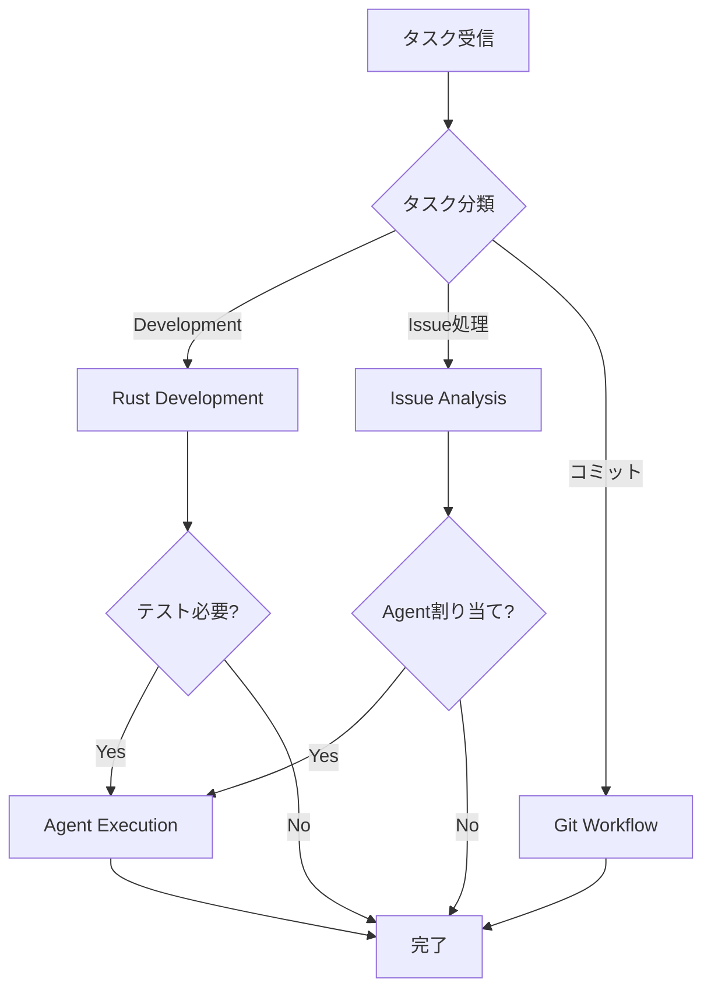

# 🎯 Miyabi Claude Code Skills

**Version**: 2.0.0
**Last Updated**: 2025-11-22
**Priority**: ⭐⭐⭐⭐⭐ (P0 Level)
**Total Skills**: 21 Skills (16 Technical + 5 Business)

---

## 📋 概要

このディレクトリには、Claude Codeの能力を拡張する**21個のSpecialized Skills**が格納されています。
Skillsは**model-invoked**（モデル自動呼び出し）で、タスクに応じて自動的にアクティベートされます。

---

## 🎯 P0: Skill使用の基本原則

### 1. 自動呼び出し原則 (Auto-Invocation)

```
❌ BAD: Skillを手動で指定
✅ GOOD: 自然言語でタスクを説明 → Claude が適切なSkillを自動選択
```

**例**:
```
User: "Build the project and run all tests"
→ Claude: 自動的に「Rust Development Workflow」Skill を呼び出し

User: "Process issues #270, #271, #272 in parallel"
→ Claude: 自動的に「Agent Execution with Worktree」Skill を呼び出し
```

### 2. Skill選択の優先順位

| 優先度 | カテゴリ | 判断基準 |
|--------|---------|---------|
| **P0** | Core Rules | MCP First, Rust優先 |
| **P1** | Technical | 開発・テスト・デプロイ |
| **P2** | Integration | tmux, Git, Issue管理 |
| **P3** | Business | 戦略・マーケティング・分析 |

### 3. 複合Skill実行パターン



---

## 🔧 P1: Skill Category別一覧

### Technical Skills (15個)

| # | Skill | 用途 | 主要ツール | 呼び出しトリガー |
|---|-------|------|-----------|----------------|
| 1 | **rust-development** | Rustビルド・テスト・品質 | Bash, Cargo | "build", "test", "clippy" |
| 2 | **agent-execution** | Agent実行・Worktree管理 | Bash, Git | "run agent", "process issue" |
| 3 | **issue-analysis** | Issue分析・ラベル推論 | Read, Grep | "analyze issue", "what labels" |
| 4 | **documentation-generation** | ドキュメント自動生成 | Read, Write | "document", "explain how" |
| 5 | **git-workflow** | Git操作・PR作成 | Bash, Git | "commit", "create PR" |
| 6 | **project-setup** | プロジェクト初期化 | Bash, Write | "new project", "integrate Miyabi" |
| 7 | **debugging-troubleshooting** | デバッグ・エラー解析 | Bash, Read | "debug", "why failing" |
| 8 | **performance-analysis** | パフォーマンス分析 | Bash, Profiler | "optimize", "slow" |
| 9 | **security-audit** | セキュリティ監査 | Bash, Audit | "scan vulnerabilities", "CVE" |
| 10 | **dependency-management** | 依存関係管理 | Bash, Cargo | "update dependencies" |
| 11 | **tmux-iterm-integration** | tmux×iTerm2統合 | Bash, tmux | "create session", "agent pane" |
| 12 | **context-eng** | コンテキストエンジニアリング | Read, Write | "context", "knowledge" |
| 13 | **claude-code-x** | Claude Code拡張機能 | Bash, API | "parallel", "headless" |
| 14 | **voicevox** | 音声合成統合 | Bash, API | "speak", "narrate" |
| 15 | **paper2agent** | 論文→Agent変換 | Read, Write | "paper to agent", "research" |
| 16 | **tdd-workflow** | TDD Red-Green-Refactor | Bash, Write | "TDD", "write tests first" |

### Business Skills (5個)

| # | Skill | 用途 | 主要ツール | 呼び出しトリガー |
|---|-------|------|-----------|----------------|
| 16 | **business-strategy-planning** | 事業戦略立案 | Read, Write | "business plan", "strategy" |
| 17 | **market-research-analysis** | 市場調査・競合分析 | WebFetch, Read | "market", "competitors" |
| 18 | **content-marketing-strategy** | コンテンツマーケティング | Write, WebFetch | "content strategy", "social" |
| 19 | **sales-crm-management** | 営業・CRM管理 | Read, Write | "sales process", "CRM" |
| 20 | **growth-analytics-dashboard** | グロース分析・KPI | Read, Write | "analytics", "KPI dashboard" |

---

## 🚀 P2: Skill別最適化パターン

### 1. rust-development

**最適パターン**:
```
[シーケンシャル] 標準ビルドサイクル
1. cargo clean (必要時のみ)
2. cargo build --workspace
3. cargo test --workspace --all-features
4. cargo clippy --workspace -- -D warnings
5. cargo fmt --all -- --check
```

**並列可能**:
```
[並列] 独立したチェック
- cargo check (型チェック)
- cargo doc (ドキュメント生成)
- cargo audit (セキュリティチェック)
```

| コマンド | 平均時間 | 呼び出し頻度 |
|---------|---------|-------------|
| `cargo build` | 30-120s | 高 |
| `cargo test` | 60-180s | 高 |
| `cargo clippy` | 30-60s | 中 |
| `cargo fmt` | 5-10s | 高 |

---

### 2. agent-execution

**Agent実行優先順位**:

| Agent | 並列可否 | 依存関係 | 用途 |
|-------|---------|---------|------|
| 🔴 CoordinatorAgent | ❌ Sequential | なし | タスク分解・割り当て |
| 🟢 CodeGenAgent | ✅ Parallel | Coordinator | コード生成 |
| 🟢 ReviewAgent | ✅ Parallel | CodeGen | レビュー |
| 🟡 DeploymentAgent | ⚠️ Conditional | Review | デプロイ |
| 🟡 PRAgent | ⚠️ Conditional | CodeGen | PR作成 |
| 🟢 IssueAgent | ✅ Parallel | なし | Issue分析 |

**最適パターン**:
```
[Phase 1: 分析] Sequential
1. IssueAgent: Issue分析・ラベル推論

[Phase 2: 計画] Sequential
2. CoordinatorAgent: タスク分解・DAG構築

[Phase 3: 実行] Parallel
3. CodeGenAgent × N: 並列コード生成
4. ReviewAgent × N: 並列レビュー

[Phase 4: 統合] Sequential
5. PRAgent: PR作成
6. DeploymentAgent: デプロイ（承認後）
```

---

### 3. issue-analysis

**ラベル推論優先順位**:

| カテゴリ | 必須/任意 | 推論ルール |
|---------|---------|-----------|
| **TYPE** | 必須 (1個) | キーワードマッチング |
| **PRIORITY** | 必須 (1個) | 影響度・緊急度 |
| **SEVERITY** | 任意 | バグ/インシデント時のみ |
| **SPECIAL** | 任意 | 特殊条件検出 |
| **HIERARCHY** | 自動 | 親子関係から自動決定 |

**キーワード→ラベル マッピング**:
```
"add", "implement", "create" → type:feature
"fix", "crash", "error" → type:bug
"security", "vulnerability" → type:bug + security
"docs", "README" → type:docs
```

---

### 4. git-workflow

**コミットタイプ優先順位**:

| Type | 用途 | 使用頻度 |
|------|------|---------|
| `feat` | 新機能 | 高 |
| `fix` | バグ修正 | 高 |
| `docs` | ドキュメント | 中 |
| `refactor` | リファクタリング | 中 |
| `test` | テスト追加 | 中 |
| `chore` | メンテナンス | 低 |

**最適パターン**:
```bash
# ステップ1: 状態確認
git status && git diff --name-status

# ステップ2: ステージング
git add <files>

# ステップ3: コミット（HEREDOC必須）
git commit -m "$(cat <<'EOF'
feat(scope): description

Body here

🤖 Generated with [Claude Code](https://claude.com/claude-code)
Co-Authored-By: Claude <noreply@anthropic.com>
EOF
)"

# ステップ4: プッシュ
git push -u origin <branch>
```

---

### 5. tmux-iterm-integration

**コマンド優先順位**:

| コマンド | 用途 | 頻度 |
|---------|------|------|
| `miyabi-start <issue>` | Issue処理開始 | 高 |
| `miyabi-list` | セッション一覧 | 高 |
| `miyabi-add <agent>` | ペイン追加 | 中 |
| `miyabi-monitor-start` | 状態監視開始 | 中 |
| `miyabi-assign <pane> <agent>` | プロファイル割当 | 低 |

**Agent別カラー**:
```
👑 Coordinator: 紫 (#1A0F2E)
⚙️ CodeGen: 緑 (#0F2E1A)
🔍 Review: オレンジ (#2E1F0F)
🐛 Debug: 赤 (#2E0F0F)
🚀 Deploy: 青 (#0F1F2E)
```

---

## ⚡ P3: パフォーマンス最適化

### Skill呼び出しコスト比較

| Skill | 平均実行時間 | リソース消費 | 推奨頻度 |
|-------|-------------|-------------|---------|
| rust-development | 1-5分 | 高（CPU） | 中 |
| agent-execution | 5-30分 | 高（API） | 低 |
| issue-analysis | 10-30秒 | 低 | 高 |
| git-workflow | 5-30秒 | 低 | 高 |
| documentation | 1-3分 | 中 | 中 |
| security-audit | 2-5分 | 中 | 低 |

### 複合Skill最適化

```
❌ BAD: 個別にSkillを順次呼び出し
rust-development → 待機 → agent-execution → 待機 → git-workflow

✅ GOOD: パイプライン化
rust-development (build + test) → agent-execution (parallel) → git-workflow (batch commit)
```

### キャッシュ活用

```
# キャッシュ有効（再利用可能）
- cargo build 成果物（target/）
- 依存関係解決結果（Cargo.lock）
- ラベル推論結果（Issue単位）

# キャッシュ無効（毎回実行）
- cargo test（状態依存）
- git status（リアルタイム）
- security-audit（最新脆弱性チェック）
```

---

## 🛡️ エラーハンドリング

### Skill失敗時のフォールバック

```
# rust-development 失敗時
1. cargo check でエラー箇所特定
2. debugging-troubleshooting Skill起動
3. エラーログ解析 → 修正提案

# agent-execution 失敗時
1. Worktree状態確認
2. git worktree prune でクリーンアップ
3. 再試行（--force フラグ）

# git-workflow 失敗時
1. git status で状態確認
2. マージコンフリクト解決
3. git stash で一時退避 → 再適用
```

### 共通エラーパターン

| エラー | 原因 | 対処 |
|--------|------|------|
| `cargo build` 失敗 | 型エラー、依存関係 | エラーメッセージ解析 → 修正 |
| Worktree作成失敗 | 既存Worktree | `git worktree prune` |
| コミット失敗 | pre-commit hook | hook出力確認 → 修正 |
| PR作成失敗 | ブランチ未push | `git push -u origin` |

---

## 📊 Skill統計

### 使用頻度ランキング

| 順位 | Skill | 頻度 | 主な用途 |
|------|-------|------|---------|
| 1 | rust-development | Very High | 日常開発 |
| 2 | git-workflow | Very High | コミット・PR |
| 3 | issue-analysis | High | Issue管理 |
| 4 | agent-execution | High | 自動開発 |
| 5 | debugging | High | 問題解決 |
| 6 | tmux-integration | Medium | セッション管理 |
| 7 | documentation | Medium | ドキュメント |
| 8 | security-audit | Medium | セキュリティ |
| 9 | performance | Medium | 最適化 |
| 10 | dependency-mgmt | Medium | 依存関係 |

### Business Skills

| 順位 | Skill | 頻度 | 主な用途 |
|------|-------|------|---------|
| 1 | growth-analytics | Very High | データ分析 |
| 2 | content-marketing | High | ブランド構築 |
| 3 | sales-crm | High | 収益成長 |
| 4 | market-research | Medium | 市場検証 |
| 5 | business-strategy | Medium | 戦略立案 |

---

## 🔗 関連ドキュメント

| ドキュメント | 用途 |
|-------------|------|
| `context/rust-tool-use-rules.md` | MCP Tool最適化ルール |
| `agents/RUST_COMMANDS_OPTIMIZATION.md` | Cargoコマンド最適化 |
| `context/rust.md` | Rust開発ガイドライン |
| `agents/specs/coding/*.md` | Agent仕様書 |

---

## 📝 バージョン履歴

- **2.0.0** (2025-11-22): rust-tool-use-rulesスタイルで全面改訂
  - P0-P3優先順位階層導入
  - 最適化パターン明確化
  - パフォーマンス比較表追加
  - エラーハンドリングセクション追加
- **1.0.0** (2025-10-26): 初版作成

---

**🎯 Miyabi Claude Code Skills - Extending Claude's capabilities for autonomous development** 🌸
